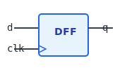
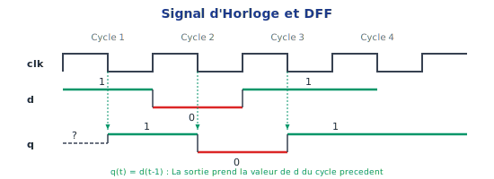
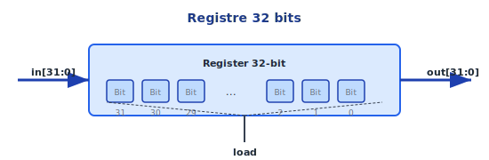
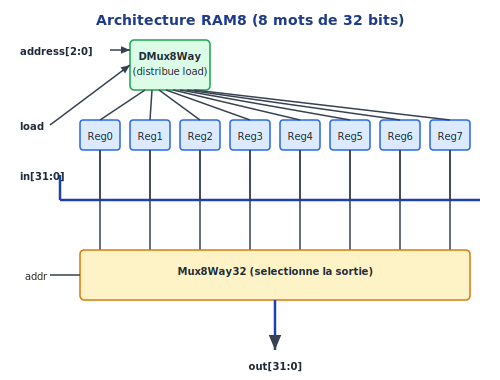
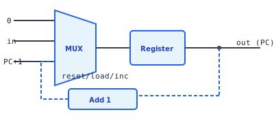

# Logique Séquentielle et Mémoire

> "Le temps est ce qui empêche tout d'arriver en même temps." — John Wheeler

Jusqu'à présent, nos circuits étaient **combinatoires** : la sortie dépendait uniquement des entrées instantanées, comme une fonction mathématique pure `y = f(x)`. Si vous coupez le courant, ils "oublient" tout.

Pour construire un véritable ordinateur, nous devons pouvoir **stocker de l'information** et la récupérer plus tard. C'est le rôle de la **logique séquentielle**.

---

## Où en sommes-nous ?


*Nous sommes à la Couche 1 : Logique Matérielle (Portes - ALU - MEMOIRE - CPU)*

Nous continuons à construire la couche matérielle. Après les portes logiques (Chapitre 1) et l'ALU (Chapitre 2), nous abordons maintenant la **mémoire** — le composant qui permet à l'ordinateur de "se souvenir".

---

## Pourquoi la Mémoire est-elle Fondamentale ?

### Le problème de l'état

Imaginez un programme simple :
```c
x = x + 1;
```

Pour exécuter cette instruction, l'ordinateur doit :
1. **Lire** la valeur actuelle de `x`
2. **Calculer** `x + 1` (avec l'ALU)
3. **Écrire** le résultat dans `x`

Sans mémoire, il n'y a pas de "valeur actuelle de x" à lire. Sans mémoire, le résultat du calcul disparaît immédiatement après avoir été produit.

### Ce que stocke la mémoire

Un ordinateur en fonctionnement stocke :
- **Le programme** : Les instructions à exécuter (le code machine)
- **Les données** : Les variables, les tableaux, les objets
- **L'état du CPU** : Les registres, le compteur de programme
- **La pile d'appels** : Pour les fonctions et les retours

Toutes ces informations vivent dans différentes formes de mémoire.

### Combinatoire vs Séquentiel

| Circuits Combinatoires | Circuits Séquentiels |
|:-----------------------|:---------------------|
| Sortie = f(entrées) | Sortie = f(entrées, **état précédent**) |
| Pas de mémoire | A de la mémoire |
| Pas d'horloge | Synchronisé par une horloge |
| Exemples : AND, OR, ALU | Exemples : Registres, RAM, CPU |

---

## Le Temps et l'Horloge (Clock)

### Le problème de la synchronisation

Dans un circuit combinatoire, les signaux se propagent à travers les portes avec un léger délai. Si on essaie de lire un résultat avant qu'il soit stable, on obtient des valeurs incorrectes.

**La solution** : L'**horloge** (`clk`).

L'horloge est un signal qui oscille perpétuellement entre 0 et 1 à une fréquence fixe :


### Front montant (Rising Edge)

Le moment crucial est le **front montant** : le passage de 0 à 1.

Dans le système Codex, les changements d'état se produisent sur le front montant. Cela signifie :

- Pendant que l'horloge est à 0, les circuits combinatoires calculent
- Quand l'horloge passe à 1, les résultats sont capturés dans les registres

C'est comme dire : "Tout le monde calcule... et maintenant, on fige les résultats !"

### Fréquence d'horloge

La fréquence de l'horloge détermine la vitesse du processeur :

- Un processeur à 1 GHz = 1 milliard de cycles par seconde
- À chaque cycle, le CPU peut exécuter (une partie d')une instruction

Plus vite bat l'horloge, plus l'ordinateur est rapide — mais aussi plus il chauffe !

---

## La Bascule D (D Flip-Flop / DFF)

La **DFF** (Data Flip-Flop) est l'atome de la mémoire. C'est le plus petit circuit capable de mémoriser un bit.

### Interface



- `d` : La donnée à mémoriser (entrée)
- `q` : La donnée mémorisée (sortie)
- `clk` : L'horloge (parfois implicite)

### Comportement

**Règle fondamentale** : `q(t) = d(t-1)`

La sortie à l'instant *t* est égale à ce qu'était l'entrée au cycle précédent.



### Pourquoi est-ce utile ?

La DFF introduit un **délai d'un cycle**. Ce délai permet :
1. De stocker une valeur pour le prochain cycle
2. De casser les boucles (éviter les oscillations infinies)
3. De synchroniser tous les composants sur l'horloge

### Comment fonctionne une DFF en interne ?

Une DFF peut être construite à partir de deux verrous (latches) en série, eux-mêmes construits à partir de portes NAND. C'est un sujet fascinant mais hors de notre scope — nous considérons la DFF comme une primitive fournie par le simulateur.

---

## Le Registre 1-bit (Bit)

La DFF mémorise pendant UN cycle, puis elle prend la nouvelle valeur d'entrée. Comment garder une valeur **indéfiniment** ?

### Le problème

On veut un circuit qui :

- Si `load = 1` : stocke la nouvelle valeur `in`
- Si `load = 0` : conserve l'ancienne valeur

### La solution : la rétroaction

On utilise un **Mux** pour choisir entre :

- L'ancienne valeur (sortie de la DFF)
- La nouvelle valeur (`in`)


**Fonctionnement** :

- Si `load = 0` : Le Mux sélectionne la sortie de la DFF. La DFF ré-enregistre sa propre valeur. La valeur est **maintenue**.
- Si `load = 1` : Le Mux sélectionne `in`. La DFF enregistre la nouvelle valeur.

### C'est magique !

Cette petite boucle de rétroaction transforme un délai d'un cycle en une mémoire permanente. C'est le principe fondamental de toute mémoire électronique.

---

## Le Registre 32-bits

### Du bit au mot

Un registre 32-bits est simplement **32 registres 1-bit en parallèle**, partageant le même signal `load`.



Quand `load = 1`, les 32 bits sont capturés simultanément. C'est atomique.

### Le rôle des registres dans le CPU

Le CPU Codex dispose de **16 registres** nommés R0 à R15 :

| Registre | Rôle typique |
|:--------:|:-------------|
| R0-R12 | Registres généraux (calculs, variables) |
| R13 (SP) | Stack Pointer (pointeur de pile) |
| R14 (LR) | Link Register (adresse de retour) |
| R15 (PC) | Program Counter (adresse de l'instruction courante) |

Les registres sont la mémoire la plus rapide du CPU — ils sont directement connectés à l'ALU et peuvent être lus/écrits en un seul cycle.

---

## La RAM (Random Access Memory)

### Du registre à la mémoire

Un registre stocke UN mot de 32 bits. Pour stocker des millions de mots, nous construisons une **RAM** (Random Access Memory).

"Random Access" signifie qu'on peut accéder à n'importe quelle cellule directement, sans parcourir les autres. Contrairement à une bande magnétique où il faut rembobiner !

### Interface de la RAM


- `in` : La donnée à écrire
- `address` : L'adresse de la cellule à lire/écrire
- `load` : Si 1, écrire `in` à `address`. Si 0, ne rien écrire.
- `out` : La valeur stockée à `address` (toujours disponible en lecture)

### Comment ça marche ?

La RAM utilise les composants que nous avons construits :

1. **DMux** (Démultiplexeur) : Route le signal `load` vers UN SEUL registre — celui correspondant à l'adresse
2. **Registres** : Stockent les données
3. **Mux** (Multiplexeur) : Sélectionne la sortie du registre correspondant à l'adresse

### Exemple : RAM8 (8 mots de 32 bits)



### Construction hiérarchique de grandes RAMs

Comment construire une RAM64 (64 mots) à partir de RAM8 ?

```
address[5:0] = address[5:3] (3 bits supérieurs) + address[2:0] (3 bits inférieurs)
               ↓                                  ↓
        Sélectionne laquelle des 8 RAM8    Sélectionne le mot dans cette RAM8
```

On utilise 8 RAM8 :

- Les 3 bits de poids fort (`address[5:3]`) choisissent **quelle RAM8**
- Les 3 bits de poids faible (`address[2:0]`) choisissent **quel mot dans la RAM8**

C'est un pattern récursif qui permet de construire des mémoires de n'importe quelle taille !

---

## Le Compteur de Programme (PC)

Le **Program Counter** (PC) est peut-être le registre le plus important du CPU. Il contient l'adresse de la prochaine instruction à exécuter.

### Pourquoi est-il spécial ?

Après chaque instruction, le PC doit passer à l'instruction suivante. Mais parfois :

- On veut **sauter** à une autre adresse (boucles, conditions)
- On veut **revenir à 0** (redémarrage)

### Les trois modes du PC

| Priorité | Mode | Condition | Action |
|:--------:|:-----|:----------|:-------|
| 1 | **Reset** | `reset = 1` | `PC ← 0` |
| 2 | **Jump** | `load = 1` | `PC ← in` |
| 3 | **Increment** | `inc = 1` | `PC ← PC + 1` |
| 4 | **Hold** | sinon | `PC ← PC` |

### Schéma simplifié



### Le lien avec l'exécution du programme

À chaque cycle d'horloge :

1. Le CPU lit l'instruction à l'adresse `PC`
2. Il décode et exécute l'instruction
3. Il met à jour le PC (incrément ou saut)
4. Le cycle recommence

C'est le cœur battant de l'ordinateur !

---

## Les Différents Types de Mémoire

Dans un vrai ordinateur, il y a plusieurs niveaux de mémoire :


Plus on monte dans la pyramide :

- Plus c'est rapide
- Plus c'est cher par octet
- Plus la capacité est faible

Dans le Codex, nous implémentons les registres et la RAM. Les caches et les disques sont des concepts plus avancés.

---

## Exercices Pratiques

### Exercices sur le Simulateur Web

Lancez le **Simulateur Web** et allez dans **HDL Progression** → **Projet 4 : Séquentiel**.

| Exercice | Description | Difficulté |
|----------|-------------|:----------:|
| `DFF1` | Bascule D (fournie comme primitive) | — |
| `BitReg` | Registre 1-bit (Mux + DFF) | [*] |
| `Register16` | Registre 16-bits (16 BitReg en parallèle) | [*] |
| `PC` | Compteur de programme avec reset/load/inc | [**] |
| `RAM8` | RAM de 8 mots (DMux + 8 Registres + Mux) | [**] |
| `RAM64` | RAM de 64 mots (8 RAM8) | [**] |
| `RegFile` | Banc de registres (lecture double, écriture simple) | [***] |

### Ordre de progression recommandé

1. **BitReg** : La brique de base. Un Mux et une DFF.
2. **Register16** : 16 BitReg en parallèle. Vérifiez que tous les bits sont synchronisés.
3. **PC** : Attention à la priorité ! reset > load > inc > hold
4. **RAM8** : Utilisez DMux8Way et Mux8Way16
5. **RAM64** : Composition de 8 RAM8

### Prérequis

Avant de construire les RAMs, assurez-vous d'avoir terminé les composants multi-bits du Projet 2 :
- `Mux8Way16` : Sélectionne parmi 8 entrées de 16 bits
- `DMux8Way` : Distribue 1 entrée vers 8 sorties

### Tests en ligne de commande

```bash
# Tester le registre 1-bit
cargo run -p hdl_cli -- test hdl_lib/04_seq/BitReg.hdl

# Tester la RAM8
cargo run -p hdl_cli -- test hdl_lib/04_seq/RAM8.hdl

# Tester le PC
cargo run -p hdl_cli -- test hdl_lib/04_seq/PC.hdl
```

---

## Défis Supplémentaires

### Défi 1 : RAM avec deux ports de lecture

Construisez une RAM qui permet de lire DEUX adresses différentes simultanément (utile pour le CPU qui doit lire deux opérandes).

### Défi 2 : Compteur avec valeur maximale

Modifiez le PC pour qu'il s'arrête à une valeur maximale au lieu de continuer à compter (overflow protection).

### Défi 3 : Registre à décalage (Shift Register)

Construisez un registre où les bits se décalent d'une position à chaque cycle. Utilisé pour :
- Les communications série
- La multiplication/division par 2
- Les générateurs de nombres aléatoires

---

## Le Lien avec la Suite

La mémoire que vous venez de construire sera utilisée partout dans l'ordinateur :

| Composant | Utilisation de la mémoire |
|:----------|:-------------------------|
| **Registres R0-R15** | 16 registres 32-bits pour les calculs |
| **RAM** | Stockage du programme et des données |
| **PC** | Adresse de l'instruction courante |
| **Pile (Stack)** | Zone de RAM pour les appels de fonction |
| **Écran** | Zone de RAM mappée aux pixels (MMIO) |
| **Clavier** | Registre mappé en mémoire (MMIO) |

Au Chapitre 4, nous verrons comment le CPU accède à la mémoire et aux périphériques via le **Memory-Mapped I/O** (MMIO).

---

## Ce qu'il faut retenir

1. **L'horloge synchronise tout** : Les changements se font sur le front montant

2. **La DFF est l'atome de mémoire** : `q(t) = d(t-1)`

3. **La rétroaction crée la persistance** : Mux + DFF = mémoire permanente

4. **La RAM est un tableau de registres** : Accès par adresse

5. **Le PC guide l'exécution** : Il pointe vers l'instruction courante

6. **Hiérarchie de mémoire** :
   - Registres → Cache → RAM → Disque
   - Rapidité vs Capacité

**Prochaine étape** : Au Chapitre 4, nous définissons l'**Architecture Machine** (ISA). C'est le "contrat" entre le matériel et le logiciel : quelles instructions le CPU comprend-il ? Comment accède-t-il à la mémoire ?

---

**Conseil** : Prenez le temps de bien comprendre la boucle de rétroaction du registre 1-bit. C'est un concept fondamental qui revient constamment en informatique !

---

## Auto-évaluation

Testez votre compréhension avant de passer au chapitre suivant.

### Questions de compréhension

**Q1.** Quelle est la différence fondamentale entre un circuit combinatoire et un circuit séquentiel ?

**Q2.** Pourquoi le signal `load` est-il nécessaire dans un registre ?

**Q3.** Comment fonctionne l'adressage dans une RAM de 8 mots ?

**Q4.** Le PC (Program Counter) a plusieurs modes : reset, load, inc, hold. Dans quel ordre de priorité fonctionnent-ils ?

**Q5.** Pourquoi la RAM est-elle plus lente que les registres ?

### Mini-défi pratique

Dessinez le schéma bloc d'un registre 1-bit avec les composants suivants :
- 1 MUX 2-vers-1
- 1 DFF

Indice : La sortie du DFF retourne vers une entrée du MUX.

*Les solutions se trouvent dans le document **Codex_Solutions**.*

### Checklist de validation

Avant de passer au chapitre 4, assurez-vous de pouvoir :

- [ ] Expliquer pourquoi l'horloge est nécessaire (synchronisation)
- [ ] Décrire le comportement d'une DFF : `q(t) = d(t-1)`
- [ ] Construire un registre 1-bit avec MUX + DFF
- [ ] Expliquer comment RAM8 utilise DMux et Mux pour l'adressage
- [ ] Décrire les priorités du PC (reset > load > inc > hold)
