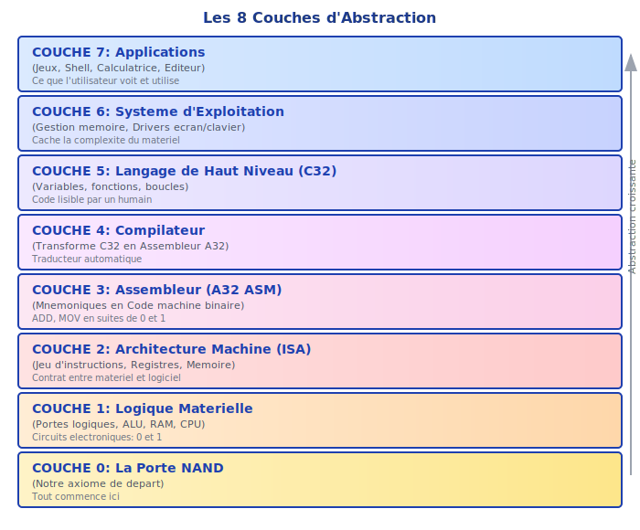
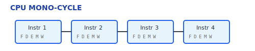
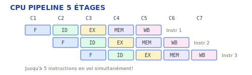
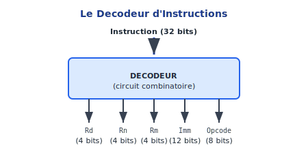
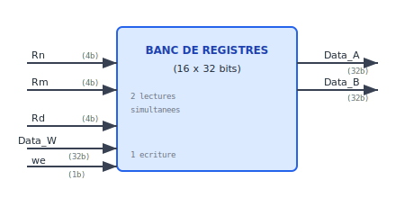
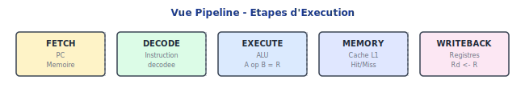
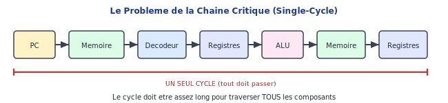
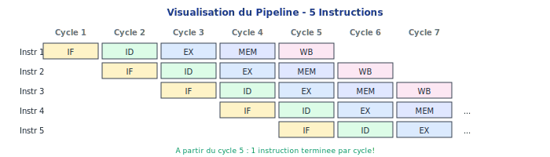
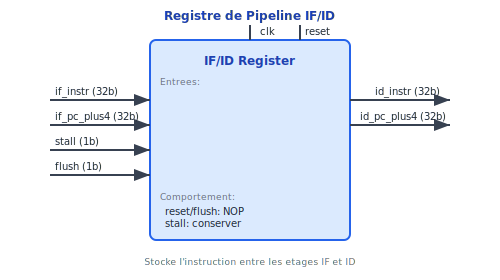
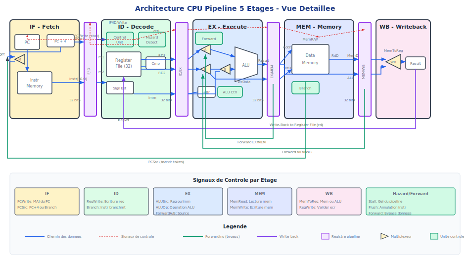

# Le Processeur (CPU)

> "Si vous ne pouvez pas le construire, vous ne le comprenez pas." — Richard Feynman

C'est le grand moment. Nous allons assembler toutes les pièces du puzzle — portes logiques, ALU, registres, mémoire — pour construire le **cœur de l'ordinateur** : le CPU A32.

---

## Où en sommes-nous ?



*Nous sommes à la Couche 1 : CPU - L'Aboutissement (ALU + RAM + Registres)*

Ce chapitre est le **point culminant** de tout le travail matériel. Après ce chapitre, vous aurez construit un ordinateur complet capable d'exécuter du vrai code !

---

## Deux Implémentations du CPU

Le projet Codex propose **deux implémentations** du CPU A32, chacune avec un objectif pédagogique différent :

### CPU Mono-cycle (Simulateur Rust)

Le **simulateur Rust** (`a32_core`) implémente un CPU **mono-cycle** :



*Chaque instruction traverse TOUTES les étapes en UN cycle*

**Utilisé par :**

- Le **CPU Visualizer** (interface web)
- Le **runner** (`a32_runner`)
- L'**IDE web** (exécution des programmes)
- Les **tests** C32 et A32

**Avantages :** Simple à comprendre, facile à déboguer, comportement prévisible.

### CPU Pipeline (HDL)

Le **CPU en HDL** (`hdl_lib/05_cpu/CPU_Pipeline.hdl`) implémente un vrai **pipeline 5 étages** :



**Composants HDL :**

| Fichier | Rôle |
|:--------|:-----|
| `IF_ID_Reg.hdl` | Registre pipeline IF→ID |
| `ID_EX_Reg.hdl` | Registre pipeline ID→EX |
| `EX_MEM_Reg.hdl` | Registre pipeline EX→MEM |
| `MEM_WB_Reg.hdl` | Registre pipeline MEM→WB |
| `HazardDetect.hdl` | Détection des hazards (stall) |
| `ForwardUnit.hdl` | Bypass/forwarding des données |
| `CPU_Pipeline.hdl` | CPU complet assemblé |

**Utilisé par :**

- Les **exercices HDL** (apprentissage hardware)
- Le **simulateur HDL** (`hdl_cli`)

**Avantages :** Réaliste, montre les vrais défis du design CPU (hazards, forwarding, stalls).

### Pourquoi deux implémentations ?

| Aspect | Mono-cycle (Rust) | Pipeline (HDL) |
|:-------|:------------------|:---------------|
| **Objectif** | Exécuter des programmes | Apprendre le hardware |
| **Complexité** | Simple | Réaliste |
| **Performance** | 1 instr/cycle | Jusqu'à 1 instr/cycle (avec hazards) |
| **Hazards** | Aucun | Gérés (stall + forward) |
| **Utilisation** | IDE, tests, visualizer | Exercices HDL |

> **Note :** Le CPU Visualizer affiche les étapes (Fetch, Decode, Execute, Memory, Writeback) de manière **pédagogique**, mais l'exécution sous-jacente est mono-cycle. Pour voir un vrai pipeline avec hazards et forwarding, utilisez le simulateur HDL avec `CPU_Pipeline.hdl`.

---

## Qu'est-ce qu'un CPU ?

### Le chef d'orchestre

Le CPU (Central Processing Unit) est le composant qui :

1. **Lit** les instructions depuis la mémoire
2. **Décode** ces instructions pour comprendre quoi faire
3. **Exécute** les opérations (calculs, accès mémoire, branchements)
4. **Répète** à l'infini (jusqu'à HALT)

C'est une machine à états qui exécute une instruction après l'autre, inlassablement.

### Ce que nous avons construit jusqu'ici

| Chapitre | Composant | Rôle dans le CPU |
|:---------|:----------|:-----------------|
| 1 | Portes logiques | Briques de base de tout circuit |
| 2 | ALU | Effectue les calculs (ADD, SUB, AND...) |
| 3 | Registres | Stockent les données du CPU (R0-R15) |
| 3 | PC | Pointe vers l'instruction courante |
| 3 | RAM | Stocke le programme et les données |
| 4 | ISA | Définit les instructions à supporter |

### Ce qu'il reste à construire

- **Décodeur** : Analyse les bits de l'instruction
- **Unité de contrôle** : Décide quoi activer
- **Multiplexeurs de données** : Routent les données entre composants
- **Le CPU lui-même** : L'assemblage final

---

## Architecture du CPU (Data Path)

Voici le schéma complet du CPU. Chaque flèche est un fil (ou un bus de 32 fils). Chaque boîte est un composant que vous avez construit ou que vous allez construire.


### Les flux de données

1. **Fetch** : PC → Mémoire Instructions → Instruction (32 bits)
2. **Decode** : Instruction → Décodeur → (Rd, Rn, Rm, Imm, opcode)
3. **Register Read** : Rn, Rm → Banc de Registres → Valeurs
4. **Execute** : Valeurs → ALU → Résultat
5. **Memory** : Résultat → Mémoire Données (si LDR/STR)
6. **Writeback** : Résultat → Registre Rd

---

## Les Composants du CPU

### 1. Le Compteur de Programme (PC)

Vous l'avez déjà construit au Chapitre 3 ! Le PC contient l'adresse de l'instruction courante.

**Modes de fonctionnement** :

- `inc = 1` : PC ← PC + 4 (instruction suivante)
- `load = 1` : PC ← adresse de branchement
- `reset = 1` : PC ← 0 (redémarrage)

### 2. Le Décodeur (Decoder)

Le décodeur est un circuit **purement combinatoire** qui "découpe" les 32 bits de l'instruction.



**Sorties du décodeur** :

| Signal | Bits | Description |
|:-------|:-----|:------------|
| `cond` | 31-28 | Code de condition (EQ, NE, LT...) |
| `class` | 27-25 | Classe d'instruction (ALU, MEM, BRANCH) |
| `op` | 24-21 | Opération ALU (ADD, SUB, AND...) |
| `S` | 20 | Mettre à jour les drapeaux ? |
| `Rn` | 19-16 | Registre source 1 |
| `Rd` | 15-12 | Registre destination |
| `Rm` | 3-0 | Registre source 2 |
| `imm12` | 11-0 | Valeur immédiate (12 bits) |
| `imm24` | 23-0 | Offset de branchement (24 bits) |

Le décodeur ne fait que du **câblage** — il ne calcule rien, il ne fait que router les bits vers les bonnes sorties.

### 3. L'Unité de Contrôle (Control)

L'unité de contrôle est le **chef d'orchestre**. Elle regarde la classe et l'opcode, et décide quels signaux activer.


**Exemples de signaux de contrôle** :

| Instruction | reg_write | mem_read | mem_write | alu_src | branch |
|:------------|:---------:|:--------:|:---------:|:-------:|:------:|
| ADD | 1 | 0 | 0 | 0 (reg) | 0 |
| ADD #imm | 1 | 0 | 0 | 1 (imm) | 0 |
| LDR | 1 | 1 | 0 | 1 (imm) | 0 |
| STR | 0 | 0 | 1 | 1 (imm) | 0 |
| B | 0 | 0 | 0 | X | 1 |
| CMP | 0 | 0 | 0 | 0 | 0 |

### 4. Le Vérificateur de Condition (CondCheck)

Ce petit circuit vérifie si la condition est satisfaite.

**Entrées** :

- `cond` : Le code de condition (4 bits, ex: 0000 = EQ)
- `flags` : Les drapeaux NZCV

**Sortie** :

- `ok` : 1 si la condition est vraie, 0 sinon

```
  cond = 0000 (EQ) et Z = 1  →  ok = 1
  cond = 0000 (EQ) et Z = 0  →  ok = 0
  cond = 1110 (AL)           →  ok = 1 (toujours)
```

**Pourquoi est-ce important ?**

Si `ok = 0`, l'instruction est "annulée" — on n'écrit pas dans le registre, on ne fait pas le branchement. C'est la **prédication** en action !

### 5. Le Banc de Registres (RegFile)

Vous l'avez construit au Chapitre 3 (RAM8, RAM16...). Le banc de registres est une RAM spéciale avec :

- **2 ports de lecture** : Lire Rn ET Rm simultanément
- **1 port d'écriture** : Écrire dans Rd



### 6. Les Multiplexeurs

Les multiplexeurs routent les données entre les composants :

| Mux | Choix | Signification |
|:----|:------|:--------------|
| **ALU_src** | 0: Rm, 1: Imm | Deuxième opérande de l'ALU |
| **Writeback** | 0: ALU, 1: MEM | Source de la valeur à écrire |
| **PC_src** | 0: PC+4, 1: Branch | Prochaine valeur du PC |

---

## Du Format d'Instruction au Hardware

C'est une question fondamentale : **comment chaque bit de l'instruction devient-il une action dans le hardware ?**

### Rappel : Format d'une Instruction A32

```
 31  28 27 25 24  21 20 19 16 15 12 11          0
┌──────┬─────┬──────┬──┬─────┬─────┬─────────────┐
│ cond │class│  op  │ S│  Rn │  Rd │   operand2  │
└──────┴─────┴──────┴──┴─────┴─────┴─────────────┘
```

### Mapping ISA → Hardware

Voici comment chaque champ de l'instruction contrôle le hardware :

| Bits | Champ | Hardware | Fonction |
|------|-------|----------|----------|
| [31:28] | `cond` | **Cond Check** | Compare avec NZCV, génère `cond_ok` |
| [27:25] | `class` | **Decoder** | Distingue ALU/Mémoire/Branch/etc. |
| [24:21] | `op` | **Control Unit** | Génère `ALU_op`, `reg_write`, `mem_write` |
| [20] | `S` | **Flag Register** | Active la mise à jour des flags |
| [19:16] | `Rn` | **RegFile port A** | Adresse du registre source 1 |
| [15:12] | `Rd` | **RegFile port W** | Adresse du registre destination |
| [11:0] | `operand2` | **Imm Extender** ou **RegFile port B** | Deuxième opérande |

### Exemple Détaillé : ADD R1, R2, R3

L'instruction `ADD R1, R2, R3` en binaire :

```
1110 000 0100 0 0010 0001 00000000 0011
│    │   │    │ │    │    │         │
│    │   │    │ │    │    │         └── Rm = R3 (0011)
│    │   │    │ │    │    └── padding (ignoré)
│    │   │    │ │    └── Rd = R1 (0001)
│    │   │    │ └── Rn = R2 (0010)
│    │   │    └── S = 0 (ne met pas à jour les flags)
│    │   └── opcode = 0100 (ADD)
│    └── class = 000 (ALU avec registre)
└── cond = 1110 (AL = Always)
```

**Parcours dans le hardware** :

1. **Cond Check** : `cond = 1110` (AL) → `cond_ok = 1` (toujours vrai)

2. **Decoder** : `class = 000` → Instruction ALU avec registre
   - `reg_write = 1` (on écrit dans un registre)
   - `mem_read = 0`, `mem_write = 0` (pas d'accès mémoire)
   - `ALU_src = 0` (opérande 2 = registre, pas immédiat)

3. **Control Unit** : `op = 0100` → `ALU_op = ADD`

4. **RegFile** :
   - Port A lit `Rn = R2` → `Data_A = valeur de R2`
   - Port B lit `Rm = R3` → `Data_B = valeur de R3`

5. **ALU** : Calcule `Data_A + Data_B`

6. **Writeback** : Écrit le résultat dans `Rd = R1`

### Exemple Détaillé : LDR R0, [R1, #8]

L'instruction `LDR R0, [R1, #8]` :

```
1110 010 1 1001 0001 0000 000000001000
│    │   │ │    │    │    │
│    │   │ │    │    │    └── offset = #8
│    │   │ │    │    └── Rd = R0
│    │   │ │    └── Rn = R1
│    │   │ └── opcode (bits) = 1001 (LDR avec offset positif)
│    │   └── L = 1 (Load, pas Store)
│    └── class = 010 (Mémoire)
└── cond = 1110 (AL)
```

**Parcours** :

1. **Decoder** : `class = 010` → Instruction mémoire
   - `mem_read = 1` (on lit la mémoire)
   - `ALU_src = 1` (opérande 2 = immédiat)
   - `ALU_op = ADD` (pour calculer l'adresse)

2. **RegFile** : Lit `Rn = R1` → adresse de base

3. **Imm Extender** : Extrait offset = 8

4. **ALU** : Calcule `R1 + 8` → adresse effective

5. **Mémoire** : Lit MEM[adresse] → valeur

6. **Writeback** : `Rd = R0` reçoit la valeur lue

### Exemple Détaillé : BEQ label

L'instruction `BEQ label` (avec offset de 10 instructions) :

```
0000 101 0 000000000000000000001010
│    │   │ │
│    │   │ └── offset = 10 (en nombre d'instructions)
│    │   └── L = 0 (Branch, pas Branch-Link)
│    └── class = 101 (Branch)
└── cond = 0000 (EQ = Equal, Z=1)
```

**Parcours** :

1. **Cond Check** : `cond = 0000` (EQ) → `cond_ok = Z` (prend le flag Z actuel)

2. **Decoder** : `class = 101` → Instruction de branchement
   - `PC_src = branch_taken` (si cond_ok = 1)
   - `reg_write = 0` (pas d'écriture registre)

3. **Calcul de l'adresse cible** : `PC + 4 + (offset × 4)` = `PC + 4 + 40`

4. **MUX PC** : Si `cond_ok = 1` (Z était à 1), PC ← adresse cible

### Schéma Récapitulatif

```
┌─────────────────────────────────────────────────────────────┐
│                     INSTRUCTION (32 bits)                    │
└─────────────────────────────────────────────────────────────┘
          │           │           │           │
          ▼           ▼           ▼           ▼
    ┌──────────┐ ┌─────────┐ ┌─────────┐ ┌──────────┐
    │cond[31:28]│ │Decoder  │ │ RegFile │ │Imm Extend│
    │          │ │class,op │ │ Rn,Rd,Rm│ │ operand2 │
    └────┬─────┘ └────┬────┘ └────┬────┘ └────┬─────┘
         │            │           │           │
         ▼            ▼           ▼           ▼
    ┌─────────┐  ┌─────────┐  ┌──────┐   ┌───────┐
    │Cond     │  │Control  │  │Data_A│   │Data_B │
    │Check    │  │Unit     │  │Data_B│   │ou Imm │
    │         │  │         │  │      │   │       │
    │cond_ok  │  │signaux  │  └──┬───┘   └───┬───┘
    └────┬────┘  └────┬────┘     │           │
         │            │          └─────┬─────┘
         │            │                │
         │            ▼                ▼
         │       ┌─────────────────────────┐
         │       │          ALU            │
         │       │    (selon ALU_op)       │
         │       └───────────┬─────────────┘
         │                   │
         │                   ▼
         │            ┌─────────────┐
         │            │   Résultat  │
         │            │   + Flags   │
         │            └──────┬──────┘
         │                   │
         ▼                   ▼
    ┌────────────────────────────────┐
    │   Activation conditionnelle    │
    │   (si cond_ok = 1, exécute)    │
    └────────────────────────────────┘
```

---

## Le Cycle d'Exécution en Détail

Notre CPU est **single-cycle** : chaque instruction s'exécute en un seul cycle d'horloge.

### Phase 1 : Fetch (Récupération)

```
PC ──► Mémoire Instructions ──► instruction (32 bits)
```

Le PC envoie son adresse à la mémoire d'instructions. La mémoire renvoie les 32 bits de l'instruction.

### Phase 2 : Decode (Décodage)

```
instruction ──► Décodeur ──► cond, class, op, Rn, Rd, Rm, imm
                   │
                   └──► Unité de Contrôle ──► signaux
```

Le décodeur découpe l'instruction. L'unité de contrôle décide quoi activer.

### Phase 3 : Register Read (Lecture des registres)

```
Rn, Rm ──► Banc de Registres ──► Data_A, Data_B
```

Les valeurs des registres sources sont lues.

### Phase 4 : Execute (Exécution)

```
Data_A ──────────────────┐
                         ├──► ALU ──► Résultat, Flags
Data_B ou Imm ──► MUX ───┘
```

L'ALU effectue l'opération. Les drapeaux sont mis à jour (si S=1).

### Phase 5 : Memory (Accès mémoire)

```
                    ┌─── Si LDR : MEM[addr] → valeur
Résultat (adresse) ─┤
                    └─── Si STR : valeur → MEM[addr]
```

Pour les instructions LDR/STR, on accède à la mémoire de données.

### Phase 6 : Writeback (Écriture)

```
Résultat (ALU ou MEM) ──► MUX ──► Banc de Registres ──► Rd
```

Si `reg_write = 1` ET `cond_ok = 1`, on écrit dans le registre destination.

### Phase 7 : PC Update

```
        ┌─── Si branch : PC + (offset × 4)
PC+4 ───┤
        └─── Sinon : PC + 4
```

Le PC est mis à jour pour le prochain cycle.

---

## Implémentation du CPU en HDL

Voici un squelette de l'architecture du CPU :

```vhdl
entity CPU is
  port(
    clk      : in bit;
    reset    : in bit;
    -- Interface mémoire
    instr    : in bits(31 downto 0);
    mem_in   : in bits(31 downto 0);
    pc_out   : out bits(31 downto 0);
    mem_addr : out bits(31 downto 0);
    mem_out  : out bits(31 downto 0);
    mem_we   : out bit
  );
end entity;

architecture rtl of CPU is
  -- Signaux internes
  signal pc, pc_next : bits(31 downto 0);
  signal cond, op : bits(3 downto 0);
  signal rd, rn, rm : bits(3 downto 0);
  signal imm12 : bits(11 downto 0);
  signal data_a, data_b, alu_result : bits(31 downto 0);
  signal reg_write, mem_read, mem_write, alu_src, branch : bit;
  signal n_flag, z_flag, c_flag, v_flag, cond_ok : bit;

begin
  -- Instanciation des composants
  u_decoder: Decoder port map (...);
  u_control: Control port map (...);
  u_condcheck: CondCheck port map (...);
  u_regfile: RegFile port map (...);
  u_alu: ALU port map (...);
  u_pc: PC port map (...);

  -- Multiplexeurs
  alu_b <= imm12 when alu_src = '1' else data_b;
  writeback <= mem_in when mem_read = '1' else alu_result;
  pc_next <= branch_addr when (branch and cond_ok) = '1' else pc_plus_4;

end architecture;
```

---

## Exercices Pratiques

### Exercices sur le Simulateur Web

Lancez le **Simulateur Web** et allez dans **HDL Progression** → **Projet 5 : CPU**.

| Exercice | Description | Difficulté |
|----------|-------------|:----------:|
| `Decoder` | Découper l'instruction en champs | [**] |
| `CondCheck` | Vérifier les conditions (EQ, NE, LT...) | [**] |
| `Control` | Générer les signaux de contrôle | [***] |
| `CPU` | L'assemblage final ! | [****] |

### Ordre de progression

1. **Decoder** : Commencez par là. C'est du pur câblage.
   - Utilisez la syntaxe `instr(31 downto 28)` pour extraire les bits

2. **CondCheck** : Table de vérité des conditions
   - EQ : Z = 1
   - NE : Z = 0
   - LT : N ≠ V
   - etc.

3. **Control** : La logique de commande
   - Pour chaque classe d'instruction, décidez les signaux
   - Attention aux cas spéciaux (CMP ne fait pas reg_write)

4. **CPU** : L'assemblage final
   - Suivez le schéma du data path
   - N'oubliez pas les multiplexeurs !

### Tests en ligne de commande

```bash
# Tester le décodeur
cargo run -p hdl_cli -- test hdl_lib/05_cpu/Decoder.hdl

# Tester le CPU complet
cargo run -p hdl_cli -- test hdl_lib/05_cpu/CPU.hdl
```

---

## CPU Visualizer : L'Outil Interactif

Pour mieux comprendre comment le CPU exécute les instructions, le projet inclut un **CPU Visualizer** interactif. C'est un outil web qui vous permet de voir en temps réel le fonctionnement du processeur.

### Accéder au Visualizer

1. Lancez le serveur web :
```bash
cd web
npm install
npm run dev
```

2. Ouvrez votre navigateur à l'adresse indiquée (généralement `http://localhost:5173`)

3. Cliquez sur **CPU Visualizer** dans la barre de navigation

### Fonctionnalités du Visualizer

#### Vue Pipeline

Le Visualizer affiche les **5 étapes du cycle d'exécution** :



Chaque étape s'illumine en jaune quand elle est active, vous permettant de suivre la progression de l'instruction.

#### Panneau Registres

Affiche les **16 registres** (R0-R15) avec les alias :

- **SP** (R13) : Stack Pointer
- **LR** (R14) : Link Register
- **PC** (R15) : Program Counter

Les registres modifiés s'illuminent en vert pendant un instant.

#### Panneau Flags (CPSR)

Les 4 drapeaux du processeur sont affichés :

- **N** (Negative) : Le résultat est négatif
- **Z** (Zero) : Le résultat est zéro
- **C** (Carry) : Retenue/emprunt
- **V** (Overflow) : Débordement signé

Les flags changent de couleur quand ils sont actifs.

#### Panneau Code Source

Affiche le code assembleur avec :

- **Coloration syntaxique** : Instructions, registres, nombres, commentaires
- **Surlignage de la ligne courante** : La ligne en cours d'exécution est mise en évidence en jaune
- **Défilement automatique** : Le code défile pour suivre l'exécution

#### Panneau Mémoire et Cache

Affiche :

- **Vue mémoire** : Les octets en mémoire autour du PC
- **Statistiques cache** : Hits, Misses, Taux de réussite
- **Contenu du cache L1** : Lignes valides avec tag et données
- **Indicateur HIT/MISS** : Flash vert pour hit, rouge pour miss

### Les Démos Intégrées

Le Visualizer inclut 7 démos prêtes à l'emploi :

| Demo | Description | Concept illustré |
|:-----|:------------|:-----------------|
| **1. Addition** | 5 + 3 = 8 | Instructions ALU basiques |
| **2. Boucle** | Somme 1-5 | Branchements conditionnels |
| **3. Mémoire** | LDR/STR | Accès mémoire |
| **4. Condition** | Valeur absolue | Prédication |
| **5. Tableau** | Somme tableau | Boucle + mémoire |
| **6. Flags** | N, Z, C, V | Drapeaux CPU |
| **7. Cache** | Parcours mémoire | Cache hits/misses |

### Contrôles

| Bouton | Raccourci | Action |
|:-------|:----------|:-------|
| **Reset** | Ctrl+R | Remet le CPU à zéro |
| **Step** | N, F10 | Exécute une instruction |
| **Play/Pause** | Espace | Lance/arrête l'exécution continue |
| **Vitesse** | Slider | Ajuste la vitesse d'exécution |

### Charger Votre Propre Code

1. Cliquez sur **Charger fichier**
2. Sélectionnez un fichier `.asm`, `.a32` ou `.a32b`
3. Le code est assemblé et chargé automatiquement

### Exercice Pratique

Utilisez le Visualizer pour observer ces comportements :

1. **Suivez une addition** : Chargez la démo "Addition" et observez comment ADD lit deux registres et écrit le résultat

2. **Observez un branchement** : Chargez la démo "Boucle" et regardez comment B.LE revient au début de la boucle

3. **Analysez le cache** : Chargez la démo "Cache" et observez les miss au premier parcours, puis les hits au second

---

## Conseils de Débogage

### Le PC reste à 0 ?

- Vérifiez que `inc = 1` par défaut
- Vérifiez que le reset n'est pas bloqué

### Les branchements ne marchent pas ?

- L'offset dans l'instruction est en mots (× 4 pour avoir des octets)
- Vérifiez que `cond_ok` est correct
- Vérifiez le calcul de l'adresse de branchement

### Rien ne s'écrit dans les registres ?

- `reg_write` doit être à 1
- `cond_ok` doit être à 1
- Le registre destination ne doit pas être R15 (géré à part)

### LDR/STR ne fonctionne pas ?

- Vérifiez le calcul de l'adresse (base + offset)
- Vérifiez les signaux `mem_read` et `mem_write`
- Attention à l'alignement (adresses multiples de 4)

---

## Aller Plus Loin : Le CPU Pipeline

Le CPU single-cycle que nous avons construit est simple et pédagogique. Mais dans le monde réel, il serait **très lent**. Les vrais processeurs utilisent une technique appelée **pipeline** pour être beaucoup plus rapides.

Cette section explique en détail ce qu'est un pipeline, pourquoi il est nécessaire, et comment le construire.

---

### Pourquoi le CPU Single-Cycle est Lent

#### Le problème de la chaîne critique

Dans notre CPU single-cycle, une instruction doit traverser **tous** les composants en un seul cycle :



Le cycle d'horloge doit être assez **long** pour que le signal traverse tout ce chemin. Si chaque étape prend 1 nanoseconde, le cycle doit faire au minimum 6 ns.

**Résultat** : Même si certaines instructions n'ont pas besoin de la mémoire de données (comme ADD), elles prennent quand même 6 ns.

#### Une analogie : La laverie

Imaginez que vous avez 4 lessives à faire. Chaque lessive a 4 étapes : laver (30 min), sécher (30 min), plier (30 min), ranger (30 min).


Le pipeline ne rend pas une lessive individuelle plus rapide, mais il permet de traiter **plus de lessives par heure** !

---

### Le Pipeline à 5 Étages

Notre CPU pipeliné divise l'exécution en **5 étapes**, chacune prenant exactement 1 cycle d'horloge :


#### Étape 1 : IF (Instruction Fetch)

**But** : Aller chercher l'instruction en mémoire.

```
┌─────────────────────────────────────────────┐
│  IF - Instruction Fetch                     │
│                                             │
│    PC ────► Mémoire ────► Instruction       │
│    │        Instructions    (32 bits)       │
│    │                                        │
│    └───► PC + 4 (préparé pour la suite)     │
│                                             │
└─────────────────────────────────────────────┘
```

**Ce qui se passe** :

1. Le PC (Program Counter) envoie son adresse à la mémoire
2. La mémoire renvoie l'instruction (32 bits)
3. On calcule PC + 4 pour l'instruction suivante

**Sortie** : L'instruction et PC+4 sont stockés dans le registre IF/ID.

#### Étape 2 : ID (Instruction Decode)

**But** : Comprendre l'instruction et lire les registres sources.

```
┌─────────────────────────────────────────────┐
│  ID - Instruction Decode                    │
│                                             │
│    Instruction ─┬─► Décodeur ──► Signaux    │
│                 │                de contrôle│
│                 │                           │
│                 └─► Registres ──► Valeurs   │
│                      (Rn, Rm)     (A, B)    │
│                                             │
└─────────────────────────────────────────────┘
```

**Ce qui se passe** :

1. Le décodeur extrait les champs (Rd, Rn, Rm, opcode, etc.)
2. L'unité de contrôle génère les signaux (reg_write, mem_read, etc.)
3. On lit les valeurs des registres Rn et Rm
4. On détecte les éventuels aléas (hazards)

**Sortie** : Tout est stocké dans le registre ID/EX.

#### Étape 3 : EX (Execute)

**But** : Effectuer le calcul.

```
┌─────────────────────────────────────────────┐
│  EX - Execute                               │
│                                             │
│    Valeur A ──────┐                         │
│                   ├──► ALU ──► Résultat     │
│    Valeur B ──┬───┘            + Flags      │
│    ou Imm    MUX                            │
│                                             │
│    (Pour Branch: calcul de l'adresse cible) │
│                                             │
└─────────────────────────────────────────────┘
```

**Ce qui se passe** :

1. L'ALU effectue l'opération (ADD, SUB, AND, etc.)
2. Les flags (N, Z, C, V) sont calculés
3. Pour les branchements, on calcule l'adresse cible
4. Le forwarding peut injecter des valeurs ici (on verra plus tard)

**Sortie** : Le résultat ALU est stocké dans le registre EX/MEM.

#### Étape 4 : MEM (Memory Access)

**But** : Lire ou écrire en mémoire (pour LDR/STR seulement).

```
┌─────────────────────────────────────────────┐
│  MEM - Memory Access                        │
│                                             │
│    Si LDR:  Adresse ──► Mémoire ──► Donnée  │
│                         Données             │
│                                             │
│    Si STR:  Adresse, Donnée ──► Mémoire     │
│                                             │
│    Sinon:   (le résultat ALU passe juste)   │
│                                             │
└─────────────────────────────────────────────┘
```

**Ce qui se passe** :

1. Pour LDR : on lit la mémoire à l'adresse calculée
2. Pour STR : on écrit la valeur en mémoire
3. Pour les autres instructions : rien (le résultat ALU est juste transmis)

**Sortie** : Le résultat (ALU ou mémoire) est stocké dans le registre MEM/WB.

#### Étape 5 : WB (Write Back)

**But** : Écrire le résultat dans le registre destination.

```
┌─────────────────────────────────────────────┐
│  WB - Write Back                            │
│                                             │
│    Résultat ──► MUX ──► Banc de Registres   │
│    (ALU ou MEM)          ↓                  │
│                         Rd                  │
│                                             │
└─────────────────────────────────────────────┘
```

**Ce qui se passe** :

1. On choisit le résultat à écrire (ALU ou mémoire)
2. Si `reg_write = 1`, on écrit dans le registre Rd

---

### Visualisation du Pipeline en Action

Voici comment 5 instructions traversent le pipeline :



**Observation clé** : À partir du cycle 5, le pipeline est "rempli" et on termine **une instruction par cycle** !

**Comparaison des performances** :

| CPU | 100 instructions | Temps (si cycle = 1ns) |
|:----|:-----------------|:-----------------------|
| Single-cycle | 100 cycles | 100 ns |
| Pipeline 5 étages | 104 cycles* | 104 ns |

*Attendez... le pipeline n'est pas plus rapide ?

C'est parce que le cycle du pipeline est **5× plus court** ! Chaque étage ne fait qu'une partie du travail.

| CPU | Durée cycle | 100 instructions | Temps réel |
|:----|:------------|:-----------------|:-----------|
| Single-cycle | 5 ns | 100 cycles | **500 ns** |
| Pipeline | 1 ns | 104 cycles | **104 ns** |

Le pipeline est **~5× plus rapide** !

---

### Les Registres de Pipeline

Pour que le pipeline fonctionne, il faut **stocker** les résultats intermédiaires entre chaque étage. C'est le rôle des **registres de pipeline**.

#### Le registre IF/ID

**Stocke** :

- L'instruction (32 bits)
- PC+4 (32 bits)

**Signaux spéciaux** :

- `stall` : Si 1, garder les mêmes valeurs (ne pas avancer)
- `flush` : Si 1, mettre l'instruction à NOP (annuler)



---

### Les Aléas (Hazards)

Le pipeline crée de nouveaux problèmes. Quand une instruction dépend du résultat d'une instruction précédente qui n'est pas encore terminée, on a un **aléa**.

#### Aléa de Données (Data Hazard)

**Exemple problématique** :

```assembly
ADD R1, R2, R3    ; Instruction 1: R1 = R2 + R3
SUB R4, R1, R5    ; Instruction 2: R4 = R1 - R5 (utilise R1!)
```


**Le problème** : SUB lit R1 au cycle 3 (étage ID), mais ADD n'écrit R1 qu'au cycle 5 (étage WB). SUB va lire l'**ancienne** valeur de R1 !

#### Solution 1 : Le Forwarding (Bypass)

Au lieu d'attendre que R1 soit écrit dans le banc de registres, on peut **transférer** le résultat directement depuis l'étage EX ou MEM vers l'étage où on en a besoin.

```
         │ Cycle 1 │ Cycle 2 │ Cycle 3 │ Cycle 4 │ Cycle 5 │
─────────┼─────────┼─────────┼─────────┼─────────┼─────────┤
ADD R1   │   IF    │   ID    │   EX ───┼── Résultat disponible!
SUB R4,R1│         │   IF    │   ID    │   EX ←── Forward!
                                            │
                                      (on prend le résultat
                                       directement de ADD)
```

**Le ForwardUnit** détecte ces situations et redirige les données :

```
┌─────────────────────────────────────────────────────────────┐
│  ForwardUnit                                                │
│                                                             │
│  Entrées:                                                   │
│    ex_rn, ex_rm  : registres sources de l'instruction en EX │
│    mem_rd        : registre destination en MEM              │
│    mem_reg_write : MEM va écrire un registre?               │
│    wb_rd         : registre destination en WB               │
│    wb_reg_write  : WB va écrire un registre?                │
│                                                             │
│  Logique:                                                   │
│    Si MEM.rd = EX.rn et MEM écrit → forward depuis MEM      │
│    Sinon si WB.rd = EX.rn et WB écrit → forward depuis WB   │
│    Sinon → pas de forwarding                                │
│                                                             │
│  Sorties (2 bits chacune):                                  │
│    forward_a : 00=rien, 01=depuis MEM, 10=depuis WB         │
│    forward_b : 00=rien, 01=depuis MEM, 10=depuis WB         │
│                                                             │
└─────────────────────────────────────────────────────────────┘
```

#### Solution 2 : Le Stall (pour Load-Use)

Le forwarding ne résout pas tous les cas. Considérons :

```assembly
LDR R1, [R2]      ; Charge R1 depuis la mémoire
ADD R4, R1, R5    ; Utilise R1 immédiatement!
```

```
         │ Cycle 1 │ Cycle 2 │ Cycle 3 │ Cycle 4 │ Cycle 5 │
─────────┼─────────┼─────────┼─────────┼─────────┼─────────┤
LDR R1   │   IF    │   ID    │   EX    │   MEM ←── R1 disponible ici
ADD R4,R1│         │   IF    │   ID    │   EX ←── Besoin de R1 ici!
```

**Problème** : ADD a besoin de R1 dans son étage EX (cycle 4), mais LDR ne lit la mémoire qu'à l'étage MEM (aussi cycle 4). On ne peut pas faire de forwarding vers le passé !

**Solution** : Insérer une **bulle** (stall) pour retarder ADD d'un cycle.

```
         │ Cycle 1 │ Cycle 2 │ Cycle 3 │ Cycle 4 │ Cycle 5 │ Cycle 6 │
─────────┼─────────┼─────────┼─────────┼─────────┼─────────┼─────────┤
LDR R1   │   IF    │   ID    │   EX    │   MEM───┼──►Forward possible!
ADD R4,R1│         │   IF    │   ID    │  STALL  │   EX ←── Forward OK!
Instr 3  │         │         │   IF    │  STALL  │   ID    │   EX    │
```

**Le HazardDetect** détecte ces situations :

```
┌───────────────────────────────────────────────────────────────┐
│  HazardDetect                                                 │
│                                                               │
│  Entrées:                                                     │
│    id_rn, id_rm    : registres sources en ID                  │
│    id_rn_used      : Rn est utilisé par l'instruction?        │
│    id_rm_used      : Rm est utilisé par l'instruction?        │
│    ex_rd           : registre destination en EX               │
│    ex_mem_read     : instruction en EX est un LDR?            │
│                                                               │
│  Logique:                                                     │
│    Si EX est un load (ex_mem_read = 1)                        │
│    ET ID utilise ce registre (id_rn = ex_rd ou id_rm = ex_rd) │
│    → Déclencher un STALL                                      │
│                                                               │
│  Sortie:                                                      │
│    stall : 1 = bloquer IF et ID, insérer NOP en EX            │
│                                                               │
└───────────────────────────────────────────────────────────────┘
```

#### Aléa de Contrôle (Control Hazard)

Les branchements posent un autre problème :

```assembly
BEQ label         ; Si égal, sauter à label
ADD R1, R2, R3    ; Cette instruction est-elle exécutée?
SUB R4, R5, R6    ; Et celle-ci?
label:
MOV R7, #42
```

```
         │ Cycle 1 │ Cycle 2 │ Cycle 3 │ Cycle 4 │
─────────┼─────────┼─────────┼─────────┼─────────┤
BEQ      │   IF    │   ID    │   EX ←── On sait si on branche
ADD      │         │   IF    │   ID    │  ???    │
SUB      │         │         │   IF    │  ???    │
```

**Problème** : Quand on exécute BEQ, on a déjà commencé à chercher les instructions suivantes ! Si le branchement est pris, ADD et SUB n'auraient jamais dû être exécutées.

**Solution** : Le **Flush**

Si le branchement est pris, on **annule** les instructions qui n'auraient pas dû être chargées :

```
         │ Cycle 1 │ Cycle 2 │ Cycle 3 │ Cycle 4 │ Cycle 5 │
─────────┼─────────┼─────────┼─────────┼─────────┼─────────┤
BEQ      │   IF    │   ID    │   EX    │   MEM   │   WB    │
ADD      │         │   IF    │   ID    │  FLUSH  │         │
SUB      │         │         │   IF    │  FLUSH  │         │
MOV R7   │         │         │         │   IF    │   ID    │...
```

Le signal `flush` met les registres de pipeline à NOP (instruction qui ne fait rien).

---

### Architecture Complète du CPU Pipeline



---

### Exercices Pratiques : Projet 6

Le **Projet 6 : CPU Pipeline** vous permet de construire ces composants.

#### Exercice 1 : IF_ID_Reg

**Objectif** : Implémenter le registre de pipeline IF/ID.

**Comportement** :

1. Sur `reset='1'` OU `flush='1'` : mettre l'instruction à NOP (0xE0000000)
2. Sur `stall='1'` : garder les valeurs actuelles
3. Sinon : capturer les nouvelles valeurs

**Squelette** :

```vhdl
architecture rtl of IF_ID_Reg is
  signal instr_reg : bits(31 downto 0);
  signal pc_plus4_reg : bits(31 downto 0);
begin
  process(clk)
  begin
    if rising_edge(clk) then
      if (reset = '1') or (flush = '1') then
        instr_reg <= x"E0000000";  -- NOP
        pc_plus4_reg <= x"00000000";
      elsif stall = '0' then
        instr_reg <= if_instr;
        pc_plus4_reg <= if_pc_plus4;
      end if;
      -- Si stall='1', on ne fait rien (garde les valeurs)
    end if;
  end process;

  id_instr <= instr_reg;
  id_pc_plus4 <= pc_plus4_reg;
end architecture;
```

#### Exercice 2 : HazardDetect

**Objectif** : Détecter les aléas load-use.

**Logique** :

```
rn_hazard = ex_mem_read AND id_rn_used AND (id_rn = ex_rd)
rm_hazard = ex_mem_read AND id_rm_used AND (id_rm = ex_rd)
stall = rn_hazard OR rm_hazard
```

**En HDL** (attention : pas de `when...else`, utiliser la logique booléenne) :

```vhdl
architecture rtl of HazardDetect is
  signal rn_hazard : bit;
  signal rm_hazard : bit;
begin
  rn_hazard <= ex_mem_read and id_rn_used and (id_rn = ex_rd);
  rm_hazard <= ex_mem_read and id_rm_used and (id_rm = ex_rd);
  stall <= rn_hazard or rm_hazard;
end architecture;
```

#### Exercice 3 : ForwardUnit

**Objectif** : Générer les signaux de forwarding.

**Encodage** :

- `00` : Pas de forwarding
- `01` : Forward depuis MEM
- `10` : Forward depuis WB

**Logique** :

```
mem_fwd_a = mem_reg_write AND (mem_rd = ex_rn)
wb_fwd_a = wb_reg_write AND (wb_rd = ex_rn) AND (NOT mem_fwd_a)
forward_a = wb_fwd_a & mem_fwd_a   (concaténation de bits)
```

**En HDL** :

```vhdl
architecture rtl of ForwardUnit is
  signal mem_fwd_a, wb_fwd_a : bit;
  signal mem_fwd_b, wb_fwd_b : bit;
begin
  mem_fwd_a <= mem_reg_write and (mem_rd = ex_rn);
  wb_fwd_a <= wb_reg_write and (wb_rd = ex_rn) and (not mem_fwd_a);

  mem_fwd_b <= mem_reg_write and (mem_rd = ex_rm);
  wb_fwd_b <= wb_reg_write and (wb_rd = ex_rm) and (not mem_fwd_b);

  forward_a <= wb_fwd_a & mem_fwd_a;
  forward_b <= wb_fwd_b & mem_fwd_b;
end architecture;
```

#### Exercice 4 : CPU_Pipeline (Projet Final)

C'est le grand défi ! Assembler tous les composants en un CPU pipeliné complet.

**Conseil** : L'implémentation de référence est dans `hdl_lib/05_cpu/CPU_Pipeline.hdl` (~450 lignes).

---

### Comment Tester le CPU Pipeline HDL

Pour tester le CPU Pipeline en HDL, créez un script de test `.tst` :

**Fichier `CPU_Pipeline_test.tst` :**
```
-- Test du CPU Pipeline
load CPU_Pipeline.hdl;

-- Charger les composants requis
load IF_ID_Reg.hdl;
load ID_EX_Reg.hdl;
load EX_MEM_Reg.hdl;
load MEM_WB_Reg.hdl;
load HazardDetect.hdl;
load ForwardUnit.hdl;
load Decoder.hdl;
load Control.hdl;
load CondCheck.hdl;
load RegFile16.hdl;
load ALU32.hdl;
load Shifter32.hdl;
load Add32.hdl;
load PC.hdl;
load Mux32.hdl;

-- Initialiser
set reset 1;
tick; tock;
set reset 0;

-- Charger une instruction ADD R1, R0, #5 en mémoire
set instr_data 0x22100005;  -- ADD R1, R0, #5

-- Exécuter plusieurs cycles (5 cycles pour traverser le pipeline)
tick; tock;  -- IF
tick; tock;  -- ID
tick; tock;  -- EX
tick; tock;  -- MEM
tick; tock;  -- WB

-- Vérifier l'état
expect halted 0;
```

**Exécuter le test :**
```bash
cargo run -p hdl_cli -- CPU_Pipeline_test.tst
```

**Structure des fichiers HDL pour le pipeline :**

```
hdl_lib/05_cpu/
├── CPU_Pipeline.hdl      # CPU complet assemblé
├── IF_ID_Reg.hdl         # Registre pipeline IF→ID
├── ID_EX_Reg.hdl         # Registre pipeline ID→EX
├── EX_MEM_Reg.hdl        # Registre pipeline EX→MEM
├── MEM_WB_Reg.hdl        # Registre pipeline MEM→WB
├── HazardDetect.hdl      # Détection load-use hazards
├── ForwardUnit.hdl       # Bypass/forwarding
├── Decoder.hdl           # Décodage instruction
├── Control.hdl           # Signaux de contrôle
└── CondCheck.hdl         # Vérification conditions
```

**Observer le pipeline en action :**

Pour voir les hazards et le forwarding, testez avec des instructions dépendantes :

```
-- Test de forwarding (EX→EX)
-- ADD R1, R0, #5     ; R1 = 5
-- ADD R2, R1, #3     ; R2 = R1 + 3 = 8 (forward depuis EX)
set instr_data 0x22100005;  tick; tock;
set instr_data 0x22210003;  tick; tock;
-- Le ForwardUnit détecte que R1 est produit par l'instruction précédente
-- et bypass la valeur directement sans attendre le writeback
```

```
-- Test de stall (load-use hazard)
-- LDR R1, [R0]       ; R1 = mem[R0]
-- ADD R2, R1, #3     ; R2 = R1 + 3 (doit attendre le load)
set instr_data 0x51100000;  tick; tock;
set instr_data 0x22210003;  tick; tock;
-- Le HazardDetect insère un stall car le LDR n'a pas encore
-- la valeur disponible au moment où ADD en a besoin
```

---

### Résumé : Pipeline vs Single-Cycle

| Aspect | Single-Cycle | Pipeline |
|:-------|:-------------|:---------|
| **Instructions en parallèle** | 1 | Jusqu'à 5 |
| **Throughput** | 1 instr / 5 unités de temps | 1 instr / 1 unité de temps |
| **Complexité** | Simple | Plus complexe |
| **Aléas** | Aucun | Data hazards, Control hazards |
| **Composants supplémentaires** | Aucun | Registres pipeline, Hazard Detect, Forward Unit |

---

### Pour Aller Encore Plus Loin

Les vrais processeurs modernes vont bien au-delà :

- **Superscalaire** : Plusieurs pipelines en parallèle
- **Exécution dans le désordre** : Réorganiser les instructions
- **Prédiction de branchement** : Deviner si un branchement sera pris
- **Cache** : Mémoire ultra-rapide proche du CPU

Mais ces concepts dépassent le cadre de ce livre. Le pipeline à 5 étages reste la base sur laquelle tout le reste est construit !

---

## Le Lien avec la Suite

**Félicitations !** Vous venez de construire un ordinateur complet.

Ce CPU que vous avez construit peut maintenant :

- Exécuter des programmes écrits en assembleur (Chapitre 6)
- Exécuter des programmes compilés depuis C32 (Chapitre 7-8)
- Faire tourner un système d'exploitation minimal (Chapitre 9)

### Le parcours complet

```
Chapitre 1-5 : MATÉRIEL
    NAND → Portes → ALU → Mémoire → CPU
                              ↓
Chapitre 6-9 : LOGICIEL
    Assembleur → Compilateur → Langage C32 → OS
```

À partir de maintenant, nous passons du côté **logiciel**. Le matériel est terminé !

---

## Ce qu'il faut retenir

1. **Le CPU orchestre tout** : Fetch → Decode → Execute → Memory → Writeback

2. **Le décodeur analyse** : 32 bits → signaux individuels

3. **L'unité de contrôle décide** : Quels composants activer

4. **Les multiplexeurs routent** : Les données entre composants

5. **Les drapeaux permettent les conditions** : NZCV → CondCheck → ok/pas ok

6. **Single-cycle = simple** : Tout en un cycle (mais lent en vrai)

**Prochaine étape** : Au Chapitre 6, nous construirons l'**Assembleur** — le programme qui traduit le code assembleur en binaire exécutable par votre CPU.

---

**Conseil** : Si vous avez réussi le CPU, vous avez accompli quelque chose de remarquable. Prenez le temps de savourer : vous avez construit un ordinateur complet, de la porte NAND au processeur fonctionnel !

---

## Auto-évaluation

Testez votre compréhension avant de passer au chapitre suivant.

### Questions de compréhension

**Q1.** Quelles sont les 5 étapes du cycle d'exécution d'une instruction ?

**Q2.** Quel est le rôle du décodeur d'instructions ?

**Q3.** Pourquoi les branchements conditionnels dépendent-ils des drapeaux NZCV ?

**Q4.** Dans un CPU pipeline 5 étages, qu'est-ce qu'un hazard de données ?

**Q5.** Quelle est la différence entre un CPU single-cycle et un CPU pipeliné ?

### Mini-défi pratique

Tracez l'exécution de cette instruction dans le CPU :
```asm
ADD R1, R2, R3
```

Décrivez ce qui se passe à chaque étape (Fetch, Decode, Execute, Memory, Writeback).

*Les solutions se trouvent dans le document **Codex_Solutions**.*

### Checklist de validation

Avant de passer au chapitre 6, assurez-vous de pouvoir :

- [ ] Décrire les 5 étapes d'exécution d'une instruction
- [ ] Expliquer le rôle du décodeur et de l'unité de contrôle
- [ ] Tracer le chemin des données pour ADD, LDR, et B
- [ ] Comprendre pourquoi les MUX sont essentiels (choix des sources)
- [ ] Expliquer le concept de pipeline et ses avantages
