# Le Cache : Pourquoi Votre Ordinateur Semble Rapide

Imaginez que vous travaillez dans un bureau et que vous avez besoin de consulter des documents. Vous avez deux options :
- **Votre bureau** : les documents sont juste devant vous, vous pouvez les lire instantanément
- **Les archives au sous-sol** : il faut descendre 5 étages, chercher le bon dossier, remonter... cela prend plusieurs minutes

Le **cache** est exactement comme votre bureau : une petite zone de stockage très rapide où l'on garde les documents (données) les plus utilisés, pour éviter d'aller constamment aux archives (la mémoire RAM).

---

## Le Problème : La RAM est Lente !

### La Hiérarchie Mémoire

Voici comment est organisée la mémoire dans un ordinateur, du plus rapide au plus lent :

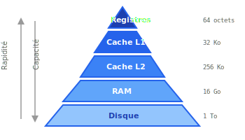

### L'écart de vitesse visualisé

Si on convertissait ces temps en échelle humaine, les registres seraient comme cligner des yeux (0.3 seconde), le cache L1 comme une seconde, le cache L2 comme 4 secondes, la RAM comme 1 minute 40 secondes, et accéder au SSD prendrait... **27 heures** !

Sans cache, le processeur passerait **99% de son temps à attendre** !

---

## La Solution : Le Principe de Localité

Les programmes ne lisent pas la mémoire au hasard. Ils suivent des **patterns** prévisibles.

### Localité Temporelle

**"Si j'utilise une donnée maintenant, je vais probablement la réutiliser bientôt"**

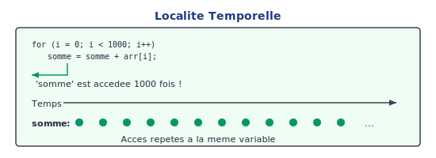

### Localité Spatiale

**"Si j'utilise une donnée, je vais probablement utiliser ses voisines"**

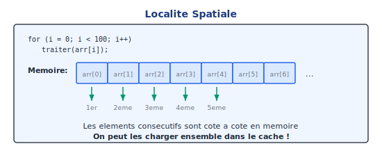

---

## Comment Fonctionne le Cache ?

### Les Lignes de Cache

Le cache stocke des **blocs** de données appelés **lignes de cache**, pas des octets individuels.

Quand vous demandez l'adresse 100, le cache charge **16 octets ensemble** (adresses 100 à 115). Ensuite, si vous demandez 101, 102, 103... c'est gratuit car déjà en cache !

### Structure d'une Ligne de Cache

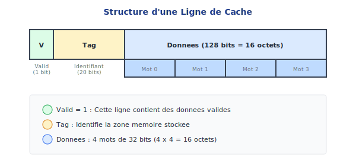

### Découpage d'une Adresse

Quand le CPU demande l'adresse `0x00001234`, comment le cache la trouve-t-il ?

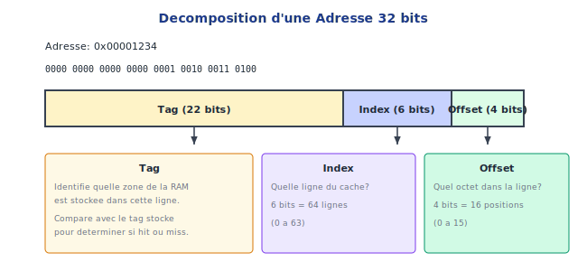

### Structure Complète du Cache

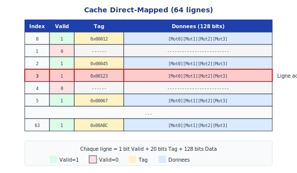

---

## Hit ou Miss : Que se passe-t-il ?

### Scénario 1 : Cache HIT (Succès)

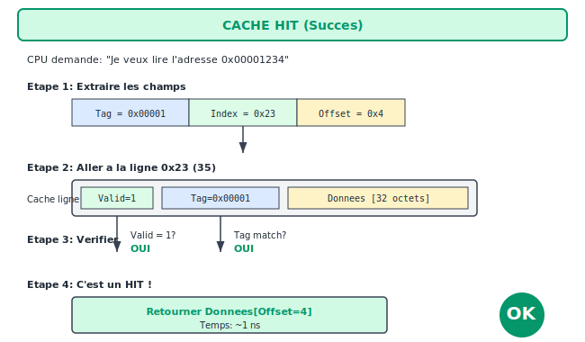

### Scénario 2 : Cache MISS (Échec)

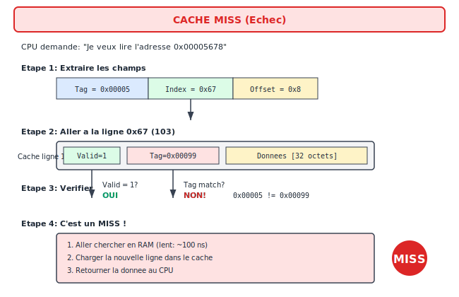

### Diagramme de Flux Complet

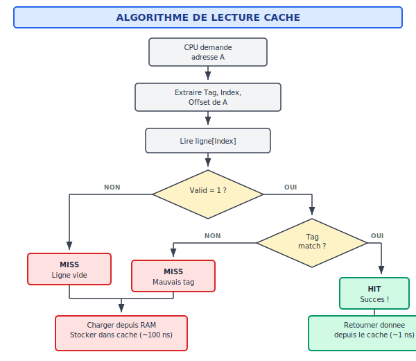

---

## Politiques d'Écriture

### Write-Through (Écriture Directe)

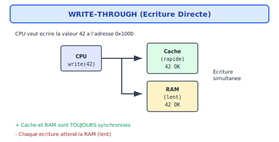

### Write-Back (Écriture Différée)

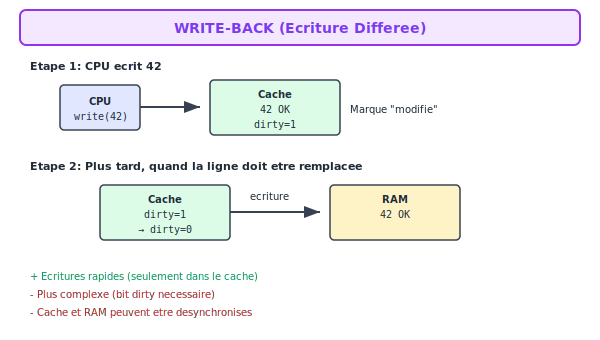

---

## Types de Cache : Direct-Mapped vs Associatif

### Cache Direct-Mapped (Correspondance Directe)

Dans un cache **direct-mapped**, chaque adresse mémoire correspond à **une seule ligne** possible dans le cache. C'est simple et rapide, mais peut causer des **conflits**.

```
Adresse → Index = (Adresse / Taille_Ligne) mod Nombre_Lignes

Exemple avec 4 lignes de cache :
- Adresse 0x000 → Ligne 0
- Adresse 0x100 → Ligne 0  ← Conflit !
- Adresse 0x200 → Ligne 0  ← Conflit !
```

**Problème** : Si votre programme alterne entre les adresses 0x000 et 0x100, chaque accès provoque un **miss** car elles partagent la même ligne !

### Cache Fully-Associatif

Un cache **fully-associatif** permet à chaque bloc de se placer **n'importe où** dans le cache.

```
┌─────────────────────────────────────────────────┐
│ Cache Fully-Associatif (4 lignes)              │
├─────────┬─────────┬─────────┬─────────┬────────┤
│ Entrée  │ Valid   │ Tag     │ Data    │ LRU    │
├─────────┼─────────┼─────────┼─────────┼────────┤
│ 0       │ 1       │ 0x000   │ ...     │ 3      │
│ 1       │ 1       │ 0x100   │ ...     │ 1      │  ← Coexistent !
│ 2       │ 1       │ 0x200   │ ...     │ 0      │
│ 3       │ 0       │ ---     │ ---     │ 2      │
└─────────┴─────────┴─────────┴─────────┴────────┘
```

**Avantage** : Pas de conflits, les adresses 0x000, 0x100 et 0x200 coexistent.
**Inconvénient** : Comparaison parallèle de tous les tags = hardware complexe et lent.

### Cache Set-Associatif (N-Way)

Compromis entre les deux : le cache est divisé en **ensembles (sets)**, chaque adresse peut aller dans **N lignes** différentes au sein de son set.

```
Cache 2-Way Set-Associatif (4 sets × 2 ways = 8 lignes)
┌────────────────────────────────────────────────────┐
│ Set 0: │ Way 0: [0x000, data] │ Way 1: [0x100, data] │
│ Set 1: │ Way 0: [0x040, data] │ Way 1: [libre]       │
│ Set 2: │ Way 0: [0x080, data] │ Way 1: [0x280, data] │
│ Set 3: │ Way 0: [0x0C0, data] │ Way 1: [libre]       │
└────────────────────────────────────────────────────┘

Index du Set = (Adresse / Taille_Ligne) mod Nombre_Sets
```

**Caches typiques des processeurs modernes** :
- L1 : 8-way associatif
- L2 : 8-16 way associatif
- L3 : 16-20 way associatif

---

## Politiques de Remplacement

Quand le cache est plein et qu'un nouveau bloc doit être chargé, **quel bloc évincer** ?

### LRU (Least Recently Used)

**Principe** : Évincer le bloc qui n'a pas été utilisé depuis le plus longtemps.

```
État initial (cache 4 lignes, ordre LRU : 3→2→1→0) :
┌────────┬──────────┬─────────┐
│ Ligne  │ Donnée   │ LRU     │
├────────┼──────────┼─────────┤
│ 0      │ Bloc A   │ 0 (MRU) │  ← Most Recently Used
│ 1      │ Bloc B   │ 1       │
│ 2      │ Bloc C   │ 2       │
│ 3      │ Bloc D   │ 3 (LRU) │  ← Least Recently Used
└────────┴──────────┴─────────┘

Accès au Bloc E (miss) → Évincer Bloc D (LRU = 3)
┌────────┬──────────┬─────────┐
│ 0      │ Bloc A   │ 1       │
│ 1      │ Bloc B   │ 2       │
│ 2      │ Bloc C   │ 3 (LRU) │
│ 3      │ Bloc E   │ 0 (MRU) │  ← Nouveau !
└────────┴──────────┴─────────┘
```

**Avantage** : Exploite bien la localité temporelle.
**Inconvénient** : Coûteux à implémenter pour N élevé (N! états possibles).

### Pseudo-LRU (Tree-PLRU)

Approximation de LRU utilisant un arbre binaire de bits.

```
Cache 4-way avec 3 bits de direction :

        [bit0]
       /      \
   [bit1]    [bit2]
   /   \     /   \
Way0  Way1 Way2  Way3

Chaque bit pointe vers le sous-arbre "moins récent".
Pour évincer : suivre les bits jusqu'à une feuille.
Pour mettre à jour : inverser les bits sur le chemin vers le way accédé.
```

### FIFO (First-In First-Out)

**Principe** : Évincer le bloc qui est dans le cache depuis le plus longtemps.

```
Ordre d'arrivée : A → B → C → D
Prochain miss : Évincer A (premier arrivé)
```

**Simple** mais ne tient pas compte de la fréquence d'utilisation.

### Random (Aléatoire)

**Principe** : Évincer un bloc au hasard.

```
Utilisé par : ARM Cortex-A9, certains L2 caches
```

**Avantage** : Hardware très simple, pas d'état à maintenir.
**Inconvénient** : Peut évincer des données utiles.

**Fait surprenant** : Random est souvent proche de LRU en pratique !

### Comparaison des Politiques

| Politique | Complexité HW | Performance | Cas d'utilisation |
|:----------|:--------------|:------------|:------------------|
| LRU       | Élevée        | Excellente  | L1 cache (petit) |
| PLRU      | Moyenne       | Très bonne  | L2/L3 cache |
| FIFO      | Faible        | Bonne       | TLB, caches simples |
| Random    | Très faible   | Correcte    | Grands caches |

---

## Caches Multi-Niveaux (L1/L2/L3)

Les processeurs modernes utilisent une **hiérarchie de caches** :

```
┌─────────────────────────────────────────────────────────┐
│                      CPU Core 0                         │
│  ┌─────────────────────────────────────────────────┐   │
│  │    L1-I (32 KB)        L1-D (32 KB)             │   │
│  │    Instructions        Données                   │   │
│  │    ~4 cycles           ~4 cycles                 │   │
│  └─────────────────────────────────────────────────┘   │
│                          ↓                              │
│  ┌─────────────────────────────────────────────────┐   │
│  │              L2 Unifié (256 KB)                  │   │
│  │              ~12 cycles                          │   │
│  └─────────────────────────────────────────────────┘   │
└─────────────────────────────────────────────────────────┘
                           ↓
┌─────────────────────────────────────────────────────────┐
│                 L3 Partagé (8-32 MB)                    │
│                 ~40 cycles                              │
│            (partagé entre tous les cores)               │
└─────────────────────────────────────────────────────────┘
                           ↓
┌─────────────────────────────────────────────────────────┐
│                    RAM (DDR4/DDR5)                      │
│                    ~200+ cycles                         │
└─────────────────────────────────────────────────────────┘
```

### Caractéristiques Typiques (2024)

| Niveau | Taille | Latence | Associativité | Partagé |
|:-------|:-------|:--------|:--------------|:--------|
| L1-I   | 32-64 KB | 4 cycles | 8-way | Non (par core) |
| L1-D   | 32-64 KB | 4-5 cycles | 8-12 way | Non (par core) |
| L2     | 256 KB-1 MB | 12-14 cycles | 8-16 way | Non (par core) |
| L3     | 8-96 MB | 30-50 cycles | 16-20 way | Oui (tous cores) |

### Politiques d'Inclusion

**Inclusive** : Tout ce qui est dans L1 est aussi dans L2 et L3.
- Avantage : Cohérence simple
- Inconvénient : Gaspillage d'espace

**Exclusive** : Les données ne sont que dans UN niveau à la fois.
- Avantage : Capacité totale = L1 + L2 + L3
- Inconvénient : Gestion plus complexe

**NINE (Non-Inclusive Non-Exclusive)** : Pas de garantie.
- Utilisé par Intel depuis Skylake pour les grands L3

---

## Patterns de Code et Localité

### Pattern 1 : Parcours Séquentiel (Localité Spatiale)

```c
// EXCELLENT : Accès séquentiels
int sum = 0;
for (int i = 0; i < 1000; i++) {
    sum += array[i];  // Adresses consécutives
}
// Hit rate ~94% (1 miss pour 16 hits si ligne = 64 octets, int = 4 octets)
```

### Pattern 2 : Accès avec Stride (Mauvaise Localité)

```c
// MAUVAIS : Stride de 64 octets = 1 ligne de cache
for (int i = 0; i < 1000; i += 16) {
    sum += array[i];  // Saute une ligne entière !
}
// Hit rate ~0% : chaque accès est un miss
```

### Pattern 3 : Réutilisation de Variables (Localité Temporelle)

```c
// BON : Même variable réutilisée
int accumulator = 0;
for (int i = 0; i < 1000; i++) {
    accumulator += array[i];
    accumulator *= 2;
    accumulator -= 1;  // 'accumulator' reste en registre/L1
}

// MAUVAIS : Variable différente à chaque fois
for (int i = 0; i < 1000; i++) {
    temps[i] = array[i] * 2;  // Écrit dans tout le tableau
}
for (int i = 0; i < 1000; i++) {
    result += temps[i];       // Relit tout le tableau
}
```

### Pattern 4 : Structure de Données Cache-Friendly

```c
// MAUVAIS : Array of Structures (AoS)
struct Particule {
    float x, y, z;      // Position
    float vx, vy, vz;   // Vitesse (souvent inutilisé)
    float mass;
    int type;
};
Particule particles[10000];

for (int i = 0; i < 10000; i++) {
    particles[i].x += particles[i].vx;  // Charge 32 octets, utilise 8
}

// BON : Structure of Arrays (SoA)
struct Particules {
    float x[10000];
    float y[10000];
    float z[10000];
    float vx[10000];
    // ...
};
Particules p;

for (int i = 0; i < 10000; i++) {
    p.x[i] += p.vx[i];  // Accès séquentiel, 100% utile
}
```

### Pattern 5 : Loop Tiling / Blocking

```c
// NAÏF : Multiplication de matrices
for (int i = 0; i < N; i++) {
    for (int j = 0; j < N; j++) {
        for (int k = 0; k < N; k++) {
            C[i][j] += A[i][k] * B[k][j];  // B[k][j] : accès par colonne !
        }
    }
}

// OPTIMISÉ : Blocking (blocs de 32×32)
#define BLOCK 32
for (int ii = 0; ii < N; ii += BLOCK) {
    for (int jj = 0; jj < N; jj += BLOCK) {
        for (int kk = 0; kk < N; kk += BLOCK) {
            // Traiter le bloc [ii:ii+BLOCK, jj:jj+BLOCK]
            for (int i = ii; i < ii + BLOCK; i++) {
                for (int j = jj; j < jj + BLOCK; j++) {
                    for (int k = kk; k < kk + BLOCK; k++) {
                        C[i][j] += A[i][k] * B[k][j];
                    }
                }
            }
        }
    }
}
// Le bloc de B tient en cache → réutilisé N/BLOCK fois
```

---

## Modélisation des Performances

### Temps d'Accès Moyen (AMAT)

```
AMAT = Hit_Time + Miss_Rate × Miss_Penalty

Exemple :
- Hit Time L1 = 4 cycles
- Miss Rate L1 = 5%
- Miss Penalty (accès L2) = 12 cycles

AMAT = 4 + 0.05 × 12 = 4.6 cycles
```

### AMAT Multi-Niveaux

```
AMAT = Hit_Time_L1 + Miss_Rate_L1 × (
         Hit_Time_L2 + Miss_Rate_L2 × (
           Hit_Time_L3 + Miss_Rate_L3 × RAM_Latency
         )
       )

Exemple réaliste :
- L1 : 4 cycles, 5% miss
- L2 : 12 cycles, 20% miss (de ce qui arrive en L2)
- L3 : 40 cycles, 30% miss
- RAM : 200 cycles

AMAT = 4 + 0.05 × (12 + 0.20 × (40 + 0.30 × 200))
     = 4 + 0.05 × (12 + 0.20 × (40 + 60))
     = 4 + 0.05 × (12 + 20)
     = 4 + 0.05 × 32
     = 4 + 1.6
     = 5.6 cycles

Sans cache : 200 cycles → Le cache accélère par 35× !
```

### Exercice de Calcul

Calculez l'AMAT pour ce système :
- L1 : 3 cycles, miss rate 8%
- L2 : 10 cycles, miss rate 25%
- RAM : 150 cycles

Solution :
```
AMAT = 3 + 0.08 × (10 + 0.25 × 150)
     = 3 + 0.08 × (10 + 37.5)
     = 3 + 0.08 × 47.5
     = 3 + 3.8
     = 6.8 cycles
```

---

## Impact sur vos Programmes

### Parcours de Tableaux 2D : L'Ordre Compte !

Une matrice 4x4 est stockée **ligne par ligne** en mémoire (row-major) :

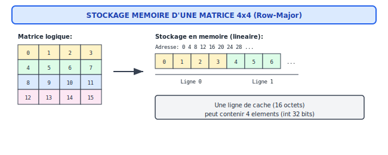

### Parcours Row-Major (En Ligne) - EFFICACE

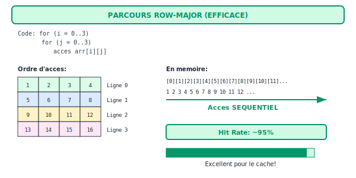

### Parcours Column-Major (En Colonne) - INEFFICACE

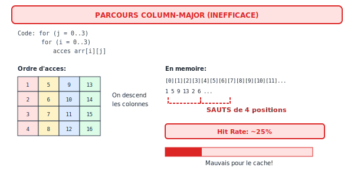

### Comparaison Visuelle

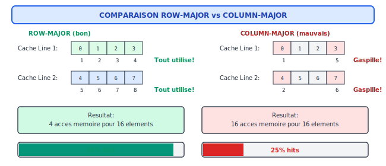

### Technique du Blocking

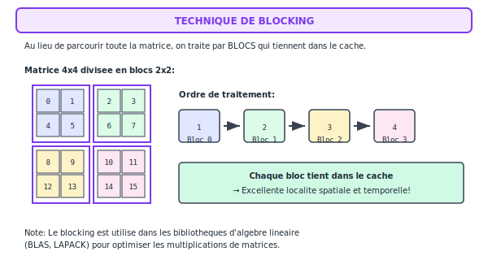

---

## Implémentation HDL du Cache

### Architecture Globale

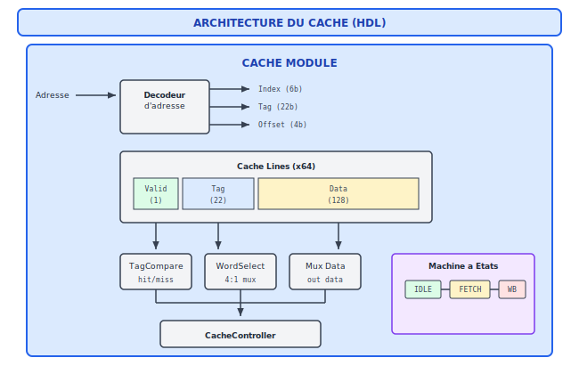

### Machine à États du Contrôleur

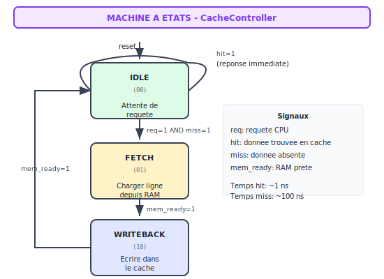

### WordSelect : Sélection du Mot

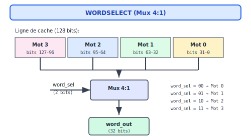

---

## Statistiques et Performance

### Calcul du Hit Rate

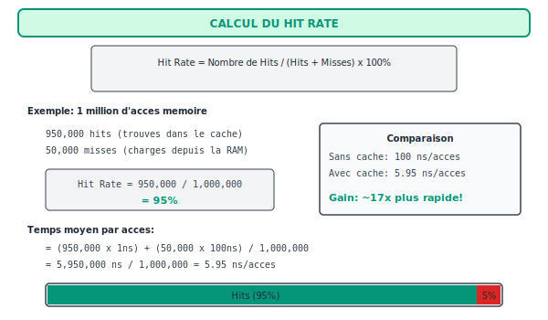

---

## Visualiser le Cache avec le CPU Visualizer

Le **CPU Visualizer** vous permet d'observer le comportement du cache en temps réel pendant l'exécution d'un programme.

### Accéder au Visualizer

```bash
cd web
npm run dev
# Ouvrir http://localhost:5173 -> CPU Visualizer
```

### La Démo "Cache"

Chargez la démo **"7. Cache"** dans le menu déroulant. Ce programme :
1. Parcourt un tableau de 16 éléments une première fois (cache misses)
2. Parcourt le même tableau une seconde fois (cache hits)

### Ce que vous verrez

**Panneau "Cache L1"** :
- **Hits** : Nombre d'accès trouvés dans le cache
- **Misses** : Nombre d'accès qui ont dû aller en RAM
- **Taux** : Pourcentage de hits (ex: "94.2%")
- **Indicateur HIT/MISS** : Flash vert pour hit, rouge pour miss

**Contenu du cache** :
- **Ligne** : Numéro de la ligne (0-63)
- **Valid** : 1 si la ligne contient des données valides
- **Tag** : Identifie quelle zone mémoire est stockée
- **Données** : Le mot stocké dans la ligne

### Exercice Pratique

1. Lancez la démo "Cache" et observez :
   - Au premier parcours : beaucoup de **MISS** (flash rouge)
   - Au second parcours : beaucoup de **HIT** (flash vert)

2. Regardez le taux de hits évoluer :
   - Début : ~0% (cache vide)
   - Après premier parcours : ~50%
   - Fin : ~85-95%

3. Observez les lignes de cache se remplir :
   - Les bits Valid passent de 0 à 1
   - Les Tags s'affichent
   - Les données apparaissent

---

## Exercices

### Exercices HDL

| Exercice | Description |
|:---------|:------------|
| **CacheLine** | Implémenter une ligne de cache avec valid, tag, data |
| **TagCompare** | Comparateur de tags pour détecter hit/miss |
| **WordSelect** | Sélecteur de mot (4:1) dans une ligne 128 bits |
| **CacheController** | Machine à états (IDLE, FETCH, WRITEBACK) |

### Exercices Assembleur A32

| Exercice | Description | Résultat |
|:---------|:------------|:---------|
| **Accès Séquentiel** | Parcours cache-friendly d'un tableau | R0 = 100 |
| **Accès avec Stride** | Parcours avec sauts (moins efficace) | R0 = 28 |
| **Réutilisation Registre** | Garder les données en registre | R0 = 91 |

### Exercices C32

| Exercice | Description | Résultat |
|:---------|:------------|:---------|
| **Parcours en Ligne** | Accès row-major (cache-friendly) | 120 |
| **Parcours en Colonne** | Accès column-major (moins efficace) | 120 |
| **Traitement par Blocs** | Technique de blocking | 120 |
| **Localité Temporelle** | Réutiliser les données | 30 |

---

## Résumé Visuel

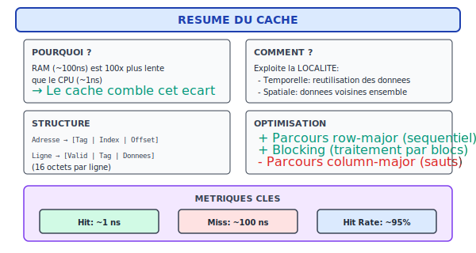

---

## Points Clés à Retenir

1. **La RAM est lente** : ~100x plus lente que le cache
2. **Le cache exploite la localité** : temporelle et spatiale
3. **L'ordre d'accès compte** : row-major >> column-major
4. **Réutilisez les données** : gardez-les en registre ou en cache
5. **Pensez en blocs** : traitez des données qui tiennent dans le cache

Ces principes s'appliquent à tous les niveaux de programmation, du code assembleur aux applications modernes !

---

## Auto-évaluation

Testez votre compréhension du cache.

### Questions de compréhension

**Q1.** Qu'est-ce que la localité temporelle et la localité spatiale ?

**Q2.** Pourquoi le parcours en ligne (row-major) est-il plus efficace que le parcours en colonne ?

**Q3.** Qu'est-ce qu'un cache hit et un cache miss ?

**Q4.** Comment fonctionne un cache direct-mapped ?

**Q5.** Qu'est-ce que la technique de "blocking" ?

### Mini-défi pratique

Calculez le hit rate pour ce pattern d'accès avec un cache de 4 lignes de 16 octets :

Accès séquentiels aux adresses : 0, 4, 8, 12, 16, 20, 24, 28, 0, 4, 8, 12

*Les solutions se trouvent dans le document **Codex_Solutions**.*

### Checklist de validation

- [ ] Expliquer la différence entre localité temporelle et spatiale
- [ ] Comprendre pourquoi le cache existe (hiérarchie mémoire)
- [ ] Calculer un hit rate simple
- [ ] Optimiser un parcours de tableau pour le cache
- [ ] Appliquer la technique de blocking sur une matrice
