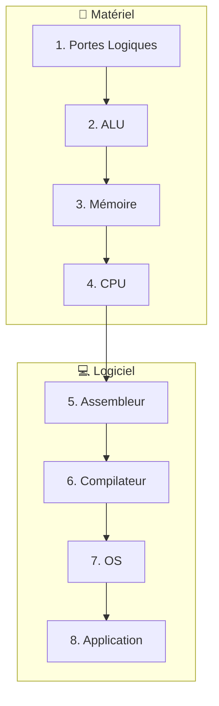
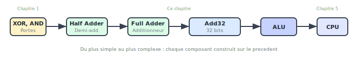

<!-- _class: lead -->

# Chapitre 00 : Introduction

**Du NAND au Tetris — Construire un ordinateur de zéro**

---

# 🎯 Accroche : Le Mystère de l'Ordinateur

Que se passe-t-il quand vous tapez une lettre sur votre clavier ?

<div class="columns">
<div>

1. Vos doigts appuient sur une touche physique
2. Un signal électrique est envoyé
3. Ce signal est transformé en code numérique

</div>
<div>

4. Le processeur le détecte et l'interprète
5. Un programme décide quoi faire
6. Des pixels s'allument sur votre écran

</div>
</div>

<div class="key-concept">
<div class="key-concept-title">Entre votre doigt et le pixel</div>
Des dizaines de couches d'abstraction invisibles
</div>

---

# Le Problème de la "Boîte Noire"

L'ordinateur est une boîte noire. Nous tapons, et la magie opère.

**Combien de développeurs savent vraiment :**

<div class="columns">
<div>

- Comment le processeur exécute leur code ?
- Pourquoi certaines opérations sont rapides et d'autres lentes ?

</div>
<div>

- Ce qui se passe quand on écrit `x = 5` ?
- Comment une image apparaît à l'écran ?

</div>
</div>

<div class="callout callout-warning">
<div class="callout-title">⚠️ Le problème</div>
Impossible d'optimiser ce qu'on ne comprend pas
</div>

---

# Notre Mission : Briser l'Abstraction

Nous allons descendre au niveau le plus bas — **la porte logique** — et remonter couche par couche.

À la fin, quand vous verrez du code s'exécuter, vous saurez **exactement** ce qui se passe.

<div class="definition">
<div class="definition-term">Philosophie du cours</div>
<div class="definition-text">Ce n'est plus de la magie — c'est de l'ingénierie que vous maîtrisez.</div>
</div>

---

# Les 8 Couches d'Abstraction

<div class="figure">

<div class="figure-caption">Du transistor à l'application — 8 niveaux d'abstraction</div>
</div>

---

# Détail des Couches



Chaque niveau ne voit que celui juste en dessous !

---

# La Beauté de l'Abstraction

Chaque couche a une propriété remarquable :

**Elle n'a besoin de connaître que la couche juste en dessous.**

<div class="columns">
<div>

- Le programmeur C32 n'a pas besoin de savoir comment fonctionne l'ALU
- L'ALU n'a pas besoin de savoir qu'elle sera utilisée pour un jeu

</div>
<div>

- La porte NAND ne "sait" pas qu'elle fait partie d'un ordinateur
- Cette ignorance permet la **complexité maîtrisée**

</div>
</div>

---

# Notre Feuille de Route

<div class="figure">

<div class="figure-caption">Progression du projet — du NAND au Tetris</div>
</div>

---

# Du NAND au CPU

<div class="figure">

<div class="figure-caption">Comment une simple porte devient un processeur complet</div>
</div>

---

# L'Architecture nand2c A32

Notre ordinateur s'inspire des architectures **ARM modernes** :

| Caractéristique | Hack (Original) | nand2c (Ce projet) |
|:----------------|:----------------|:-------------------|
| Architecture    | 16-bits         | **32-bits**        |
| Registres       | 2 (A et D)      | **16 (R0-R15)**    |
| Mémoire         | Séparée         | **Unifiée**        |
| Instructions    | Propriétaire    | **RISC moderne**   |

---

# Pont avec ARM

<div class="callout callout-arm">
Les processeurs ARM Cortex de vos smartphones utilisent aussi 16 registres (R0-R15) et une architecture RISC.
</div>

**Comprendre nand2c, c'est comprendre ARM.**

Les mêmes concepts s'appliquent :
- Load/Store architecture
- Registres généraux
- Flags (N, Z, C, V)
- Pipeline d'exécution

---

# Ce que Vous Allez Apprendre

<div class="columns">
<div>

**Au niveau matériel :**
- Construire des portes logiques à partir de NAND
- Comment un additionneur transforme des bits en nombres
- Comment la mémoire "se souvient" des données
- Comment le CPU orchestre tout cela

</div>
<div>

**Au niveau logiciel :**
- Comment l'assembleur traduit en binaire
- Comment un compilateur transforme du code
- Comment un OS simplifie l'accès au matériel

</div>
</div>

---

# Objectifs Détaillés par Chapitre

| Ch. | Objectif Principal | Livrable |
|:---:|:-------------------|:---------|
| 01 | Construire toutes les portes depuis NAND | 15 composants HDL |
| 02 | Créer l'ALU complète | Additionneur + ALU |
| 03 | Implémenter la mémoire | Registres + RAM |
| 04 | Comprendre l'architecture | Jeu d'instructions |
| 05 | Assembler le CPU | Processeur complet |
| 06 | Programmer en assembleur | Programme fonctionnel |

---

# Vos Outils

| Outil | Rôle |
|:------|:-----|
| `hdl_cli` | Simule vos circuits HDL |
| `a32_cli` | Assemble le code A32 → binaire |
| `c32_cli` | Compile le code C32 → assembleur |
| **Simulateur Web** | Interface visuelle pour tout |
| **CPU Visualizer** | Voir le CPU en action |

<div class="callout callout-tip">
<div class="callout-title">Installation</div>
<code>cd seed && cargo build --release</code>
</div>

---

# Le Simulateur Web

Pour une expérience **visuelle et interactive** :

<div class="columns">
<div>

- Écrire et tester votre HDL dans le navigateur
- Voir l'état des signaux en temps réel
- Compiler et exécuter du code C et Assembleur

</div>
<div>

- Visualiser l'écran, les registres et la mémoire
- Mode pas-à-pas pour le débogage
- Export/Import de fichiers

</div>
</div>

```bash
cd web && npm run dev
# → http://localhost:5173
```

---

# Le CPU Visualizer

Outil pédagogique pour comprendre le processeur :

<div class="columns">
<div>

- **Pipeline** : Les 5 étapes d'exécution s'illuminent
- **Registres** : R0-R15 avec mise en évidence des modifications

</div>
<div>

- **Flags** : N, Z, C, V animés
- **Cache** : Statistiques hits/misses

</div>
</div>

👉 Accessible via `/visualizer.html`

---

# Plan du Cours

| Chapitre | Sujet | Couche | Durée estimée |
|:---------|:------|:-------|:--------------|
| 01 | Logique Booléenne | Portes | 2h |
| 02 | Arithmétique | ALU | 2h |
| 03 | Mémoire | RAM, Registres | 2h |
| 04 | Architecture | Structure CPU | 2h |
| 05 | CPU | Implémentation | 3h |
| 06 | Assembleur | Programmation | 2h |

---

# Comment Réussir

<div class="process-step">
<div class="step-number">1</div>
<div class="step-content">
<div class="step-title">Lisez chaque chapitre en entier</div>
Avant les exercices — comprenez le contexte
</div>
</div>

<div class="process-step">
<div class="step-number">2</div>
<div class="step-content">
<div class="step-title">Faites les exercices dans l'ordre</div>
Chaque exercice prépare le suivant
</div>
</div>

<div class="process-step">
<div class="step-number">3</div>
<div class="step-content">
<div class="step-title">Ne regardez pas les solutions</div>
Avant d'avoir vraiment essayé (30 min minimum)
</div>
</div>

---

# Conseils Pratiques

<div class="columns">
<div>

<div class="callout callout-tip">
<div class="callout-title">Utilisez le simulateur</div>
La visualisation aide énormément à comprendre
</div>

</div>
<div>

<div class="callout callout-note">
<div class="callout-title">Reliez à l'ensemble</div>
Demandez-vous toujours : "où cela s'insère-t-il ?"
</div>

</div>
</div>

<div class="callout callout-warning">
<div class="callout-title">Piège classique</div>
Ne pas comprendre l'abstraction = être bloqué aux chapitres suivants
</div>

---

# La Grande Aventure Commence

Vous êtes sur le point d'entreprendre un voyage fascinant.

Quand vous aurez terminé, vous regarderez votre ordinateur différemment.

<div class="key-concept">
<div class="key-concept-title">Promesse du cours</div>
Ce ne sera plus une boîte noire mystérieuse, mais une symphonie d'abstractions que vous pouvez comprendre, modifier, et reconstruire.
</div>

**Prêt ? Passons à la première brique : la logique booléenne.**

---

<!-- _class: question -->

# Questions ?

📚 **Références :**
- Livre Seed, Chapitre 00 - Introduction
- Simulateur Web : `npm run dev`

👉 **Prochain chapitre :** Logique Booléenne
