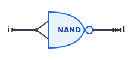
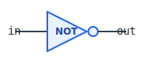
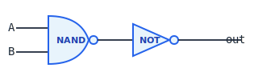
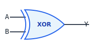

<!-- _class: lead -->

# Chapitre 01 : Logique Booléenne

> "Au commencement était le NAND."

---

# 🎯 Où en sommes-nous ?

<div class="figure">

<div class="figure-caption">Les 8 couches d'abstraction — nous sommes à la couche 1</div>
</div>

Nous posons les **fondations** de tout l'édifice !

---

# Pourquoi le Binaire ?

**Question :** Pourquoi 0 et 1, pas 0-9 ?

<div class="columns">
<div>

**Réponses :**

1. **Fiabilité** : Distinguer 2 états est plus robuste que 10
2. **Simplicité** : Un transistor = un interrupteur (on/off)
3. **Universalité** : George Boole (1854) : toute logique = Vrai/Faux

</div>
<div>

<div class="key-concept">
<div class="key-concept-title">💡 Concept Clé</div>
Moins d'états = plus de tolérance au bruit électrique
</div>

</div>
</div>

---

# Du Voltage au Bit

| Tension | Signification |
|---------|---------------|
| 0V - 0.8V | `0` (Faux) |
| 2.4V - 3.3V | `1` (Vrai) |

La zone 0.8V-2.4V est **interdite** — c'est cette séparation nette qui rend le binaire robuste.

<div class="callout callout-vhdl">
On retrouve <code>'0'</code> et <code>'1'</code> comme valeurs de type <code>std_logic</code>.
</div>

---

# La Porte NAND : Notre Axiome

**Pourquoi partir du NAND ?**

<div class="columns">
<div>

1. **Complétude fonctionnelle** : TOUTES les portes peuvent être construites à partir de NAND
2. **Réalité physique** : En CMOS, NAND = seulement 4 transistors
3. **Pédagogie** : Une seule brique → comprendre l'abstraction

</div>
<div class="figure">

<div class="figure-caption">Symbole de la porte NAND</div>
</div>
</div>

---

# Table de Vérité NAND

<div class="columns">
<div>

<table class="truth-table">
<tr><th>A</th><th>B</th><th>NAND(A, B)</th></tr>
<tr><td>0</td><td>0</td><td>1</td></tr>
<tr><td>0</td><td>1</td><td>1</td></tr>
<tr><td>1</td><td>0</td><td>1</td></tr>
<tr><td>1</td><td>1</td><td>0</td></tr>
</table>

</div>
<div>

<div class="definition">
<div class="definition-term">Règle NAND</div>
<div class="definition-text">Le résultat est <code>0</code> <em>seulement si</em> A <strong>et</strong> B sont à <code>1</code>.</div>
</div>

**NAND** = "**N**ot-**AND**" = inverse d'un AND

</div>
</div>

---

# Universalité du NAND

```
            ┌───► NOT ───┐
            │            ├───► XOR
NAND ───────┼───► AND ───┤
            │            ├───► MUX
            └───► OR ────┤
                         └───► DMUX
```

<div class="callout callout-tip">
<div class="callout-title">Théorème de complétude</div>
Toute fonction booléenne peut être exprimée uniquement avec des portes NAND.
</div>

---

# Construction : NOT (Inverseur)

**Astuce :** Connecter le même signal aux deux entrées !

<div class="columns">
<div>

<div class="figure">

<div class="figure-caption">NOT = NAND(a, a)</div>
</div>

</div>
<div>

**Vérification :**
- Si `in = 0` : NAND(0, 0) = **1** ✓
- Si `in = 1` : NAND(1, 1) = **0** ✓

<table class="truth-table">
<tr><th>in</th><th>NOT(in)</th></tr>
<tr><td>0</td><td>1</td></tr>
<tr><td>1</td><td>0</td></tr>
</table>

</div>
</div>

---

# Symbole de la porte NOT

<div class="figures-row">
<div class="figure">

<div class="figure-caption">Symbole standard de l'inverseur</div>
</div>
</div>

<div class="callout callout-vhdl">
En VHDL : <code>y &lt;= not a;</code>
</div>

---

# Construction : AND

**Insight :** NOT(NAND(A, B)) = AND(A, B)

<div class="columns">
<div>

<div class="figure">

<div class="figure-caption">AND = NOT(NAND(a, b))</div>
</div>

</div>
<div>

<table class="truth-table">
<tr><th>A</th><th>B</th><th>AND</th></tr>
<tr><td>0</td><td>0</td><td>0</td></tr>
<tr><td>0</td><td>1</td><td>0</td></tr>
<tr><td>1</td><td>0</td><td>0</td></tr>
<tr><td>1</td><td>1</td><td>1</td></tr>
</table>

</div>
</div>

---

# Symbole de la porte AND

<div class="figures-row">
<div class="figure">

<div class="figure-caption">Symbole standard de la porte AND</div>
</div>
</div>

<div class="callout callout-vhdl">
En VHDL : <code>y &lt;= a and b;</code>
</div>

---

# Construction : OR

**Théorème de De Morgan :**

```
A OR B = NOT( (NOT A) AND (NOT B) )
       = (NOT A) NAND (NOT B)
```

<div class="columns">
<div>

<div class="figure">

<div class="figure-caption">OR avec 3 portes NAND</div>
</div>

</div>
<div>

<table class="truth-table">
<tr><th>A</th><th>B</th><th>OR</th></tr>
<tr><td>0</td><td>0</td><td>0</td></tr>
<tr><td>0</td><td>1</td><td>1</td></tr>
<tr><td>1</td><td>0</td><td>1</td></tr>
<tr><td>1</td><td>1</td><td>1</td></tr>
</table>

</div>
</div>

---

# Symbole de la porte OR

<div class="figures-row">
<div class="figure">

<div class="figure-caption">Symbole standard de la porte OR</div>
</div>
</div>

<div class="callout callout-vhdl">
En VHDL : <code>y &lt;= a or b;</code>
</div>

---

# Construction : XOR (Ou Exclusif)

<div class="columns">
<div>

**Rôles cruciaux du XOR :**
- Addition binaire (somme sans retenue)
- Comparaison (bits différents ?)
- Cryptage (chiffrement par flux)
- Calcul de parité

</div>
<div>

<table class="truth-table">
<tr><th>A</th><th>B</th><th>XOR</th></tr>
<tr><td>0</td><td>0</td><td>0</td></tr>
<tr><td>0</td><td>1</td><td>1</td></tr>
<tr><td>1</td><td>0</td><td>1</td></tr>
<tr><td>1</td><td>1</td><td>0</td></tr>
</table>

</div>
</div>

<div class="key-concept">
<div class="key-concept-title">Règle XOR</div>
Sortie = 1 si et seulement si les entrées sont <strong>différentes</strong>
</div>

---

# XOR : Détail de Construction

**Formule :** `A XOR B = (A AND NOT B) OR (NOT A AND B)`

<div class="columns">
<div>

<div class="figure">

<div class="figure-caption">Symbole de la porte XOR</div>
</div>

</div>
<div>

**Autre formule équivalente :**
`A XOR B = (A OR B) AND NOT(A AND B)`

<div class="callout callout-vhdl">
En VHDL : <code>y &lt;= a xor b;</code>
</div>

</div>
</div>

---

# XOR : Propriétés Utiles

| Propriété | Expression | Usage |
|-----------|------------|-------|
| Identité | `A XOR 0 = A` | Masquage sélectif |
| Inversion | `A XOR 1 = NOT A` | Inversion conditionnelle |
| Auto-inverse | `A XOR A = 0` | Mise à zéro rapide |
| Commutativité | `A XOR B = B XOR A` | Simplification |
| Associativité | `(A XOR B) XOR C = A XOR (B XOR C)` | Parité |

<div class="callout callout-arm">
En ARM, l'instruction <code>EOR</code> (Exclusive OR) utilise ces propriétés : <code>EOR R0, R0, R0</code> met R0 à zéro en 1 cycle.
</div>

---

# Le Multiplexeur (Mux) — L'Aiguilleur

**Le composant le plus important !**

<div class="columns">
<div>

- Si `sel == 0` → `out = a`
- Si `sel == 1` → `out = b`

**Formule :**
`out = (a AND NOT sel) OR (b AND sel)`

</div>
<div class="figure">

<div class="figure-caption">Mux 2:1</div>
</div>
</div>

---

# Pourquoi le Mux est Crucial ?

Dans un CPU, à chaque cycle il faut choisir :

<div class="columns">
<div>

- **D'où vient l'opérande ?**
  - Mémoire ou registre ?
- **Où va le résultat ?**
  - Mémoire ou registre ?
- **Quelle instruction ?**
  - ADD, SUB, AND... ?

**Chaque choix = un Mux !**

</div>
<div>

<div class="callout callout-arm">
Le CPU ARM utilise des Mux pour sélectionner parmi les registres R0-R15. Le champ de registre (4 bits) commande un Mux 16:1.
</div>

</div>
</div>

---

# Mux Étendu : Mux4Way, Mux8Way

Pour sélectionner parmi N entrées, il faut log₂(N) bits de sélection :

| Mux | Entrées | Bits sel |
|-----|---------|----------|
| Mux2 | 2 | 1 |
| Mux4 | 4 | 2 |
| Mux8 | 8 | 3 |
| Mux16 | 16 | 4 |

<div class="callout callout-tip">
<div class="callout-title">Construction hiérarchique</div>
Un Mux4Way = 3 Mux2Way en arbre
</div>

---

# Le Démultiplexeur (DMux)

**L'inverse du Mux** : 1 entrée → N sorties

<div class="columns">
<div>

- Si `sel == 0` → `a = in, b = 0`
- Si `sel == 1` → `a = 0, b = in`

**Usages :**
- Adressage mémoire
- Routage des signaux
- Décodage d'instructions

</div>
<div class="figure">

<div class="figure-caption">DMux 1:2</div>
</div>
</div>

---

# Portes Multi-Bits (Bus)

Pour traiter des mots de 32 bits en parallèle :

<div class="columns">
<div>

```vhdl
entity And32 is
  port(
    a : in bits(31 downto 0);
    b : in bits(31 downto 0);
    y : out bits(31 downto 0)
  );
end entity;
```

</div>
<div>

```vhdl
architecture rtl of And32 is
begin
  gen: for i in 0 to 31 generate
    u: And2 port map (
      a => a(i),
      b => b(i),
      y => y(i)
    );
  end generate;
end architecture;
```

</div>
</div>

---

# Notion de Bus

<div class="definition">
<div class="definition-term">Bus</div>
<div class="definition-text">Groupe de fils transportant des données multi-bits en parallèle. Notation : <code>bits(31 downto 0)</code> = 32 fils.</div>
</div>

<div class="columns">
<div>

**Avantages :**
- Transfert parallèle (32 bits/cycle)
- Notation compacte
- Opérations vectorielles

</div>
<div>

**Exemples de bus :**
- Bus de données : 32 bits
- Bus d'adresse : 32 bits
- Bus de contrôle : 8-16 bits

</div>
</div>

---

# Portes Multi-Entrées

**Or8Way :** Teste si au moins 1 bit parmi 8 est à 1

```
Or8Way(a[0..7]) = a[0] OR a[1] OR ... OR a[7]
```

**Construction en arbre** (3 niveaux au lieu de 7) :

```
Niveau 1:  Or2(a[0],a[1])→t0  Or2(a[2],a[3])→t1 ...
Niveau 2:  Or2(t0, t1) → t4   Or2(t2, t3) → t5
Niveau 3:  Or2(t4, t5) → sortie
```

<div class="callout callout-tip">
<div class="callout-title">Pourquoi l'arbre ?</div>
Profondeur log₂(N) au lieu de N-1 → moins de délai de propagation
</div>

---

# HDL : Description Matérielle

```vhdl
entity And2 is
  port(
    a : in bit;
    b : in bit;
    y : out bit
  );
end entity;

architecture rtl of And2 is
  component Nand port(a,b: in bit; y: out bit); end component;
  component Inv port(a: in bit; y: out bit); end component;
  signal w : bit;
begin
  u1: Nand port map (a => a, b => b, y => w);
  u2: Inv port map (a => w, y => y);
end architecture;
```

---

# Pont avec VHDL Professionnel

<div class="callout callout-vhdl">

| nand2c HDL | VHDL standard |
|------------|---------------|
| `bit` | `std_logic` |
| `bits(31 downto 0)` | `std_logic_vector(31 downto 0)` |
| `port map` | Identique ! |
| `for generate` | Identique ! |

**Vous apprenez la vraie syntaxe VHDL !**

</div>

---

# Exemple Tracé : Calcul AND

Traçons `AND(1, 0)` pas à pas :

<div class="process-step">
<div class="step-number">1</div>
<div class="step-content">
<div class="step-title">Entrées</div>
A = 1, B = 0
</div>
</div>

<div class="process-step">
<div class="step-number">2</div>
<div class="step-content">
<div class="step-title">NAND(A, B)</div>
NAND(1, 0) = 1
</div>
</div>

<div class="process-step">
<div class="step-number">3</div>
<div class="step-content">
<div class="step-title">NOT du résultat</div>
NOT(1) = 0 → AND(1, 0) = <strong>0</strong> ✓
</div>
</div>

---

# Exemple Tracé : Calcul Mux

Traçons `Mux(a=1, b=0, sel=1)` :

<div class="columns">
<div>

<div class="process-step">
<div class="step-number">1</div>
<div class="step-content">
NOT(sel) = NOT(1) = 0
</div>
</div>

<div class="process-step">
<div class="step-number">2</div>
<div class="step-content">
a AND NOT(sel) = 1 AND 0 = 0
</div>
</div>

</div>
<div>

<div class="process-step">
<div class="step-number">3</div>
<div class="step-content">
b AND sel = 0 AND 1 = 0
</div>
</div>

<div class="process-step">
<div class="step-number">4</div>
<div class="step-content">
0 OR 0 = <strong>0</strong>
</div>
</div>

</div>
</div>

Résultat : `out = b = 0` quand `sel = 1` ✓

---

# Du NAND au CPU : La Feuille de Route

<div class="figure">

<div class="figure-caption">Progression à travers les chapitres</div>
</div>

---

# Rôle de Chaque Porte dans le CPU

| Porte | Rôle dans le CPU |
|-------|------------------|
| **NOT** | Soustraction (complément à 2), inversion de condition |
| **AND** | Masquage de bits, conditions ET, extraction de champs |
| **OR** | Combinaison de signaux, conditions OU |
| **XOR** | Addition bit à bit, comparaison, parité |
| **Mux** | Tous les choix du datapath |
| **DMux** | Adressage mémoire, décodage instruction |

---

# Questions de Réflexion

<div class="columns">
<div>

1. Pourquoi le NAND est-il préféré au NOR en CMOS ?

2. Combien de portes NAND faut-il pour un XOR ?

3. Quel est l'avantage d'un Mux large (16:1) vs plusieurs petits ?

</div>
<div>

4. Comment faire un Mux 4:1 avec des Mux 2:1 ?

5. Quelle est la profondeur d'un Or16Way en arbre ?

</div>
</div>

---

# Synthèse des Portes

<table class="truth-table">
<tr><th>A</th><th>B</th><th>NAND</th><th>AND</th><th>OR</th><th>XOR</th></tr>
<tr><td>0</td><td>0</td><td>1</td><td>0</td><td>0</td><td>0</td></tr>
<tr><td>0</td><td>1</td><td>1</td><td>0</td><td>1</td><td>1</td></tr>
<tr><td>1</td><td>0</td><td>1</td><td>0</td><td>1</td><td>1</td></tr>
<tr><td>1</td><td>1</td><td>0</td><td>1</td><td>1</td><td>0</td></tr>
</table>

<div class="callout callout-note">
<div class="callout-title">Mnémotechnique</div>
<strong>AND</strong> = tous à 1 | <strong>OR</strong> = au moins un à 1 | <strong>XOR</strong> = nombre impair de 1
</div>

---

<!-- _class: summary -->

# Ce qu'il faut retenir

1. **Le binaire simplifie** : 2 états plus fiables que 10
2. **NAND est universel** : Toutes les portes en découlent
3. **L'abstraction est puissante** : Couches les unes sur les autres
4. **Mux = choix, DMux = routage**
5. **XOR = addition, comparaison, parité**
6. **Bus = traitement parallèle de plusieurs bits**

---

<!-- _class: question -->

# Questions ?

📚 **Référence :** Livre Seed, Chapitre 01 - Logique Booléenne

👉 **Exercices :** TD et TP disponibles

**Prochain chapitre :** Arithmétique (ALU)
