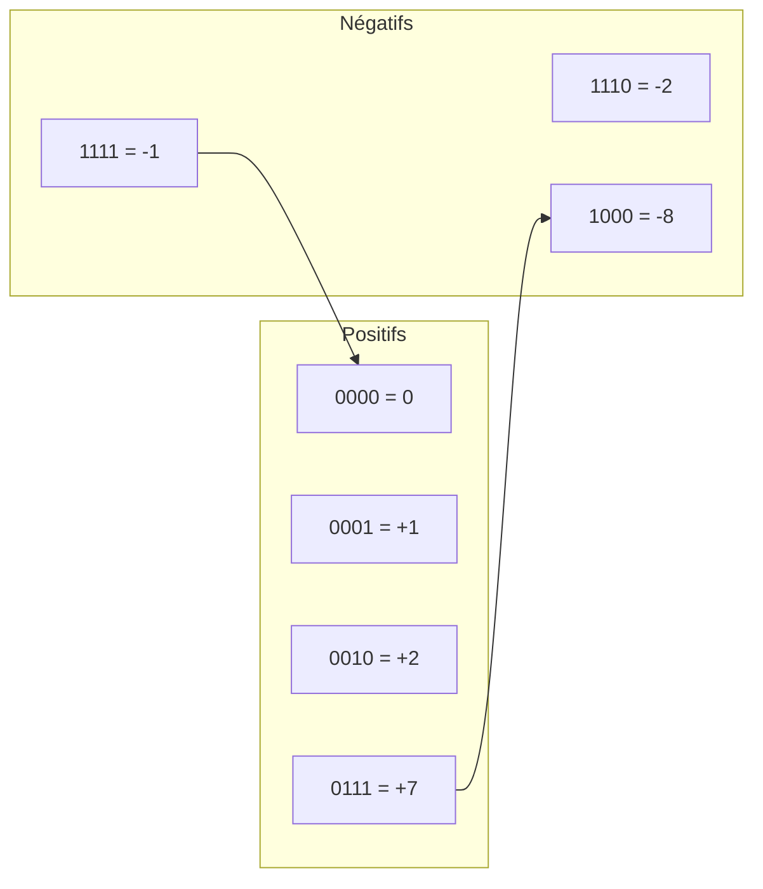
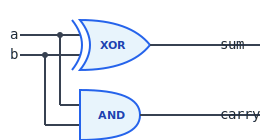
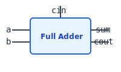
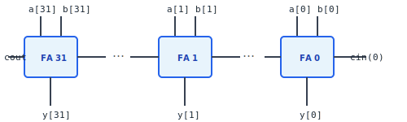
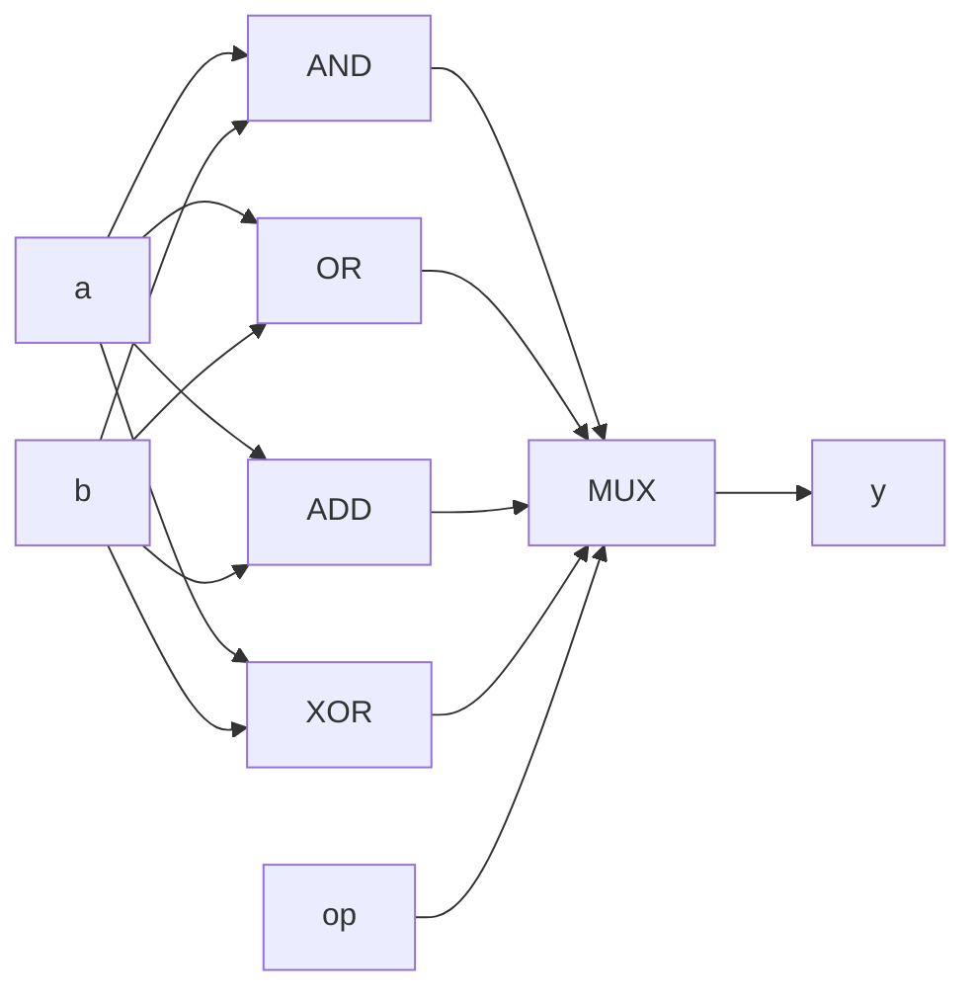

<!-- _class: lead -->

# Chapitre 02 : Arithmétique Binaire

> "Les mathématiques sont le langage avec lequel Dieu a écrit l'univers." — Galilée

---

# 🎯 Où en sommes-nous ?

<div class="figure">

<div class="figure-caption">L'ALU — le cœur calculatoire du processeur</div>
</div>

Nous combinons les portes pour construire l'**ALU** !

---

# Pourquoi l'Arithmétique ?

**Tout est calcul :**

<div class="columns">
<div>

- **Afficher une image** : Calculer la couleur de chaque pixel
- **Jouer un son** : Mélanger des formes d'onde

</div>
<div>

- **Exécuter un programme** : Calculer l'adresse de la prochaine instruction
- **Traiter du texte** : Comparer des codes ASCII

</div>
</div>

<div class="key-concept">
<div class="key-concept-title">L'ALU (Arithmetic Logic Unit)</div>
Le cœur calculatoire du CPU — effectue toutes les opérations
</div>

---

# Le Système Binaire

<div class="columns">
<div>

**Base 10 (décimal) :**
```
  4   2   7
  ↓   ↓   ↓
10² 10¹ 10⁰ → 4×100 + 2×10 + 7×1 = 427
```

</div>
<div>

**Base 2 (binaire) :**
```
Position :   3    2    1    0
Poids    :  2³   2²   2¹   2⁰
Valeur   :   8    4    2    1

1011₂ = 8+0+2+1 = 11₁₀
```

</div>
</div>

---

# Conversion Décimal → Binaire

**Méthode des divisions successives par 2 :**

| Division | Quotient | Reste |
|:---------|:--------:|:-----:|
| 13 ÷ 2   | 6 | **1** |
| 6 ÷ 2    | 3 | **0** |
| 3 ÷ 2    | 1 | **1** |
| 1 ÷ 2    | 0 | **1** |

Lecture de bas en haut : 13₁₀ = **1101**₂

---

# Nombres dans nand2c (32 bits)

| Type | Plage | Exemples |
|------|-------|----------|
| **Non-signé** | 0 à 4 294 967 295 | Adresses mémoire, compteurs |
| **Signé** | -2 147 483 648 à +2 147 483 647 | Coordonnées, températures |

<div class="callout callout-arm">
Les registres ARM R0-R15 sont aussi sur 32 bits, avec les mêmes plages de valeurs.
</div>

---

# Le Problème des Nombres Négatifs

**Question :** Comment représenter -5 avec seulement des 0 et 1 ?

**Solution naïve : Bit de signe** (0 = positif, 1 = négatif)

<div class="columns">
<div>

**Problèmes :**
- Deux zéros (+0 et -0)
- Circuits différents pour + et -

</div>
<div>

<div class="callout callout-tip">
<div class="callout-title">Solution brillante</div>
Le <strong>Complément à 2</strong>
</div>

</div>
</div>

---

# Complément à 2

**Pour obtenir -X à partir de X :**

<div class="process-step">
<div class="step-number">1</div>
<div class="step-content">
<div class="step-title">Inverser tous les bits</div>
</div>
</div>

<div class="process-step">
<div class="step-number">2</div>
<div class="step-content">
<div class="step-title">Ajouter 1</div>
</div>
</div>

**Exemple (4 bits) : Calculer -5**
```
  5 en binaire :   0101
  Inversion    :   1010
  Ajouter 1    : + 0001
                 ──────
  -5           :   1011
```

---

# Visualisation du Complément à 2 (4 bits)

<div class="columns">
<div>

| Binaire | Non-signé | Signé |
|:-------:|:---------:|:-----:|
| 0000 | 0 | 0 |
| 0001 | 1 | +1 |
| 0010 | 2 | +2 |
| 0011 | 3 | +3 |
| 0100 | 4 | +4 |
| 0101 | 5 | +5 |
| 0110 | 6 | +6 |
| 0111 | 7 | +7 |

</div>
<div>

| Binaire | Non-signé | Signé |
|:-------:|:---------:|:-----:|
| 1000 | 8 | **-8** |
| 1001 | 9 | **-7** |
| 1010 | 10 | **-6** |
| 1011 | 11 | **-5** |
| 1100 | 12 | **-4** |
| 1101 | 13 | **-3** |
| 1110 | 14 | **-2** |
| 1111 | 15 | **-1** |

</div>
</div>

---

# Roue du Complément à 2



Le passage de +7 à -8 est le **point de débordement** (overflow).

---

# Vérification : 5 + (-5) = 0

```
    0101   (5)
  + 1011   (-5)
  ──────
   10000   → Les 4 bits = 0000 ✓
```

La retenue est ignorée (on travaille sur 4 bits).

<div class="key-concept">
<div class="key-concept-title">Magie du complément à 2</div>
L'addition fonctionne identiquement pour les positifs et négatifs !
</div>

---

# Avantages du Complément à 2

<div class="columns">
<div>

1. **Un seul zéro** : `0000` uniquement
2. **Addition universelle** : Même circuit pour +/-
3. **Soustraction = Addition** : A - B = A + NOT(B) + 1

</div>
<div>

<div class="callout callout-vhdl">
Le type <code>signed</code> en VHDL utilise automatiquement le complément à 2.
</div>

</div>
</div>

---

# L'Addition Binaire

**Règles de base (1 bit) :**

<table class="truth-table">
<tr><th>A</th><th>B</th><th>Somme</th><th>Retenue</th></tr>
<tr><td>0</td><td>0</td><td>0</td><td>0</td></tr>
<tr><td>0</td><td>1</td><td>1</td><td>0</td></tr>
<tr><td>1</td><td>0</td><td>1</td><td>0</td></tr>
<tr><td>1</td><td>1</td><td>0</td><td>1</td></tr>
</table>

Comme l'addition décimale, mais en base 2 !

---

# Exemple : 5 + 3 = 8

```
  Retenues :   1 1 1
              ─────
     5     :   0 1 0 1
  +  3     : + 0 0 1 1
            ─────────
     8     :   1 0 0 0
```

Colonne par colonne, de droite à gauche.

---

# Le Demi-Additionneur (Half Adder)

<div class="columns">
<div>

**Entrées :** a, b (1 bit chacun)
**Sorties :** sum (somme), carry (retenue)

<table class="truth-table">
<tr><th>a</th><th>b</th><th>sum</th><th>carry</th></tr>
<tr><td>0</td><td>0</td><td>0</td><td>0</td></tr>
<tr><td>0</td><td>1</td><td>1</td><td>0</td></tr>
<tr><td>1</td><td>0</td><td>1</td><td>0</td></tr>
<tr><td>1</td><td>1</td><td>0</td><td>1</td></tr>
</table>

</div>
<div class="figure">

<div class="figure-caption">Schéma du Half Adder</div>
</div>
</div>

---

# Half Adder = XOR + AND

**Observation clé :**

- **sum** = XOR(a, b) — différent = 1
- **carry** = AND(a, b) — les deux à 1

<div class="callout callout-vhdl">

```vhdl
sum   <= a xor b;
carry <= a and b;
```

</div>

---

# L'Additionneur Complet (Full Adder)

**Problème :** Half Adder ne peut pas recevoir de retenue !

<div class="columns">
<div>

**Full Adder :**
- 3 entrées : a, b, cin
- 2 sorties : sum, cout

</div>
<div class="figure">

<div class="figure-caption">Schéma du Full Adder</div>
</div>
</div>

---

# Table de vérité du Full Adder

<table class="truth-table">
<tr><th>a</th><th>b</th><th>cin</th><th>sum</th><th>cout</th></tr>
<tr><td>0</td><td>0</td><td>0</td><td>0</td><td>0</td></tr>
<tr><td>0</td><td>0</td><td>1</td><td>1</td><td>0</td></tr>
<tr><td>0</td><td>1</td><td>0</td><td>1</td><td>0</td></tr>
<tr><td>0</td><td>1</td><td>1</td><td>0</td><td>1</td></tr>
<tr><td>1</td><td>0</td><td>0</td><td>1</td><td>0</td></tr>
<tr><td>1</td><td>0</td><td>1</td><td>0</td><td>1</td></tr>
<tr><td>1</td><td>1</td><td>0</td><td>0</td><td>1</td></tr>
<tr><td>1</td><td>1</td><td>1</td><td>1</td><td>1</td></tr>
</table>

---

# Construction du Full Adder

**2 Half Adders + 1 OR**

```
sum  = a XOR b XOR cin
cout = (a AND b) OR ((a XOR b) AND cin)
```

<div class="callout callout-tip">
<div class="callout-title">Astuce de construction</div>
Premier HA additionne a et b, second HA ajoute cin au résultat.
</div>

---

# Additionneur 32 bits (Ripple Carry)

<div class="figure">

<div class="figure-caption">32 Full Adders en cascade</div>
</div>

La retenue "ondule" (ripple) à travers tous les additionneurs.

---

# Délai de propagation

<div class="callout callout-warning">
<div class="callout-title">Limitation du Ripple Carry</div>
Le délai total = 32 × délai d'un Full Adder
</div>

**Solutions avancées :**
- Carry Lookahead Adder (CLA)
- Carry Select Adder

<div class="callout callout-arm">
Les processeurs ARM modernes utilisent des additionneurs optimisés avec carry lookahead.
</div>

---

# L'ALU : Le Cœur du CPU

<div class="columns">
<div>

L'**ALU** effectue TOUTES les opérations arithmétiques et logiques.

**Interface :**
- Entrées : a[31:0], b[31:0], op[3:0]
- Sorties : y[31:0], N, Z, C, V

</div>
<div class="figure">

<div class="figure-caption">Vue interne de l'ALU</div>
</div>
</div>

---

# Principe de l'ALU



**Calculer TOUS les résultats, puis Mux pour choisir.**

---

# Opérations de l'ALU

<table class="encoding">
<tr><th>op</th><th>Nom</th><th>Opération</th><th>Usage</th></tr>
<tr><td>0000</td><td>AND</td><td>a & b</td><td>Masquage bits</td></tr>
<tr><td>0001</td><td>EOR</td><td>a ^ b</td><td>Comparaison</td></tr>
<tr><td>0010</td><td>SUB</td><td>a - b</td><td>Soustraction</td></tr>
<tr><td>0011</td><td>ADD</td><td>a + b</td><td>Addition</td></tr>
<tr><td>0100</td><td>ORR</td><td>a | b</td><td>Combinaison</td></tr>
<tr><td>0101</td><td>MOV</td><td>b</td><td>Copie</td></tr>
<tr><td>0110</td><td>MVN</td><td>~b</td><td>Inversion</td></tr>
</table>

---

# La Soustraction via Complément à 2

```
A - B = A + (-B) = A + NOT(B) + 1
```

**Implémentation :**

<div class="process-step">
<div class="step-number">1</div>
<div class="step-content">Inverser les bits de B (NOT)</div>
</div>

<div class="process-step">
<div class="step-number">2</div>
<div class="step-content">Additionner avec cin = 1</div>
</div>

<div class="key-concept">
<div class="key-concept-title">Réutilisation</div>
Même additionneur pour ADD et SUB !
</div>

---

# Les Drapeaux (Flags)

| Flag | Nom | Signification | Calcul |
|:----:|:----|:--------------|:-------|
| **N** | Negative | Résultat négatif | bit 31 |
| **Z** | Zero | Résultat = 0 | NOR de tous les bits |
| **C** | Carry | Dépassement non-signé | Retenue de l'additionneur |
| **V** | Overflow | Dépassement signé | Logique spéciale |

<div class="callout callout-arm">
Ces flags sont stockés dans le registre CPSR en ARM.
</div>

---

# Calcul du Flag V (Overflow)

**Overflow se produit si :**
- Deux positifs → résultat négatif
- Deux négatifs → résultat positif

**Formule :**
```
V = (a[31] == b[31]) AND (a[31] != y[31])
```

Pour la soustraction (où b est inversé) :
```
V = (a[31] != b[31]) AND (a[31] != y[31])
```

---

# Exemple : Détection d'overflow

**100 + 50 = 150 (sur 8 bits signés)**

```
  01100100  (+100)
+ 00110010  (+50)
──────────
  10010110  = -106 en signé !
```

<div class="callout callout-warning">
<div class="callout-title">Overflow détecté</div>
V = 1 car deux positifs donnent un négatif
</div>

---

# Drapeaux et Branchements

| Instruction | Condition | Test | Usage |
|:------------|:----------|:-----|:------|
| B.EQ | Equal | Z = 1 | Égalité |
| B.NE | Not Equal | Z = 0 | Différence |
| B.LT | Less Than | N ≠ V | Moins que (signé) |
| B.GE | Greater/Equal | N = V | Plus ou égal (signé) |
| B.LO | Lower | C = 0 | Moins que (non-signé) |
| B.HS | Higher/Same | C = 1 | Plus ou égal (non-signé) |

---

# Exemple : CMP et Branchement

```asm
    CMP R0, R1      ; Calcule R0 - R1, met à jour flags
    B.EQ egaux      ; Si Z=1, sauter à 'egaux'
    B.LT plus_petit ; Si N≠V, sauter à 'plus_petit'
```

<div class="columns">
<div>

**Si R0 = 5, R1 = 5 :**
- R0 - R1 = 0
- Z = 1 → B.EQ pris

</div>
<div>

**Si R0 = 3, R1 = 5 :**
- R0 - R1 = -2
- N = 1, V = 0, N≠V → B.LT pris

</div>
</div>

---

# Exemple Tracé : ADD avec Flags

Calculons `ADD R2, R0, R1` avec R0 = 5, R1 = 3 :

<div class="process-step">
<div class="step-number">1</div>
<div class="step-content">
<div class="step-title">Entrées</div>
a = 0000...0101, b = 0000...0011
</div>
</div>

<div class="process-step">
<div class="step-number">2</div>
<div class="step-content">
<div class="step-title">Addition</div>
y = 0000...1000 (8)
</div>
</div>

<div class="process-step">
<div class="step-number">3</div>
<div class="step-content">
<div class="step-title">Flags</div>
N=0, Z=0, C=0, V=0
</div>
</div>

---

# Exemple Tracé : SUB avec Overflow

Calculons `SUB` avec a = -100, b = 50 (8 bits) :

```
  10011100  (-100)
- 00110010  (50)   → + 11001101 + 1 = 11001110
──────────
  01101010  = +106 ?!
```

**Overflow !** V = 1 car négatif - positif = positif impossible.

---

# Architecture de l'ALU — Vue Détaillée

```
         a          b
         │          │
    ┌────┴────┐ ┌───┴───┐
    │         │ │ INV?  │ ← si SUB
    │         │ └───┬───┘
    │         │     │
┌───▼───┐ ┌───▼───┐ │
│  AND  │ │  ADD  │◄┘ cin=1 si SUB
└───┬───┘ └───┬───┘
    │         │
    └────┬────┘
         │
    ┌────▼────┐
    │   MUX   │◄─── op
    └────┬────┘
         │
         y
```

---

# Questions de Réflexion

<div class="columns">
<div>

1. Pourquoi le complément à 2 est-il préféré au signe+magnitude ?

2. Que se passe-t-il si on additionne -1 et +1 en complément à 2 ?

3. Comment l'ALU sait-elle si une opération est signée ou non-signée ?

</div>
<div>

4. Pourquoi le flag C est-il utile pour les comparaisons non-signées ?

5. Comment faire une multiplication avec l'ALU ?

</div>
</div>

---

# Du Half Adder à l'ALU

```
CHAPITRE 1          CHAPITRE 2
    ↓                    ↓
  NAND              Half Adder
    ↓                    ↓
XOR, AND, OR  →    Full Adder  →  Add32  →  ALU
Mux, DMux               ↓
                     Flags (N,Z,C,V)
```

---

<!-- _class: summary -->

# Ce qu'il faut retenir

1. **XOR + AND = Half Adder**
2. **2 Half Adders + OR = Full Adder**
3. **32 Full Adders = Additionneur 32-bits**
4. **Complément à 2 = Soustraction avec le même additionneur**
5. **Les Flags (N, Z, C, V) permettent les décisions**
6. **L'ALU calcule tout, le Mux sélectionne**

---

<!-- _class: question -->

# Questions ?

📚 **Référence :** Livre Seed, Chapitre 02 - Arithmétique

👉 **Exercices :** TD et TP disponibles

**Prochain chapitre :** Mémoire (DFF, Registres, RAM)
