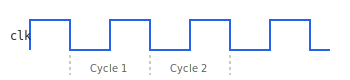
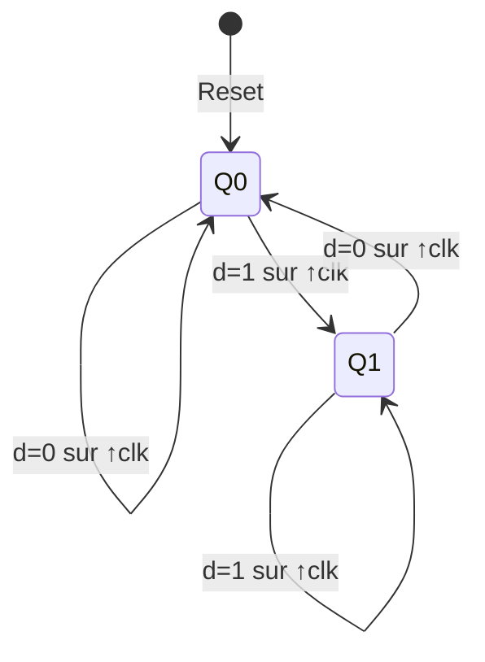
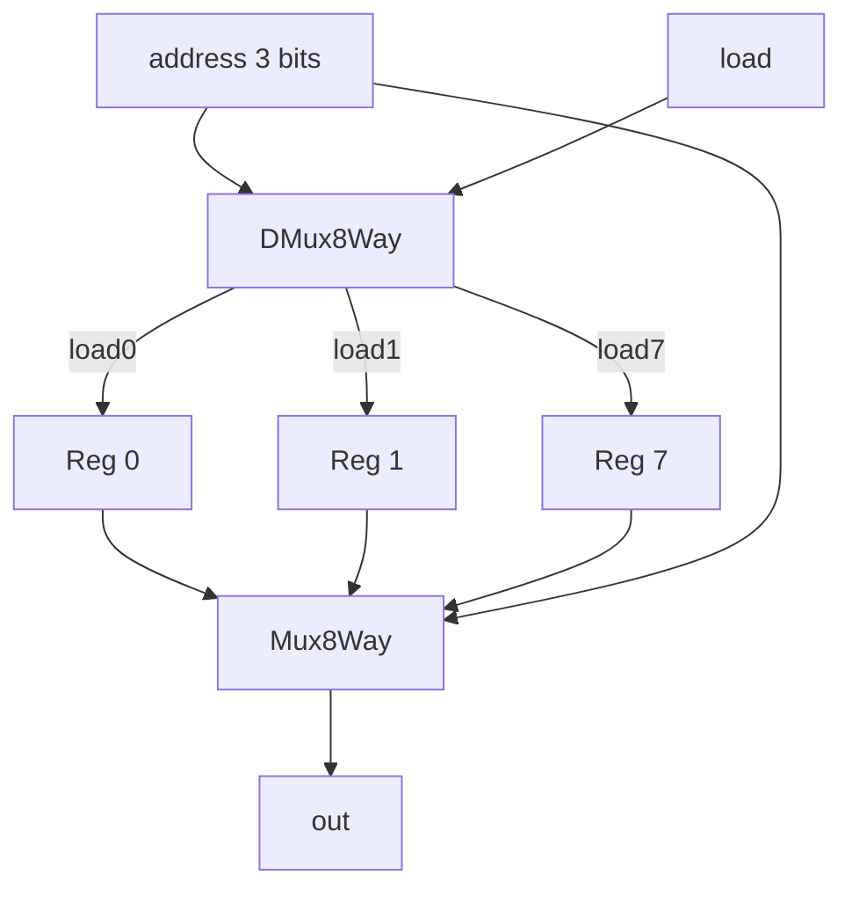
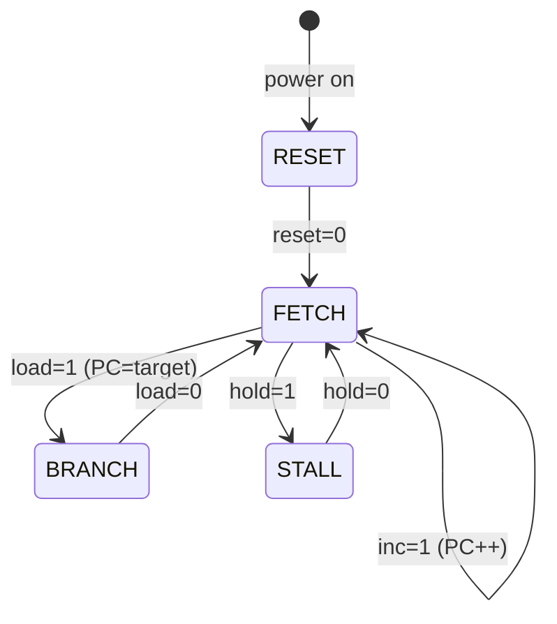

<!-- _class: lead -->

# Chapitre 03 : Logique Séquentielle et Mémoire

> "Le temps est ce qui empêche tout d'arriver en même temps." — John Wheeler

---

# 🎯 Où en sommes-nous ?

<div class="figure">

<div class="figure-caption">La mémoire — niveau 3 de notre stack</div>
</div>

Nous apprenons à **mémoriser** !

---

# Le Problème de l'État

```c
x = x + 1;
```

Pour exécuter cette instruction :

<div class="process-step">
<div class="step-number">1</div>
<div class="step-content">
<div class="step-title">Lire</div>
la valeur actuelle de <code>x</code>
</div>
</div>

<div class="process-step">
<div class="step-number">2</div>
<div class="step-content">
<div class="step-title">Calculer</div>
<code>x + 1</code> avec l'ALU
</div>
</div>

<div class="process-step">
<div class="step-number">3</div>
<div class="step-content">
<div class="step-title">Écrire</div>
le résultat dans <code>x</code>
</div>
</div>

**Sans mémoire, pas de "valeur actuelle" !**

---

# Combinatoire vs Séquentiel

| Circuits Combinatoires | Circuits Séquentiels |
|:-----------------------|:---------------------|
| Sortie = f(entrées) | Sortie = f(entrées, **état**) |
| Pas de mémoire | A de la mémoire |
| Pas d'horloge | Synchronisé par horloge |
| Ex: AND, OR, ALU | Ex: Registres, RAM, CPU |

<div class="key-concept">
<div class="key-concept-title">Différence fondamentale</div>
Les circuits séquentiels ont une <strong>notion de temps</strong>
</div>

---

# L'Horloge (Clock)

<div class="columns">
<div>

Signal qui oscille entre 0 et 1 à fréquence fixe :

```
      ┌───┐   ┌───┐   ┌───┐
clk ──┘   └───┘   └───┘   └───
      ↑       ↑       ↑
   Front   Front   Front
   montant montant montant
```

</div>
<div class="figure">

<div class="figure-caption">Signal d'horloge périodique</div>
</div>
</div>

---

# Timing de l'Horloge

<div class="definition">
<div class="definition-term">Front montant (Rising Edge)</div>
<div class="definition-text">Passage de 0 à 1 — moment où les données sont capturées</div>
</div>

<div class="definition">
<div class="definition-term">Période</div>
<div class="definition-text">Durée d'un cycle complet (high + low)</div>
</div>

<div class="callout callout-arm">
Un processeur ARM Cortex-M4 tourne à ~168 MHz = 168 millions de cycles/seconde.
</div>

---

# Pourquoi l'Horloge ?

**Problème :** Les signaux se propagent avec délai

**Solution :** L'horloge synchronise tout

<div class="columns">
<div>

- Pendant clk = 0 : les circuits calculent
- Sur front montant : les résultats sont capturés

</div>
<div>

<div class="callout callout-tip">
<div class="callout-title">Synchronisation</div>
Tous les registres capturent au même instant
</div>

</div>
</div>

---

# La Bascule D (DFF)

**DFF** = Data Flip-Flop = atome de mémoire

<div class="columns">
<div class="figure">

<div class="figure-caption">Symbole de la DFF</div>
</div>
<div>

**Règle fondamentale :**
```
q(t) = d(t-1)
```

La sortie = l'entrée du cycle précédent

</div>
</div>

---

# Comportement de la DFF

```
clk:   ──┐ ┌─┐ ┌─┐ ┌─┐ ┌─┐
         └─┘ └─┘ └─┘ └─┘ └─

  d:   ──[A]───[B]───[C]───[D]──

  q:   ──[?]───[A]───[B]───[C]──
```

<div class="key-concept">
<div class="key-concept-title">Décalage temporel</div>
La sortie est "en retard" d'un cycle — c'est la mémoire !
</div>

---

# Diagramme d'États de la DFF



La DFF a exactement 2 états : Q=0 ou Q=1

---

# Le Problème : Garder une Valeur

La DFF mémorise UN cycle, puis prend la nouvelle valeur.

**On veut :**
- Si `load = 1` : stocker la nouvelle valeur
- Si `load = 0` : **conserver** l'ancienne

<div class="callout callout-note">
<div class="callout-title">Besoin</div>
Un signal de contrôle pour décider quand écrire
</div>

---

# La Solution : Rétroaction

<div class="columns">
<div>

```
           ┌─────┐
  in ──────┤     │
           │ Mux ├────┬─── out
  ┌────────┤     │    │
  │   sel──┤     │    │
  │  (load)└─────┘    │
  │                   │
  │   ┌─────┐         │
  └───┤ DFF │◄────────┘
      └─────┘
```

</div>
<div>

- Si load=0 : Mux choisit sortie DFF (conservation)
- Si load=1 : Mux choisit `in` (nouvelle valeur)

</div>
</div>

---

# Registre 1-bit

<div class="columns">
<div class="figure">

<div class="figure-caption">Structure du registre 1-bit</div>
</div>
<div>

```vhdl
entity BitReg is
  port(
    d    : in bit;
    load : in bit;
    q    : out bit
  );
end entity;
```

Cette boucle transforme un délai en **mémoire permanente** !

</div>
</div>

---

# VHDL : Registre avec Load

<div class="callout callout-vhdl">

```vhdl
process(clk)
begin
  if rising_edge(clk) then
    if load = '1' then
      q <= d;
    -- sinon q garde sa valeur
    end if;
  end if;
end process;
```

</div>

---

# Registre 32-bits

**32 registres 1-bit en parallèle :**

```
         d[31:0]        load
            │             │
    ┌───────┼───────┬─────┤
    ▼       ▼       ▼     │
┌──────┬──────┬──────┐    │
│Bit31 │ ...  │ Bit0 │◄───┘
└──┬───┴──────┴──┬───┘
   │             │
   q[31]     q[0]
```

Tous les bits sont capturés **simultanément** sur le front montant.

---

# Banc de Registres

<div class="columns">
<div class="figure">

<div class="figure-caption">16 registres avec 2 ports lecture, 1 port écriture</div>
</div>
<div>

**Interface :**
- 2 ports de lecture (Ra, Rb)
- 1 port d'écriture (Rd)
- Signal write enable

</div>
</div>

---

# Registres du CPU nand2c

<table class="registers">
<tr><th>Registre</th><th>Alias</th><th>Rôle</th></tr>
<tr><td>R0-R12</td><td>-</td><td>Registres généraux</td></tr>
<tr><td>R13</td><td>SP</td><td>Stack Pointer</td></tr>
<tr><td>R14</td><td>LR</td><td>Link Register (retour fonction)</td></tr>
<tr><td>R15</td><td>PC</td><td>Program Counter</td></tr>
</table>

<div class="callout callout-arm">
Même organisation que ARM ! L'ABI est compatible.
</div>

---

# La RAM (Random Access Memory)

<div class="columns">
<div>

**RAM = Tableau de registres adressables**

```
        ┌─────┐
   in ──┤     │
        │     │
address─┤ RAM ├── out
        │     │
  load ─┤     │
        └─────┘
```

</div>
<div class="figure">

<div class="figure-caption">Interface de la RAM</div>
</div>
</div>

---

# Fonctionnement de la RAM

<div class="columns">
<div>

**Lecture (load = 0) :**
- `address` sélectionne une cellule
- `out` = contenu de cette cellule
- Lecture instantanée (combinatoire)

</div>
<div>

**Écriture (load = 1) :**
- `address` sélectionne une cellule
- `in` est écrit dans cette cellule
- Écriture sur front montant

</div>
</div>

---

# Architecture RAM8

<div class="columns">
<div class="figure">

<div class="figure-caption">8 registres avec décodage d'adresse</div>
</div>
<div>

**Composants :**
- **DMux8Way** : Route le signal load
- **8 Registres** : Stockent les données
- **Mux8Way** : Sélectionne la sortie

</div>
</div>

---

# Décodage d'Adresse RAM8



---

# Construction Hiérarchique

**RAM64 = 8 × RAM8**

```
address[5:0] = [5:3] + [2:0]
                 │       │
         Quelle RAM8    Quel mot dans RAM8
```

<div class="callout callout-tip">
<div class="callout-title">Pattern récursif</div>
RAM512 = 8 × RAM64, RAM4K = 8 × RAM512, etc.
</div>

---

# Le Compteur de Programme (PC)

Le PC contient l'adresse de la **prochaine instruction**.

**Modes (par priorité) :**

| Priorité | Mode | Action | Usage |
|:--------:|:-----|:-------|:------|
| 1 | reset | PC ← 0 | Démarrage |
| 2 | load | PC ← in | Branchement |
| 3 | inc | PC ← PC + 1 | Séquentiel |
| 4 | hold | PC ← PC | Stall |

---

# Diagramme d'États du PC



---

# Implémentation du PC

```vhdl
process(clk)
begin
  if rising_edge(clk) then
    if reset = '1' then
      pc <= (others => '0');
    elsif load = '1' then
      pc <= target;
    elsif inc = '1' then
      pc <= pc + 1;
    -- else hold
    end if;
  end if;
end process;
```

---

# Cycle d'Exécution du CPU

À chaque cycle d'horloge :

<div class="process-step">
<div class="step-number">1</div>
<div class="step-content">
<div class="step-title">Fetch</div>
Lire l'instruction à l'adresse PC
</div>
</div>

<div class="process-step">
<div class="step-number">2</div>
<div class="step-content">
<div class="step-title">Decode</div>
Comprendre l'instruction
</div>
</div>

<div class="process-step">
<div class="step-number">3</div>
<div class="step-content">
<div class="step-title">Execute</div>
Faire le calcul (ALU)
</div>
</div>

<div class="process-step">
<div class="step-number">4</div>
<div class="step-content">
<div class="step-title">Update PC</div>
Incrémenter ou sauter
</div>
</div>

---

# Hiérarchie Mémoire

<div class="figure">

<div class="figure-caption">Plus rapide en haut, plus grand en bas</div>
</div>

---

# Comparaison des Niveaux

| Niveau | Capacité | Latence | Technologie |
|:-------|:---------|:--------|:------------|
| Registres | 16 × 32 bits | 0 cycle | Flip-flops |
| Cache L1 | ~32 KB | 1-3 cycles | SRAM |
| Cache L2 | ~256 KB | 10-20 cycles | SRAM |
| RAM | ~8 GB | 100-300 cycles | DRAM |
| SSD | ~1 TB | 10K+ cycles | Flash |

---

# Timing Détaillé : Écriture Registre

```
clk:    ──┐   ┌───┐   ┌───┐
          └───┘   └───┘   └───

load:   ──────┐         ┌─────
              └─────────┘

d:      ──────[VALEUR]────────

q:      ──────────┐     ┌─────
          [OLD]   └─────┘[NEW]
```

La nouvelle valeur apparaît après le front montant suivant.

---

# Questions de Réflexion

<div class="columns">
<div>

1. Pourquoi utilise-t-on le front montant plutôt que le niveau haut ?

2. Que se passe-t-il si on lit et écrit la même adresse RAM simultanément ?

3. Combien de DFF faut-il pour une RAM de 1 KB (256 mots de 32 bits) ?

</div>
<div>

4. Pourquoi le PC a-t-il une priorité sur ses modes ?

5. Comment le CPU sait-il quand la RAM a terminé une lecture ?

</div>
</div>

---

<!-- _class: summary -->

# Ce qu'il faut retenir

1. **L'horloge synchronise** : Front montant = capture
2. **DFF = atome** : `q(t) = d(t-1)`
3. **Rétroaction = persistance** : Mux + DFF
4. **RAM = tableau** : DMux + Registres + Mux
5. **PC = guide** : reset > load > inc > hold
6. **Hiérarchie** : Registres > Cache > RAM > Disque

---

<!-- _class: question -->

# Questions ?

📚 **Référence :** Livre Seed, Chapitre 03 - Mémoire

👉 **Exercices :** TD et TP disponibles

**Prochain chapitre :** Architecture Machine (ISA)
