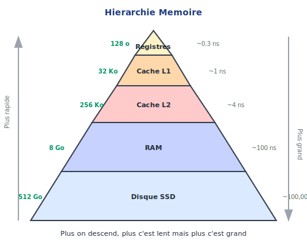
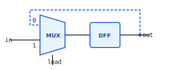
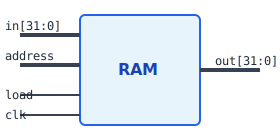

<!-- _class: lead -->

# Chapitre 03 : Logique Séquentielle et Mémoire

> "Le temps est ce qui empêche tout d'arriver en même temps." — John Wheeler

---

# 🎯 Où en sommes-nous ?

<div class="figure">

<div class="figure-caption">La mémoire — niveau 3 de notre stack</div>
</div>

Nous apprenons à **mémoriser** !

---

# Le Problème de l'État

```c
x = x + 1;
```

Pour exécuter cette instruction :

<div class="process-step">
<div class="step-number">1</div>
<div class="step-content">
<div class="step-title">Lire</div>
la valeur actuelle de <code>x</code>
</div>
</div>

<div class="process-step">
<div class="step-number">2</div>
<div class="step-content">
<div class="step-title">Calculer</div>
<code>x + 1</code> avec l'ALU
</div>
</div>

<div class="process-step">
<div class="step-number">3</div>
<div class="step-content">
<div class="step-title">Écrire</div>
le résultat dans <code>x</code>
</div>
</div>

**Sans mémoire, pas de "valeur actuelle" !**

---

# Combinatoire vs Séquentiel

| Circuits Combinatoires | Circuits Séquentiels |
|:-----------------------|:---------------------|
| Sortie = f(entrées) | Sortie = f(entrées, **état**) |
| Pas de mémoire | A de la mémoire |
| Pas d'horloge | Synchronisé par horloge |
| Ex: AND, OR, ALU | Ex: Registres, RAM, CPU |

<div class="key-concept">
<div class="key-concept-title">Différence fondamentale</div>
Les circuits séquentiels ont une <strong>notion de temps</strong>
</div>

---

# Le Problème : Quand Capturer ?

**Sans horloge, comment savoir QUAND lire les entrées ?**

```
Signal A: ────┐     ┌─────────    (arrive tôt)
              └─────┘
Signal B: ──────────┐   ┌─────    (arrive tard - délai)
                    └───┘
                  ↑
            Quel moment choisir ?
```

<div class="columns">
<div>

**Le problème :**
- Les signaux ont des délais différents
- Certains bits sont "prêts" avant d'autres
- Capturer trop tôt = valeur incorrecte !

</div>
<div>

<div class="callout callout-warning">
<div class="callout-title">Chaos garanti</div>
Sans synchronisation, le circuit capture des valeurs incohérentes
</div>

</div>
</div>

---

# La Solution : Un Chef d'Orchestre

**L'horloge = un signal qui dit "MAINTENANT !" à tout le circuit**

<div class="columns">
<div>

Comme un **chef d'orchestre** qui bat la mesure :
- Tous les musiciens jouent au même moment
- Pas de cacophonie

Comme un **feu de signalisation** :
- Tout le monde attend le feu vert
- Puis tout le monde avance ensemble

</div>
<div>

<div class="key-concept">
<div class="key-concept-title">Principe fondamental</div>
L'horloge donne un <strong>rythme commun</strong> à tous les composants du circuit
</div>

</div>
</div>

---

# L'Horloge (Clock)

Signal périodique qui oscille entre 0 et 1 :

```
      ┌───┐   ┌───┐   ┌───┐   ┌───┐
clk ──┘   └───┘   └───┘   └───┘   └───
      ↑       ↑       ↑       ↑
   "CAPTURE" "CAPTURE" "CAPTURE" ...
```

<div class="columns">
<div>

**Vocabulaire :**
- **Front montant** : passage 0→1 (moment de capture)
- **Période** : durée d'un cycle complet
- **Fréquence** : cycles par seconde (Hz)

</div>
<div>

<div class="callout callout-arm">
Un ARM Cortex-M4 à 168 MHz = 168 millions de "MAINTENANT !" par seconde
</div>

</div>
</div>

---

# D'où Vient l'Horloge ?

**Un cristal de quartz** vibre à fréquence fixe quand on lui applique une tension :

```
              ┌─────────┐      ┌──────────┐
Alimentation ─┤ Cristal ├──────┤Oscillateur├───► Signal carré
              │ Quartz  │      └──────────┘       (horloge)
              └─────────┘
                 32 kHz
               ou MHz
```

<div class="columns">
<div>

**Pourquoi le quartz ?**
- Vibration TRÈS stable (~10 ppm)
- Peu coûteux et robuste
- Même principe que les montres !

</div>
<div>

<div class="callout callout-tip">
<div class="callout-title">Le battement de cœur</div>
Le cristal est le "cœur" de l'ordinateur — sans lui, rien ne fonctionne
</div>

</div>
</div>

---

# Horloge et Mémoire : Le Lien Fondamental

<div class="columns">
<div>

**SANS horloge :**
```
entrée ───► sortie
```
- Sortie change dès que l'entrée change
- Impossible de "figer" une valeur
- = Circuit **combinatoire**

</div>
<div>

**AVEC horloge :**
```
entrée ───►[attend]───► sortie
              ↑
            front
           montant
```
- Sortie change SEULEMENT au front montant
- Entre deux fronts = valeur STABLE
- = Circuit **séquentiel** (mémoire !)

</div>
</div>

<div class="key-concept">
<div class="key-concept-title">Révélation</div>
L'horloge transforme un simple fil en <strong>mémoire</strong>
</div>

---

# Comment Construire une Mémoire ?

**Problème :** Comment créer un circuit qui "retient" une valeur ?

<div class="columns">
<div>

**L'idée clé : la rétroaction**

Si la sortie d'une porte revient à son entrée, le circuit peut "se souvenir" de son état.

```
    ┌─────┐
 ───┤     ├───┬───► sortie
    │     │   │
    └─────┘   │
        ▲     │
        └─────┘
      rétroaction
```

</div>
<div>

<div class="callout callout-tip">
<div class="callout-title">Progression pédagogique</div>
Pour comprendre en détail, voir les animations :
<ol style="font-size: 0.9em; margin: 5px 0;">
<li><strong>SR Latch</strong> — verrou de base</li>
<li><strong>Gated D Latch</strong> — avec Enable</li>
<li><strong>DFF</strong> — déclenché par front</li>
</ol>
</div>

</div>
</div>

---

# La Bascule D (DFF)

**DFF** = Data Flip-Flop = notre **brique de base** pour la mémoire

<div class="columns">
<div class="figure">

<div class="figure-caption">Symbole de la DFF</div>
</div>
<div>

**Règle fondamentale :**
```
q(t) = d(t-1)
```

La sortie = l'entrée **au front montant précédent**

<div class="callout callout-note">
<div class="callout-title">Abstraction</div>
On utilise le DFF comme "atome" sans détailler son intérieur (voir animations pour les curieux)
</div>

</div>
</div>

---

# Comportement de la DFF

```
clk:   ──┐ ┌─┐ ┌─┐ ┌─┐ ┌─┐
         └─┘ └─┘ └─┘ └─┘ └─

  d:   ──[A]───[B]───[C]───[D]──

  q:   ──[?]───[A]───[B]───[C]──
```

<div class="key-concept">
<div class="key-concept-title">Décalage temporel</div>
La sortie est "en retard" d'un cycle — c'est la mémoire !
</div>

---

# Diagramme d'États de la DFF

```
              d=0            d=1
             ┌───┐          ┌───┐
             │   ▼          │   ▼
Reset ──►  ┌───────┐      ┌───────┐
           │  Q=0  │◄────►│  Q=1  │
           └───────┘ d=1  └───────┘
              ▲     d=0      ▲
              └──────────────┘
```

La DFF a exactement 2 états : Q=0 ou Q=1

---

# Le Problème : Garder une Valeur

La DFF mémorise UN cycle, puis prend la nouvelle valeur.

**On veut :**
- Si `load = 1` : stocker la nouvelle valeur
- Si `load = 0` : **conserver** l'ancienne

<div class="callout callout-note">
<div class="callout-title">Besoin</div>
Un signal de contrôle pour décider quand écrire
</div>

---

# La Solution : Rétroaction

<div class="columns">
<div>

```
           ┌─────┐
  in ──────┤     │
           │ Mux ├────┬─── out
  ┌────────┤     │    │
  │   sel──┤     │    │
  │  (load)└─────┘    │
  │                   │
  │   ┌─────┐         │
  └───┤ DFF │◄────────┘
      └─────┘
```

</div>
<div>

- Si load=0 : Mux choisit sortie DFF (conservation)
- Si load=1 : Mux choisit `in` (nouvelle valeur)

</div>
</div>

---

# Registre 1-bit

<div class="columns">
<div class="figure">

<div class="figure-caption">Structure du registre 1-bit</div>
</div>
<div>

```vhdl
entity BitReg is
  port(
    d    : in bit;
    load : in bit;
    q    : out bit
  );
end entity;
```

Cette boucle transforme un délai en **mémoire permanente** !

</div>
</div>

---

# VHDL : Registre avec Load

<div class="callout callout-vhdl">

```vhdl
process(clk)
begin
  if rising_edge(clk) then
    if load = '1' then
      q <= d;
    -- sinon q garde sa valeur
    end if;
  end if;
end process;
```

</div>

---

# Registre 32-bits

**32 registres 1-bit en parallèle :**

```
         d[31:0]        load
            │             │
    ┌───────┼───────┬─────┤
    ▼       ▼       ▼     │
┌──────┬──────┬──────┐    │
│Bit31 │ ...  │ Bit0 │◄───┘
└──┬───┴──────┴──┬───┘
   │             │
   q[31]     q[0]
```

Tous les bits sont capturés **simultanément** sur le front montant.

---

# Banc de Registres : Pourquoi 2 Ports Lecture ?

**Considérons une instruction ALU :**

```asm
ADD R2, R0, R1    ; R2 = R0 + R1
```

<div class="columns">
<div>

**Besoin en UN cycle :**
1. Lire R0 (premier opérande)
2. Lire R1 (deuxième opérande)
3. Calculer R0 + R1
4. Écrire le résultat dans R2

</div>
<div>

```
       ┌──────────┐
  Ra ──┤          ├──► DataA ──┐
       │ Register │            │
  Rb ──┤   File   ├──► DataB ──┼──► ALU
       │          │            │
  Rd ──┤          │◄── Result ─┘
  WE ──┤          │
       └──────────┘
```

</div>
</div>

<div class="key-concept">
<div class="key-concept-title">2 lectures simultanées</div>
Pour faire A op B en un cycle, il faut lire A ET B en même temps !
</div>

---

# Registres du CPU nand2c

<table class="registers">
<tr><th>Registre</th><th>Alias</th><th>Rôle</th></tr>
<tr><td>R0-R12</td><td>-</td><td>Registres généraux</td></tr>
<tr><td>R13</td><td>SP</td><td>Stack Pointer</td></tr>
<tr><td>R14</td><td>LR</td><td>Link Register (retour fonction)</td></tr>
<tr><td>R15</td><td>PC</td><td>Program Counter</td></tr>
</table>

<div class="callout callout-arm">
Même organisation que ARM ! L'ABI est compatible.
</div>

---

# La RAM : Une Bibliothèque Numérique

**Analogie : La RAM est comme une bibliothèque**

<div class="columns">
<div>

```
Bibliothèque           RAM
─────────────          ────
Numéro étagère    =    Adresse
Livre             =    Donnée (32 bits)
Ranger un livre   =    Écriture (load=1)
Consulter         =    Lecture (load=0)
```

</div>
<div>

```
     Adresse 0 → [████████████]
     Adresse 1 → [████████████]
     Adresse 2 → [████████████]
        ...
     Adresse N → [████████████]
```

</div>
</div>

<div class="key-concept">
<div class="key-concept-title">Random Access = Accès Direct</div>
On peut accéder à N'IMPORTE quelle adresse directement, sans parcourir les autres
</div>

---

# La RAM (Random Access Memory)

<div class="columns">
<div>

**RAM = Tableau de registres adressables**

```
        ┌─────┐
   in ──┤     │
        │     │
address─┤ RAM ├── out
        │     │
  load ─┤     │
        └─────┘
```

</div>
<div class="figure">

<div class="figure-caption">Interface de la RAM</div>
</div>
</div>

---

# Fonctionnement de la RAM

<div class="columns">
<div>

**Lecture (load = 0) :**
- `address` sélectionne une cellule
- `out` = contenu de cette cellule
- Lecture instantanée (combinatoire)

</div>
<div>

**Écriture (load = 1) :**
- `address` sélectionne une cellule
- `in` est écrit dans cette cellule
- Écriture sur front montant

</div>
</div>

---

# Architecture RAM8

<div class="columns">
<div class="figure">

<div class="figure-caption">8 registres avec décodage d'adresse</div>
</div>
<div>

**Composants :**
- **DMux8Way** : Route le signal load
- **8 Registres** : Stockent les données
- **Mux8Way** : Sélectionne la sortie

</div>
</div>

---

# Décodage d'Adresse RAM8

```
 address ──┬──────────────────────────┐
 (3 bits)  │                          │
           ▼                          ▼
      ┌─────────┐               ┌──────────┐
load─►│ DMux8Way│               │ Mux8Way  │──► out
      └────┬────┘               └────┬─────┘
           │                         ▲
    ┌──────┼──────┐           ┌──────┼──────┐
    ▼      ▼      ▼           │      │      │
 ┌─────┐┌─────┐┌─────┐        │      │      │
 │Reg 0││Reg 1││Reg 7│────────┴──────┴──────┘
 └─────┘└─────┘└─────┘
```

---

# Construction Hiérarchique

**RAM64 = 8 × RAM8**

```
address[5:0] = [5:3] + [2:0]
                 │       │
         Quelle RAM8    Quel mot dans RAM8
```

<div class="callout callout-tip">
<div class="callout-title">Pattern récursif</div>
RAM512 = 8 × RAM64, RAM4K = 8 × RAM512, etc.
</div>

---

# Le Compteur de Programme (PC)

**Le PC = le "doigt" qui suit le programme**

<div class="columns">
<div>

```
Adresse  Instruction
───────  ───────────
  0      MOV R0, #5
  1      MOV R1, #3    ◄── PC = 1
  2      ADD R2, R0, R1
  3      ...
```

Le PC pointe vers l'instruction **en cours** (ou la suivante selon l'architecture).

</div>
<div>

**Question clé :**
Comment le PC sait-il quelle sera la prochaine instruction ?

- Normalement : PC + 1 (séquentiel)
- Parfois : sauter ailleurs (branchement)
- Au démarrage : commencer à 0 (reset)

</div>
</div>

---

# Modes du PC (par priorité)

| Priorité | Mode | Action | Usage |
|:--------:|:-----|:-------|:------|
| 1 | reset | PC ← 0 | Démarrage du CPU |
| 2 | load | PC ← in | Branchement (B, BL) |
| 3 | inc | PC ← PC + 1 | Exécution séquentielle |
| 4 | hold | PC ← PC | Attente (stall) |

<div class="callout callout-warning">
<div class="callout-title">Priorité importante !</div>
Si reset=1, on ignore tout le reste. Si load=1, on ignore inc. Etc.
</div>

---

# Exemple : Suivons le PC !

```asm
Addr  Instruction         ; PC après exécution
────  ───────────         ; ──────────────────
 0    MOV R0, #10         ; PC = 1 (inc)
 1    MOV R1, #0          ; PC = 2 (inc)
 2    CMP R0, #0          ; PC = 3 (inc)
 3    B.EQ fin            ; PC = 6 (load!) ou 4 (inc)
 4    ADD R1, R1, R0      ; PC = 5 (inc)
 5    B boucle            ; PC = 2 (load!)
 6    fin: ...
```

<div class="columns">
<div>

**Exécution séquentielle :**
PC = 0 → 1 → 2 → 3 (inc, inc, inc)

</div>
<div>

**Branchement :**
PC = 3 → 6 si condition vraie (load)
PC = 5 → 2 toujours (load)

</div>
</div>

---

# Diagramme d'États du PC

```
                    ┌────────────────┐
    power on        │                │ inc=1
        │           ▼     ┌──────────┤ (PC++)
        ▼      ┌─────────┐│          │
     ┌───────┐ │         ││  ┌───────┴───────┐
     │ RESET │─┼►│ FETCH │◄──┤    STALL      │
     └───────┘ │ │       │   └───────────────┘
    reset=0    │ └───┬───┘        ▲
               │     │            │ hold=1
               │     │ load=1     │
               │     ▼            │
               │ ┌────────┐       │
               └─┤ BRANCH │───────┘
                 └────────┘  load=0
```

---

# Implémentation du PC

```vhdl
process(clk)
begin
  if rising_edge(clk) then
    if reset = '1' then
      pc <= (others => '0');
    elsif load = '1' then
      pc <= target;
    elsif inc = '1' then
      pc <= pc + 1;
    -- else hold
    end if;
  end if;
end process;
```

---

# Cycle d'Exécution du CPU

À chaque cycle d'horloge :

<div class="process-step">
<div class="step-number">1</div>
<div class="step-content">
<div class="step-title">Fetch</div>
Lire l'instruction à l'adresse PC
</div>
</div>

<div class="process-step">
<div class="step-number">2</div>
<div class="step-content">
<div class="step-title">Decode</div>
Comprendre l'instruction
</div>
</div>

<div class="process-step">
<div class="step-number">3</div>
<div class="step-content">
<div class="step-title">Execute</div>
Faire le calcul (ALU)
</div>
</div>

<div class="process-step">
<div class="step-number">4</div>
<div class="step-content">
<div class="step-title">Update PC</div>
Incrémenter ou sauter
</div>
</div>

---

# Le Compromis Fondamental : Vitesse vs Taille

**Problème : On ne peut pas tout avoir !**

<div class="columns">
<div>

```
        Rapide
           ▲
           │    ✗ Impossible
           │      (trop cher)
  Registres│●
           │
     Cache │  ●
           │
       RAM │      ●
           │
       SSD │          ●
           └──────────────► Grand
```

</div>
<div>

**Pourquoi ?**
- Mémoire rapide = transistors complexes = cher
- Mémoire grande = transistors simples = lent

**Solution :** Utiliser PLUSIEURS niveaux !

</div>
</div>

---

# Le Principe de Localité

**Observation clé : Les programmes n'accèdent pas à la mémoire au hasard**

<div class="columns">
<div>

**Localité temporelle :**
Si on accède à une donnée, on y accèdera probablement **bientôt** à nouveau.

```c
for (i = 0; i < 1000; i++) {
    sum += i;  // 'sum' accédé 1000 fois !
}
```

</div>
<div>

**Localité spatiale :**
Si on accède à une adresse, on accèdera probablement aux adresses **voisines**.

```c
for (i = 0; i < 100; i++) {
    sum += tab[i];  // tab[0], tab[1], tab[2]...
}
```

</div>
</div>

<div class="key-concept">
<div class="key-concept-title">Idée du cache</div>
Garder les données récentes/voisines dans une mémoire rapide
</div>

---

# Hiérarchie Mémoire

<div class="figure">

<div class="figure-caption">Plus rapide en haut, plus grand en bas</div>
</div>

---

# Comparaison des Niveaux

| Niveau | Capacité | Latence | Technologie |
|:-------|:---------|:--------|:------------|
| Registres | 16 × 32 bits | 0 cycle | Flip-flops |
| Cache L1 | ~32 KB | 1-3 cycles | SRAM |
| Cache L2 | ~256 KB | 10-20 cycles | SRAM |
| RAM | ~8 GB | 100-300 cycles | DRAM |
| SSD | ~1 TB | 10K+ cycles | Flash |

<div class="callout callout-tip">
<div class="callout-title">Illusion de performance</div>
Grâce à la localité, le CPU "voit" souvent une mémoire rapide (cache hit ~95%)
</div>

---

# Timing Détaillé : Écriture Registre

```
clk:    ──┐   ┌───┐   ┌───┐
          └───┘   └───┘   └───

load:   ──────┐         ┌─────
              └─────────┘

d:      ──────[VALEUR]────────

q:      ──────────┐     ┌─────
          [OLD]   └─────┘[NEW]
```

La nouvelle valeur apparaît après le front montant suivant.

---

# Vue d'Ensemble : Du Bit au Système

```
                         ┌─────────────────────────────────────┐
                         │              CPU                    │
                         │  ┌─────────┐      ┌─────────────┐   │
                         │  │   PC    │─────►│ Instruction │   │
                         │  │(compteur)│     │   Memory    │   │
                         │  └─────────┘      └─────────────┘   │
                         │       │                  │          │
                         │       ▼                  ▼          │
                         │  ┌─────────┐      ┌─────────────┐   │
              Données ◄──┼──┤Register │◄────►│     ALU     │   │
                         │  │  File   │      └─────────────┘   │
                         │  │(16×32b) │                        │
                         │  └─────────┘                        │
                         └───────┼─────────────────────────────┘
                                 │
                                 ▼
                         ┌─────────────┐
                         │     RAM     │  ◄── Stockage principal
                         │ (données +  │
                         │ programmes) │
                         └─────────────┘
```

**Tous construits avec des DFF + logique combinatoire !**

---

# Questions de Réflexion

<div class="columns">
<div>

1. Pourquoi utilise-t-on le front montant plutôt que le niveau haut ?

2. Que se passe-t-il si on lit et écrit la même adresse RAM simultanément ?

3. Combien de DFF faut-il pour une RAM de 1 KB (256 mots de 32 bits) ?

</div>
<div>

4. Pourquoi le PC a-t-il une priorité sur ses modes ?

5. Comment le CPU sait-il quand la RAM a terminé une lecture ?

</div>
</div>

---

<!-- _class: summary -->

# Ce qu'il faut retenir

1. **L'horloge synchronise** : Front montant = capture
2. **DFF = atome** : `q(t) = d(t-1)`
3. **Rétroaction = persistance** : Mux + DFF
4. **RAM = tableau** : DMux + Registres + Mux
5. **PC = guide** : reset > load > inc > hold
6. **Hiérarchie** : Registres > Cache > RAM > Disque

---

<!-- _class: question -->

# Questions ?

📚 **Référence :** Livre Seed, Chapitre 03 - Mémoire

👉 **Exercices :** TD et TP disponibles

**Prochain chapitre :** Architecture Machine (ISA)
