<!-- _class: lead -->

# Chapitre 04 : Architecture Machine

> "Le langage est la limite de mon monde." — Wittgenstein

---

# 🎯 Où en sommes-nous ?

<div class="figure">

<div class="figure-caption">L'ISA — le contrat entre matériel et logiciel</div>
</div>

L'**ISA** = le langage que parle le processeur !

---

# Qu'est-ce qu'une Architecture ?

L'architecture définit :

<div class="columns">
<div>

1. **Les registres** : Combien ? Quelle taille ?
2. **Les instructions** : Quelles opérations possibles ?

</div>
<div>

3. **L'encodage** : Représentation binaire
4. **Le modèle mémoire** : Comment accéder aux données ?

</div>
</div>

<div class="key-concept">
<div class="key-concept-title">ISA = Instruction Set Architecture</div>
C'est un <strong>contrat</strong> entre matériel et logiciel.
</div>

---

# nand2c A32 : Architecture RISC

Inspirée de ARM (smartphones, Raspberry Pi) :

- **RISC** : Reduced Instruction Set Computer
- **32 bits** : Registres et adresses
- **Load/Store** : Calcul uniquement entre registres

<div class="callout callout-arm">
Les mêmes concepts s'appliquent à ARM — syntaxe très proche.
</div>

---

# CISC vs RISC

| CISC (x86) | RISC (ARM, A32) |
|:-----------|:----------------|
| Instructions complexes | Instructions simples |
| `ADD [mem], reg` OK | Calcul entre registres seulement |
| Vitesse variable | ~1 instruction/cycle |
| Plus facile à programmer | Plus facile à construire |

<div class="callout callout-tip">
<div class="callout-title">Avantage RISC</div>
Pipeline plus efficace, consommation réduite
</div>

---

# La Règle Load/Store

En RISC, **jamais de calcul direct en mémoire** :

<div class="process-step">
<div class="step-number">1</div>
<div class="step-content">
<div class="step-title">LOAD</div>
Mémoire → Registre
</div>
</div>

<div class="process-step">
<div class="step-number">2</div>
<div class="step-content">
<div class="step-title">COMPUTE</div>
Calcul dans les registres
</div>
</div>

<div class="process-step">
<div class="step-number">3</div>
<div class="step-content">
<div class="step-title">STORE</div>
Registre → Mémoire
</div>
</div>

---

# Exemple Load/Store

**Incrémenter une variable en mémoire :**

```asm
LDR R0, [R1]      ; Charger depuis mémoire
ADD R0, R0, #1    ; Ajouter 1
STR R0, [R1]      ; Stocker en mémoire
```

<div class="callout callout-note">
<div class="callout-title">3 instructions pour x++</div>
CISC le fait en 1 instruction, mais le matériel est plus complexe
</div>

---

# Le Cycle Fetch-Decode-Execute

<div class="figure">

<div class="figure-caption">Le cœur du fonctionnement CPU</div>
</div>

---

# Détail du Cycle

```mermaid
sequenceDiagram
    participant PC as Program Counter
    participant MEM as Mémoire
    participant DEC as Décodeur
    participant ALU as ALU
    participant REG as Registres

    PC->>MEM: Adresse instruction
    MEM->>DEC: Instruction 32 bits
    DEC->>REG: Lecture registres
    REG->>ALU: Opérandes
    ALU->>REG: Résultat
    PC->>PC: PC++
```



---

# Les 16 Registres

<table class="registers">
<tr><th>Registre</th><th>Alias</th><th>Rôle</th></tr>
<tr><td>R0-R3</td><td>—</td><td>Arguments, retours</td></tr>
<tr><td>R4-R11</td><td>—</td><td>Variables locales</td></tr>
<tr><td>R12</td><td>IP</td><td>Temporaire</td></tr>
<tr><td><strong>R13</strong></td><td><strong>SP</strong></td><td>Stack Pointer</td></tr>
<tr><td><strong>R14</strong></td><td><strong>LR</strong></td><td>Link Register</td></tr>
<tr><td><strong>R15</strong></td><td><strong>PC</strong></td><td>Program Counter</td></tr>
</table>

---

# Registres Spéciaux

<div class="columns">
<div>

**R13 (SP)** : Pointe vers le sommet de la pile

**R14 (LR)** : Adresse de retour après `BL`

**R15 (PC)** : Adresse de l'instruction courante

</div>
<div>

```asm
MOV PC, LR    ; Équivalent à "return"
```

<div class="callout callout-arm">
Organisation identique à ARM (ABI standard).
</div>

</div>
</div>

---

# La Carte Mémoire

<div class="columns">
<div class="figure">

<div class="figure-caption">Organisation de l'espace d'adressage</div>
</div>
<div>

| Zone | Adresse | Usage |
|:-----|:--------|:------|
| Code | 0x00000000 | Instructions |
| Data | 0x00200000 | Variables |
| Screen | 0x00400000 | MMIO |
| Keyboard | 0x00402600 | MMIO |

</div>
</div>

---

# Memory-Mapped I/O (MMIO)

Les périphériques sont des **adresses mémoire** :

**Écran :** `0x00400000` - 1 bit par pixel

**Clavier :** `0x00402600` - Code ASCII

```asm
; Allumer premier pixel
LDR R0, =0x00400000
MOV R1, #0x80
STRB R1, [R0]
```

---

# Format des Instructions (32 bits)

<div class="figure">

<div class="figure-caption">Structure commune à toutes les instructions</div>
</div>

---

# Détail du Format

<table class="encoding">
<tr><th>Bits</th><th>Champ</th><th>Taille</th><th>Rôle</th></tr>
<tr><td>31-28</td><td>Cond</td><td>4 bits</td><td>Condition d'exécution</td></tr>
<tr><td>27-25</td><td>Class</td><td>3 bits</td><td>Type d'instruction</td></tr>
<tr><td>24-21</td><td>Opcode</td><td>4 bits</td><td>Opération spécifique</td></tr>
<tr><td>20</td><td>S</td><td>1 bit</td><td>Update flags</td></tr>
<tr><td>19-16</td><td>Rn</td><td>4 bits</td><td>Registre source 1</td></tr>
<tr><td>15-12</td><td>Rd</td><td>4 bits</td><td>Registre destination</td></tr>
<tr><td>11-0</td><td>Op2</td><td>12 bits</td><td>Opérande 2</td></tr>
</table>

---

# Exemple d'Encodage : ADD R1, R2, R3

```
Cond  Class Opcode S Rn   Rd   Shift  Rm
1110  000   0100   0 0010 0001 0000   0011
│     │     │      │ │    │    │      │
AL    Data  ADD    N R2   R1   0      R3
```

<div class="callout callout-tip">
<div class="callout-title">Encodage fixe 32 bits</div>
Simplifie le décodage et le pipeline
</div>

---

# Exécution Conditionnelle

Toute instruction peut être conditionnelle !

<div class="columns">
<div>

**Avec branchement :**
```asm
CMP R0, #0
B.NE skip
MOV R1, #1
skip:
```

</div>
<div>

**Avec prédication :**
```asm
CMP R0, #0
MOV.EQ R1, #1   ; Exécuté SI Z=1
```

</div>
</div>

---

# Codes de Condition Complets

<table class="encoding">
<tr><th>Code</th><th>Suffixe</th><th>Condition</th><th>Test</th></tr>
<tr><td>0000</td><td>EQ</td><td>Égal</td><td>Z = 1</td></tr>
<tr><td>0001</td><td>NE</td><td>Différent</td><td>Z = 0</td></tr>
<tr><td>0010</td><td>CS/HS</td><td>Carry Set / ≥ non-signé</td><td>C = 1</td></tr>
<tr><td>0011</td><td>CC/LO</td><td>Carry Clear / < non-signé</td><td>C = 0</td></tr>
<tr><td>1010</td><td>GE</td><td>≥ signé</td><td>N = V</td></tr>
<tr><td>1011</td><td>LT</td><td>< signé</td><td>N ≠ V</td></tr>
<tr><td>1100</td><td>GT</td><td>> signé</td><td>Z=0, N=V</td></tr>
<tr><td>1101</td><td>LE</td><td>≤ signé</td><td>Z=1 ou N≠V</td></tr>
<tr><td>1110</td><td>AL</td><td>Toujours</td><td>—</td></tr>
</table>

---

# Classes d'Instructions

| Bits | Classe | Description | Exemples |
|:-----|:-------|:------------|:---------|
| 000 | Data (reg) | Opérations registre-registre | ADD, SUB, AND |
| 001 | Data (imm) | Opérations avec immédiat | ADD R0, R1, #42 |
| 010 | Load/Store | Accès mémoire | LDR, STR |
| 011 | Branch | Branchements | B, BL |
| 111 | System | Instructions système | HALT |

---

# Instructions Arithmétiques

```asm
ADD Rd, Rn, Rm     ; Rd = Rn + Rm
ADD Rd, Rn, #imm   ; Rd = Rn + imm
SUB Rd, Rn, Rm     ; Rd = Rn - Rm
MUL Rd, Rn, Rm     ; Rd = Rn * Rm
```

<div class="callout callout-note">
<div class="callout-title">Suffixe S</div>
ADDS met à jour les flags (N, Z, C, V), ADD ne les modifie pas.
</div>

---

# Instructions Logiques

```asm
AND Rd, Rn, Rm     ; Rd = Rn & Rm
ORR Rd, Rn, Rm     ; Rd = Rn | Rm
EOR Rd, Rn, Rm     ; Rd = Rn ^ Rm
MVN Rd, Rm         ; Rd = ~Rm
MOV Rd, Rm         ; Rd = Rm
```

<div class="callout callout-vhdl">
Ce sont les mêmes opérations que l'ALU que vous avez construite !
</div>

---

# Instructions de Comparaison

```asm
CMP Rn, Rm         ; Calcule Rn - Rm, modifie flags
CMP Rn, #imm       ; Compare avec immédiat
TST Rn, Rm         ; Calcule Rn & Rm, modifie flags
```

<div class="key-concept">
<div class="key-concept-title">CMP = SUB sans destination</div>
Le résultat est jeté, seuls les flags comptent
</div>

---

# Accès Mémoire

```asm
LDR Rd, [Rn]       ; Rd = MEM[Rn]
LDR Rd, [Rn, #off] ; Rd = MEM[Rn + off]
STR Rd, [Rn]       ; MEM[Rn] = Rd
LDRB Rd, [Rn]      ; Charger 1 octet
STRB Rd, [Rn]      ; Stocker 1 octet
```

<div class="callout callout-arm">
Syntaxe identique à ARM — les modes d'adressage sont compatibles.
</div>

---

# Modes d'Adressage

| Mode | Syntaxe | Calcul adresse |
|:-----|:--------|:---------------|
| Direct | `[Rn]` | Rn |
| Offset immédiat | `[Rn, #off]` | Rn + off |
| Offset registre | `[Rn, Rm]` | Rn + Rm |
| Pre-indexé | `[Rn, #off]!` | Rn = Rn + off, puis accès |
| Post-indexé | `[Rn], #off` | Accès, puis Rn = Rn + off |

---

# Branchements

```asm
B label            ; Saut inconditionnel
BL label           ; Branch with Link (appel)
B.EQ label         ; Saut si égal
B.NE label         ; Saut si différent
B.GT label         ; Saut si > (signé)
B.LT label         ; Saut si < (signé)
```

---

# Appel de Fonction (BL)

```asm
main:
    BL ma_fonction  ; LR = PC+4, puis saute
    ; ... on revient ici

ma_fonction:
    ; ... code
    MOV PC, LR      ; Retour (saute à LR)
```

<div class="key-concept">
<div class="key-concept-title">BL = Branch and Link</div>
Sauvegarde l'adresse de retour dans LR avant de sauter
</div>

---

# La Pile (Stack)

<div class="columns">
<div class="figure">

<div class="figure-caption">La pile grandit vers le bas</div>
</div>
<div>

- SP pointe vers le sommet
- PUSH = décrémenter SP, puis écrire
- POP = lire, puis incrémenter SP

</div>
</div>

---

# Push et Pop

<div class="columns">
<div>

**PUSH R0 :**
```asm
SUB SP, SP, #4    ; Réserver place
STR R0, [SP]      ; Stocker
```

</div>
<div>

**POP R0 :**
```asm
LDR R0, [SP]      ; Lire
ADD SP, SP, #4    ; Libérer place
```

</div>
</div>

<div class="callout callout-arm">
ARM a les instructions PUSH et POP natives.
</div>

---

# Exemple : Somme de 1 à 10

```asm
    MOV R0, #0       ; sum = 0
    MOV R1, #1       ; i = 1

loop:
    CMP R1, #10
    B.GT done        ; si i > 10, sortir
    ADD R0, R0, R1   ; sum += i
    ADD R1, R1, #1   ; i++
    B loop

done:
    HALT             ; R0 = 55
```

---

# Tracé de l'Exemple

| Cycle | R0 | R1 | Instruction |
|:-----:|:--:|:--:|:------------|
| 1 | 0 | ? | MOV R0, #0 |
| 2 | 0 | 1 | MOV R1, #1 |
| 3 | 0 | 1 | CMP R1, #10 |
| 4 | 0 | 1 | B.GT done (non pris) |
| 5 | 1 | 1 | ADD R0, R0, R1 |
| 6 | 1 | 2 | ADD R1, R1, #1 |
| ... | ... | ... | ... |
| fin | 55 | 11 | HALT |

---

# Exemple : Max sans branchement

```asm
; R2 = max(R0, R1)
CMP R0, R1
MOV.GE R2, R0     ; Si R0 >= R1
MOV.LT R2, R1     ; Si R0 < R1
```

<div class="callout callout-tip">
<div class="callout-title">Avantage de la prédication</div>
Évite les branchements coûteux (pipeline flush)
</div>

---

# Questions de Réflexion

<div class="columns">
<div>

1. Pourquoi RISC est-il plus adapté aux smartphones qu'aux PC ?

2. Combien de bits faut-il pour encoder un numéro de registre parmi 16 ?

3. Pourquoi le PC est-il un registre visible (R15) ?

</div>
<div>

4. Comment fonctionne une boucle `while` en assembleur ?

5. Que se passe-t-il si on oublie le `B loop` ?

</div>
</div>

---

<!-- _class: summary -->

# Ce qu'il faut retenir

1. **ISA = contrat** matériel/logiciel
2. **RISC** : Load, Compute, Store
3. **16 registres** : R13=SP, R14=LR, R15=PC
4. **Tout est conditionnel** : ADD.EQ, MOV.GT
5. **MMIO** : Périphériques = adresses
6. **Fetch-Decode-Execute** : Le cycle CPU

---

<!-- _class: question -->

# Questions ?

📚 **Référence :** Livre Seed, Chapitre 04 - Architecture

👉 **Exercices :** TD et TP sur le simulateur

**Prochain chapitre :** CPU (implémentation de l'ISA)
