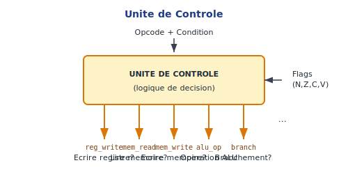
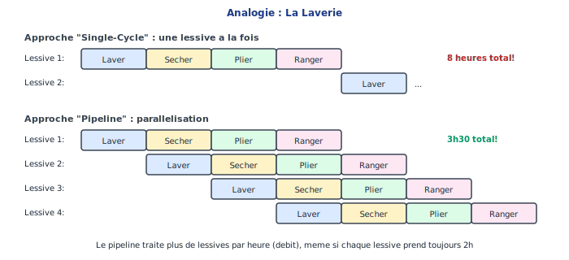
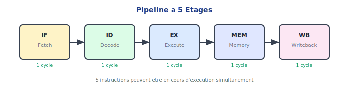
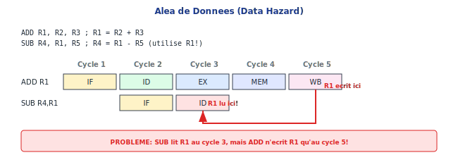

<!-- _class: lead -->

# Chapitre 05 : Le Processeur (CPU)

> "Si vous ne pouvez pas le construire, vous ne le comprenez pas." — Feynman

---

# 🎯 Où en sommes-nous ?

<div class="figure">

<div class="figure-caption">Le CPU — point culminant du matériel</div>
</div>

Nous assemblons toutes les pièces !

---

# Qu'est-ce qu'un CPU ?

Le CPU (Central Processing Unit) :

<div class="process-step">
<div class="step-number">1</div>
<div class="step-content">
<div class="step-title">Lit</div>
les instructions depuis la mémoire
</div>
</div>

<div class="process-step">
<div class="step-number">2</div>
<div class="step-content">
<div class="step-title">Décode</div>
pour comprendre quoi faire
</div>
</div>

<div class="process-step">
<div class="step-number">3</div>
<div class="step-content">
<div class="step-title">Exécute</div>
les opérations
</div>
</div>

<div class="process-step">
<div class="step-number">4</div>
<div class="step-content">
<div class="step-title">Répète</div>
à l'infini (jusqu'à HALT)
</div>
</div>

---

# Ce qu'on a construit

| Chapitre | Composant | Rôle |
|:---------|:----------|:-----|
| 1 | Portes | Briques de base |
| 2 | ALU | Calculs |
| 3 | Registres | R0-R15 |
| 3 | PC | Adresse courante |
| 3 | RAM | Programme + données |
| 4 | ISA | Instructions |

---

# Ce qu'il reste à construire

<div class="columns">
<div>

- **Décodeur** : Analyse les bits
- **Unité de contrôle** : Décide quoi activer

</div>
<div>

- **Multiplexeurs** : Routent les données
- **Le CPU** : L'assemblage final !

</div>
</div>

<div class="key-concept">
<div class="key-concept-title">Assemblage</div>
Connecter les composants existants avec la logique de contrôle
</div>

---

# Le Cycle Fetch-Decode-Execute

```
┌─────────┐    ┌─────────┐    ┌─────────┐
│  FETCH  │───►│ DECODE  │───►│ EXECUTE │
│ PC→Mem  │    │ Analyser│    │  ALU    │
└─────────┘    └─────────┘    └─────────┘
     ▲                              │
     └──────────────────────────────┘
            Cycle infini
```

---

# Architecture du CPU (Datapath)

<div class="figure">

<div class="figure-caption">Le datapath — chemin des données à travers le CPU</div>
</div>

---

# Vue Schématique du Datapath

```
     PC ──► Mém Instr ──► Décodeur
                              │
                   ┌──────────┼──────────┐
                   ▼          ▼          ▼
              Contrôle    RegFile     Extend
                   │          │          │
                   ▼          ▼          ▼
                   └────► ALU ◄────────┘
                           │
                   ┌───────┴───────┐
                   ▼               ▼
              Mém Data        Writeback
```

---

# Étage 1 : Fetch (IF)

<div class="columns">
<div>

```
PC ──► Mémoire Instructions
         │
         ▼
    instruction (32 bits)
```

**Actions :**
- PC envoie l'adresse
- Mémoire renvoie l'instruction
- PC préparé pour PC+4

</div>
<div>

<div class="callout callout-note">
<div class="callout-title">Instruction Fetch</div>
Lecture de 32 bits à l'adresse pointée par PC
</div>

</div>
</div>

---

# Étage 2 : Decode (ID)

<div class="columns">
<div>

```
instruction ──► Décodeur
                   │
    ┌──────────────┼──────────────┐
    ▼              ▼              ▼
  cond, class    Rn, Rd, Rm    imm
    │
    ▼
Contrôle ──► signaux
```

</div>
<div>

**Découpe les champs :**
- Condition (4 bits)
- Classe d'instruction
- Registres sources/dest
- Immédiat étendu

</div>
</div>

---

# Le Décodeur — Détail des Champs

<table class="encoding">
<tr><th>Signal</th><th>Bits</th><th>Description</th></tr>
<tr><td>cond</td><td>31-28</td><td>Condition (EQ, NE...)</td></tr>
<tr><td>class</td><td>27-25</td><td>Type (ALU, MEM, BRANCH)</td></tr>
<tr><td>op</td><td>24-21</td><td>Opération ALU</td></tr>
<tr><td>S</td><td>20</td><td>Mettre à jour flags ?</td></tr>
<tr><td>Rn</td><td>19-16</td><td>Source 1</td></tr>
<tr><td>Rd</td><td>15-12</td><td>Destination</td></tr>
<tr><td>Rm/Imm</td><td>11-0</td><td>Source 2 / Immédiat</td></tr>
</table>

---

# L'Unité de Contrôle

<div class="columns">
<div class="figure">

<div class="figure-caption">L'unité de contrôle génère les signaux</div>
</div>
<div>

Génère les **signaux de contrôle** basés sur l'opcode.

</div>
</div>

---

# Signaux de Contrôle

| Instruction | reg_write | mem_read | mem_write | alu_src |
|:------------|:---------:|:--------:|:---------:|:-------:|
| ADD | 1 | 0 | 0 | reg |
| ADD #imm | 1 | 0 | 0 | imm |
| LDR | 1 | 1 | 0 | imm |
| STR | 0 | 0 | 1 | imm |
| B | 0 | 0 | 0 | — |
| CMP | 0 | 0 | 0 | reg |

---

# Étage 3 : Register Read (ID suite)

```
Rn, Rm ──► Banc de Registres ──► Data_A, Data_B
```

<div class="callout callout-tip">
<div class="callout-title">Lecture simultanée</div>
Le banc de registres a 2 ports de lecture, on lit Rn et Rm en parallèle.
</div>

---

# Étage 4 : Execute (EX)

```
Data_A ──────────┐
                 ├──► ALU ──► Résultat, Flags
Data_B ou Imm ───┘
```

**Actions :**
- L'ALU effectue l'opération (ADD, SUB, AND...)
- Les flags (N, Z, C, V) sont calculés
- Les flags sont mis à jour si S=1

---

# Étage 5 : Memory (MEM)

<div class="columns">
<div>

**Pour LDR :**
```
MEM[adresse] → valeur
```

**Pour STR :**
```
valeur → MEM[adresse]
```

**Sinon :** (rien)

</div>
<div>

<div class="callout callout-note">
<div class="callout-title">Accès mémoire</div>
Uniquement pour les instructions Load/Store
</div>

</div>
</div>

---

# Étage 6 : Writeback (WB)

```
Résultat ──► MUX ──► Banc de Registres ──► Rd
                │
            ALU_out ou MEM_out ?
```

Si `reg_write = 1` ET `cond_ok = 1`, on écrit dans Rd.

---

# Le CondCheck — Exécution Conditionnelle

```
cond (4 bits) ───┐
                 │    ┌─────────────┐
                 └───►│             │──► ok=1 ──► Exécuter
                      │  CondCheck  │
                 ┌───►│             │──► ok=0 ──► Annuler
                 │    └─────────────┘
N,Z,C,V (flags)──┘
```

Si la condition n'est pas satisfaite, l'instruction est **annulée**.

---

# Logique CondCheck

```vhdl
case cond is
  when "0000" => ok := Z;           -- EQ
  when "0001" => ok := not Z;       -- NE
  when "1010" => ok := (N = V);     -- GE
  when "1011" => ok := (N /= V);    -- LT
  when "1100" => ok := (Z='0') and (N=V); -- GT
  when "1110" => ok := '1';         -- AL
  when others => ok := '0';
end case;
```

---

# Les Multiplexeurs du CPU

| Mux | Choix 0 | Choix 1 | Contrôle |
|:----|:--------|:--------|:---------|
| ALU_src | Rm | Imm | imm_src |
| Writeback | ALU_out | MEM_out | mem_to_reg |
| PC_src | PC+4 | Branch_target | branch_taken |

---

# Exemple Complet : ADD R1, R2, R3

```
1110 000 0100 0 0010 0001 00000000 0011
│    │   │    │ │    │              │
│    │   │    │ │    │              └── Rm = R3
│    │   │    │ │    └── Rd = R1
│    │   │    │ └── Rn = R2
│    │   │    └── S = 0
│    │   └── op = ADD
│    └── class = ALU
└── cond = AL (toujours)
```

---

# Parcours de ADD R1, R2, R3

<div class="process-step">
<div class="step-number">IF</div>
<div class="step-content">Lire l'instruction à PC</div>
</div>

<div class="process-step">
<div class="step-number">ID</div>
<div class="step-content">Décoder : class=ALU, reg_write=1, lire R2 et R3</div>
</div>

<div class="process-step">
<div class="step-number">EX</div>
<div class="step-content">ALU calcule R2 + R3</div>
</div>

<div class="process-step">
<div class="step-number">MEM</div>
<div class="step-content">(rien)</div>
</div>

<div class="process-step">
<div class="step-number">WB</div>
<div class="step-content">Écrire résultat dans R1</div>
</div>

---

# Exemple : LDR R0, [R1, #8]

<div class="process-step">
<div class="step-number">ID</div>
<div class="step-content">class=MEM, mem_read=1</div>
</div>

<div class="process-step">
<div class="step-number">EX</div>
<div class="step-content">ALU calcule R1 + 8</div>
</div>

<div class="process-step">
<div class="step-number">MEM</div>
<div class="step-content">Lire MEM[R1+8]</div>
</div>

<div class="process-step">
<div class="step-number">WB</div>
<div class="step-content">Écrire dans R0</div>
</div>

---

# Exemple : B.EQ label

<div class="process-step">
<div class="step-number">ID</div>
<div class="step-content">class=BRANCH, calcul adresse cible</div>
</div>

<div class="process-step">
<div class="step-number">EX</div>
<div class="step-content">CondCheck vérifie Z = 1 ?</div>
</div>

<div class="process-step">
<div class="step-number">PC</div>
<div class="step-content">Si ok : PC ← cible, sinon PC ← PC+4</div>
</div>

---

# CPU Mono-cycle vs Pipeline

| Mono-cycle | Pipeline |
|:-----------|:---------|
| 1 instruction à la fois | 5 en parallèle |
| Cycle long (toutes les phases) | Cycles courts (1 phase) |
| Simple à concevoir | Plus complexe |
| Notre implémentation | Processeurs réels |

---

# Analogie du Pipeline : La Laverie

<div class="figure">

<div class="figure-caption">Pipeline = plusieurs charges en parallèle</div>
</div>

---

# Pipeline 5 Étages

<div class="figure">

<div class="figure-caption">IF → ID → EX → MEM → WB</div>
</div>

---

# Vue Temporelle du Pipeline

```
Cycle:     1     2     3     4     5     6     7
         ┌─────┬─────┬─────┬─────┬─────┬─────┬─────┐
Instr 1  │ IF  │ ID  │ EX  │ MEM │ WB  │     │     │
         ├─────┼─────┼─────┼─────┼─────┼─────┼─────┤
Instr 2  │     │ IF  │ ID  │ EX  │ MEM │ WB  │     │
         ├─────┼─────┼─────┼─────┼─────┼─────┼─────┤
Instr 3  │     │     │ IF  │ ID  │ EX  │ MEM │ WB  │
         └─────┴─────┴─────┴─────┴─────┴─────┴─────┘
```

Débit = 1 instruction/cycle (après remplissage)

---

# Hazards (Problèmes Pipeline)

<div class="columns">
<div>

**Data Hazard :**
```asm
ADD R1, R2, R3    ; Écrit R1
SUB R4, R1, R5    ; Lit R1 → Problème !
```

R1 n'est pas encore écrit quand SUB le lit !

</div>
<div class="figure">

<div class="figure-caption">Dépendance de données</div>
</div>
</div>

---

# Solutions aux Hazards

```
        ┌─────────────────────┐
        │ Data Hazard détecté │
        └──────────┬──────────┘
                   ▼
          ┌───────────────┐
          │  Forwarding   │
          │   possible?   │
          └───────┬───────┘
           Oui    │    Non
          ┌───────┴───────┐
          ▼               ▼
    ┌───────────┐   ┌───────────┐
    │  Bypass   │   │   Stall   │
    │  direct   │   │  pipeline │
    └─────┬─────┘   └─────┬─────┘
          │               ▼
          │         ┌───────────┐
          │         │ Attendre  │
          │         │  1 cycle  │
          │         └─────┬─────┘
          └───────┬───────┘
                  ▼
           ┌────────────┐
           │ Continuer  │
           └────────────┘
```

---

# Forwarding (Bypass)

<div class="columns">
<div>

```asm
ADD R1, R2, R3
SUB R4, R1, R5
```

Le résultat de ADD est disponible à la sortie de l'ALU **avant** d'être écrit dans R1.

</div>
<div>

**Forwarding** : Envoyer le résultat directement à l'entrée de l'ALU pour l'instruction suivante.

</div>
</div>

---

# CPU Visualizer

👉 [Ouvrir le CPU Visualizer](https://seed.music-music.fr/visualizer.html)

<div class="columns">
<div>

**Fonctionnalités :**
- Vue pipeline (5 étapes)
- Registres R0-R15
- Flags NZCV

</div>
<div>

- Code source avec surlignage
- Mode pas-à-pas
- 7 démos interactives

</div>
</div>

---

# Questions de Réflexion

<div class="columns">
<div>

1. Combien de MUX minimum faut-il dans un CPU simple ?

2. Pourquoi le PC est-il incrémenté de 4 et pas de 1 ?

3. Que se passe-t-il si on charge une instruction invalide ?

</div>
<div>

4. Pourquoi le forwarding ne résout-il pas tous les hazards ?

5. Comment le pipeline gère-t-il un branchement ?

</div>
</div>

---

<!-- _class: summary -->

# Ce qu'il faut retenir

1. **Fetch → Decode → Execute → Mem → WB**
2. **Décodeur** analyse les bits de l'instruction
3. **Contrôle** génère les signaux d'activation
4. **MUX** routent les données selon le contexte
5. **CondCheck** permet l'exécution conditionnelle
6. **Pipeline** = performances (5× potentiel)

---

<!-- _class: question -->

# Questions ?

📚 **Référence :** Livre Seed, Chapitre 05 - CPU

👉 **Exercices :** TD et TP + CPU Visualizer

**Prochain chapitre :** Assembleur
