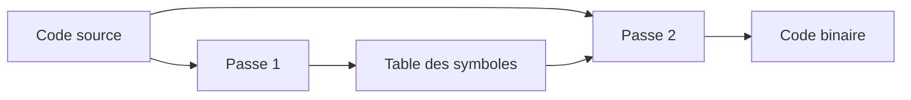
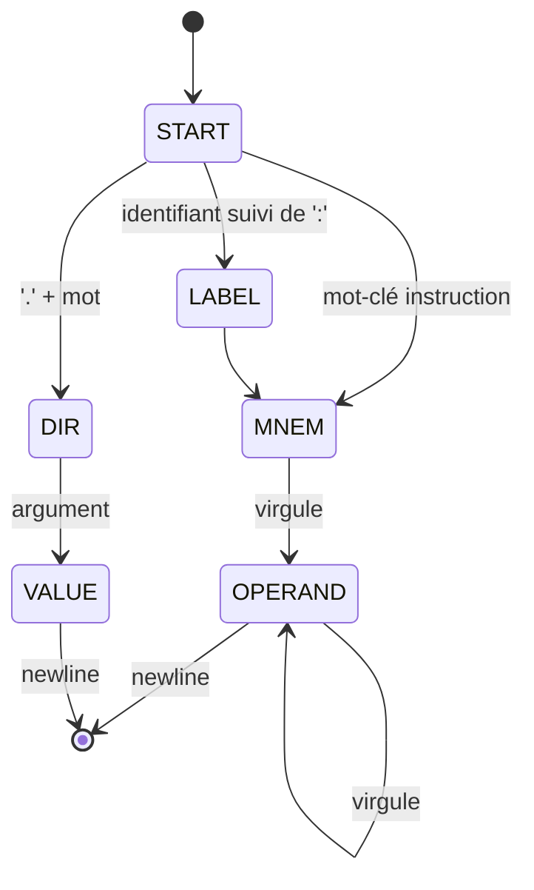

<!-- _class: lead -->

# Chapitre 06 : L'Assembleur

> "Traduire, c'est trahir ?" — Pas ici.

---

# Où en sommes-nous ?

```
┌─────────────────────────────────┐
│  8. Applications                │
├─────────────────────────────────┤
│  7. OS                          │
├─────────────────────────────────┤
│  6. Assembleur        ◀── NOUS  │
├─────────────────────────────────┤
│  5. CPU ✓                       │
├─────────────────────────────────┤
│  1-4. Matériel ✓                │
└─────────────────────────────────┘
```

Première étape dans le monde du **logiciel** !

---

# Le Problème

Écrire un programme en hexadécimal :

```
0xE2801001
0xE2822003
0xE0813002
0xEAFFFFFE
```

<div class="callout callout-warning">
<div class="callout-title">Illisible</div>
C'est source d'erreurs et impossible à maintenir !
</div>

---

# La Solution : L'Assembleur

Un **programme** qui traduit :

<div class="columns">
<div>

```asm
    ADD R1, R1, #1
    ADD R2, R2, #3
    ADD R3, R1, R2
    B loop
```

</div>
<div>

```
0xE2811001
0xE2822003
0xE0813002
0xEAFFFFFE
```

</div>
</div>

---

# Du Texte au Binaire

```
                    Assembleur
   Code source  ──────────────►  Code machine
   (texte)                       (binaire)

   ADD R1, R2, #10     →     0xE2821010
   B loop              →     0xEAFFFFFE
```

<div class="key-concept">
<div class="key-concept-title">L'assembleur</div>
Un traducteur fidèle : 1 instruction assembleur = 1 instruction machine
</div>

---

# Les Trois Tâches de l'Assembleur

<div class="process-step">
<div class="step-number">1</div>
<div class="step-content">
<div class="step-title">Analyse (Parsing)</div>
Lire et comprendre les instructions
</div>
</div>

<div class="process-step">
<div class="step-number">2</div>
<div class="step-content">
<div class="step-title">Résolution des Symboles</div>
Transformer les labels en adresses
</div>
</div>

<div class="process-step">
<div class="step-number">3</div>
<div class="step-content">
<div class="step-title">Encodage</div>
Générer le binaire 32 bits
</div>
</div>

---

# Le Problème des Références

```asm
    B suite    ; Où est 'suite' ? On ne sait pas encore !
    MOV R0, #1
suite:
    ADD R0, R0, #1
```

À la ligne 1, l'assembleur ne connaît pas l'adresse de `suite`.

<div class="definition">
<div class="definition-term">Référence vers l'avant (Forward Reference)</div>
<div class="definition-text">Un symbole utilisé avant d'être défini</div>
</div>

---

# La Solution : Deux Passes



---

# Passe 1 : Table des Symboles

Parcourir le fichier et noter chaque label :

```
Adresse 0x0000 : B suite         (4 octets)
Adresse 0x0004 : MOV R0, #1      (4 octets)
Adresse 0x0008 : suite:          ← Note : suite = 0x0008
```

<div class="callout callout-note">
<div class="callout-title">Table des symboles</div>
<code>{ "suite": 0x0008 }</code>
</div>

---

# Passe 2 : Génération

Reparcourir le fichier avec la table :

```
B suite → cherche "suite" dans la table → 0x0008

offset = (0x0008 - 0x0000 - 8) / 4 = -2

→ 0xEAFFFFFE
```

Maintenant toutes les références sont résolues !

---

# Processus du Tokenizer



---

# Les Sections

| Section | Contenu |
|:--------|:--------|
| `.text` | Le code (instructions) |
| `.data` | Variables initialisées |
| `.bss` | Variables non initialisées |

```asm
.text
    MOV R0, #1
    LDR R1, [R2]
.data
    .word 42
```

---

# Les Directives

<table class="encoding">
<tr><th>Directive</th><th>Effet</th><th>Exemple</th></tr>
<tr><td>.text</td><td>Section code</td><td>.text</td></tr>
<tr><td>.data</td><td>Section données</td><td>.data</td></tr>
<tr><td>.global</td><td>Exporte un symbole</td><td>.global main</td></tr>
<tr><td>.word</td><td>Réserve 4 octets</td><td>.word 42</td></tr>
<tr><td>.asciz</td><td>Chaîne + '\0'</td><td>.asciz "Hello"</td></tr>
<tr><td>.align</td><td>Aligne en mémoire</td><td>.align 2</td></tr>
</table>

---

# Exemple : Encoder ADD R1, R2, #10

**Étape 1 : Identifier les composants**

| Champ | Valeur |
|:------|:-------|
| Mnémonique | ADD → opcode = 0100 |
| Rd | R1 → 0001 |
| Rn | R2 → 0010 |
| Immédiat | #10 → 0x00A |

**Classe** : `001` (data processing immédiat)

---

# Étape 2 : Assembler les Bits

```
31-28  27-25  24-21  20   19-16  15-12  11-0
Cond   Class   Op    S     Rn     Rd    Imm12
1110   001    0100   0    0010   0001   000000001010
```

<div class="columns">
<div>

- Cond = 1110 (AL)
- Class = 001 (imm)
- Op = 0100 (ADD)

</div>
<div>

- S = 0 (pas de flags)
- Rn = 0010 (R2)
- Rd = 0001 (R1)

</div>
</div>

**Résultat** : `0xE2821010`

---

# Le Problème des Grandes Constantes

12 bits d'immédiat maximum !

```asm
MOV R0, #0xDEADBEEF   ; ERREUR ! Trop grand
```

<div class="callout callout-warning">
<div class="callout-title">Limitation</div>
Impossible d'encoder plus de 12 bits d'immédiat
</div>

---

# La Solution : Pseudo-instruction

La syntaxe spéciale `LDR Rd, =valeur` :

```asm
LDR R0, =0xDEADBEEF
```

L'assembleur la transforme en :

```asm
LDR R0, [PC, #offset]   ; Va chercher en mémoire
...
literal_pool:
    .word 0xDEADBEEF    ; La valeur est stockée ici
```

---

# Le Literal Pool

```
Adresse   Contenu
0x0000    LDR R0, [PC, #8]    ; PC+8 = 0x000C
0x0004    ...
0x0008    ...
0x000C    0xDEADBEEF          ; ← Literal pool
```

<div class="key-concept">
<div class="key-concept-title">Literal Pool</div>
Zone de données après le code où sont stockées les grandes constantes
</div>

---

# Patterns Idiomatiques en Assembleur

<div class="columns">
<div>

**Boucle for :**
```asm
    MOV R0, #0       ; i = 0
loop:
    CMP R0, #10
    B.GE done
    ; ... corps
    ADD R0, R0, #1
    B loop
done:
```

</div>
<div>

**If/else :**
```asm
    CMP R0, #0
    B.EQ else
    ; ... then
    B endif
else:
    ; ... else
endif:
```

</div>
</div>

---

# Pattern : Appel de Fonction

```asm
; Appelant
    MOV R0, #5       ; argument 1
    MOV R1, #3       ; argument 2
    BL ma_fonction   ; appel
    ; R0 contient le retour

ma_fonction:
    PUSH {LR}        ; sauver l'adresse de retour
    ADD R0, R0, R1   ; R0 = arg1 + arg2
    POP {PC}         ; retour
```

---

# Pattern : Sauvegarde Registres

```asm
ma_fonction:
    PUSH {R4-R7, LR}  ; sauver callee-saved

    ; utiliser R4-R7 librement
    MOV R4, R0
    ...

    POP {R4-R7, PC}   ; restaurer et retourner
```

<div class="callout callout-arm">
Convention ARM : R4-R11 doivent être préservés par l'appelé (callee-saved).
</div>

---

# Résumé du Pipeline Assembleur

```
   Code source (.s)
        │
        ▼
   ┌──────────┐
   │ Passe 1  │───► Table des symboles
   └──────────┘      { main: 0x0000, loop: 0x0010, ... }
        │
        ▼
   ┌──────────┐
   │ Passe 2  │───► Code binaire (.bin)
   └──────────┘
```

---

# Utilisation Pratique

```bash
# Assembler un fichier
cargo run -p a32_cli -- assemble prog.s -o prog.bin

# Examiner le binaire
hexdump -C prog.bin

# Désassembler
cargo run -p a32_cli -- disasm prog.bin

# Simuler l'exécution
cargo run -p a32_cli -- run prog.bin
```

---

# Exemple Complet : Somme 1 à N

```asm
.text
.global main

main:
    MOV R0, #0       ; sum = 0
    MOV R1, #1       ; i = 1
    LDR R2, =10      ; n = 10
loop:
    CMP R1, R2
    B.GT done
    ADD R0, R0, R1   ; sum += i
    ADD R1, R1, #1   ; i++
    B loop
done:
    HALT             ; R0 = 55
```

---

# Questions de Réflexion

<div class="columns">
<div>

1. Pourquoi deux passes et pas une seule ?

2. Que se passe-t-il si on référence un label non défini ?

3. Pourquoi l'offset des branches est-il divisé par 4 ?

</div>
<div>

4. Comment l'assembleur gère-t-il les erreurs de syntaxe ?

5. Quelle est la taille maximale d'un literal pool ?

</div>
</div>

---

<!-- _class: summary -->

# Ce qu'il faut retenir

1. **Assembleur = Traducteur** : Texte → Binaire (1:1)
2. **Deux passes** : Symboles puis code
3. **Directives** : `.text`, `.data`, `.word`, `.align`
4. **Literal pool** : Pour les grandes constantes
5. **Label = Adresse** : Un nom devient un nombre
6. **Patterns** : Boucles, conditions, appels standardisés

---

<!-- _class: question -->

# Questions ?

📚 **Référence :** Livre Seed, Chapitre 06 - Assembleur

👉 **Exercices :** TD et TP + Simulateur Web

**Prochain chapitre :** Compilateur (C32 → Assembleur)
